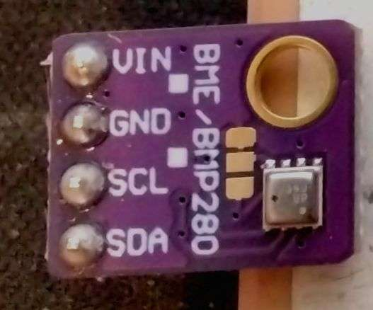
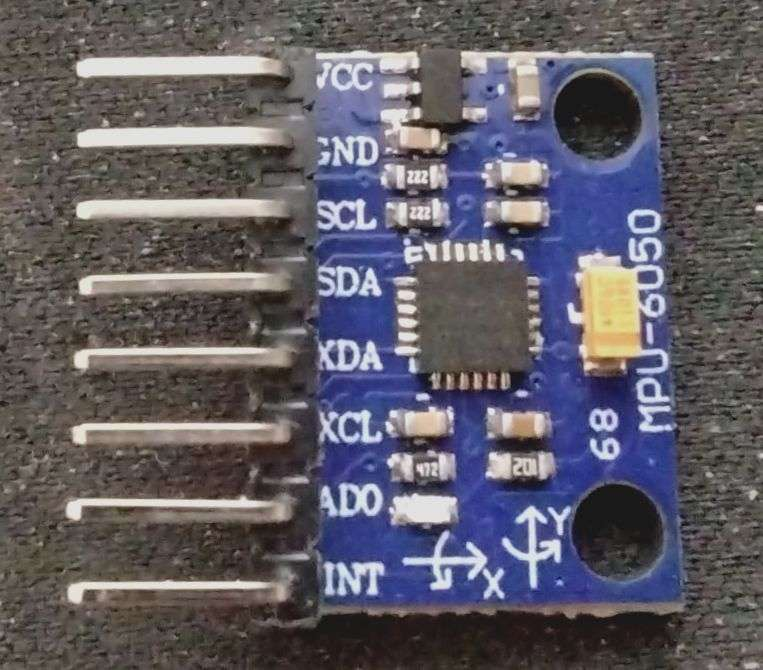
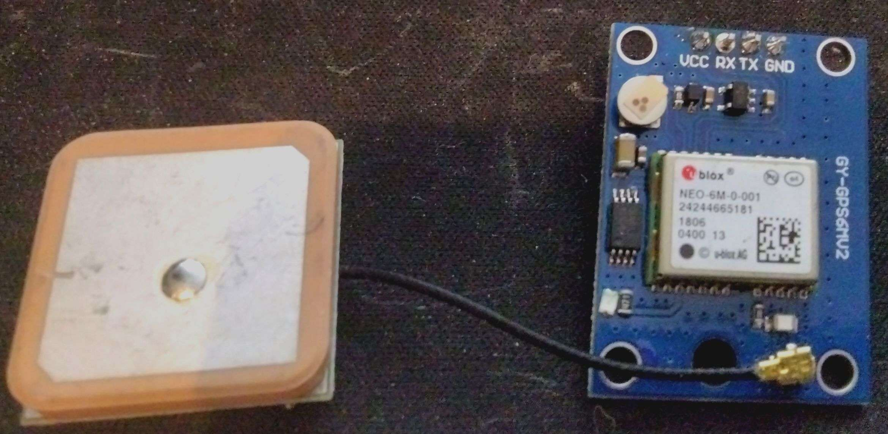
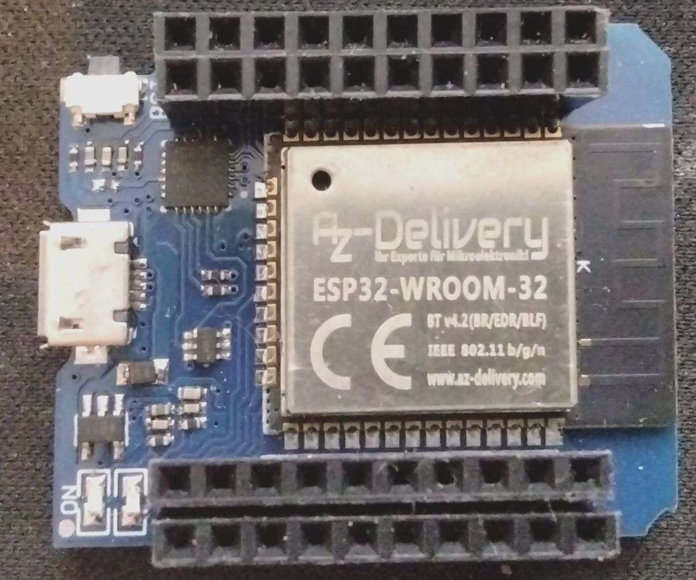
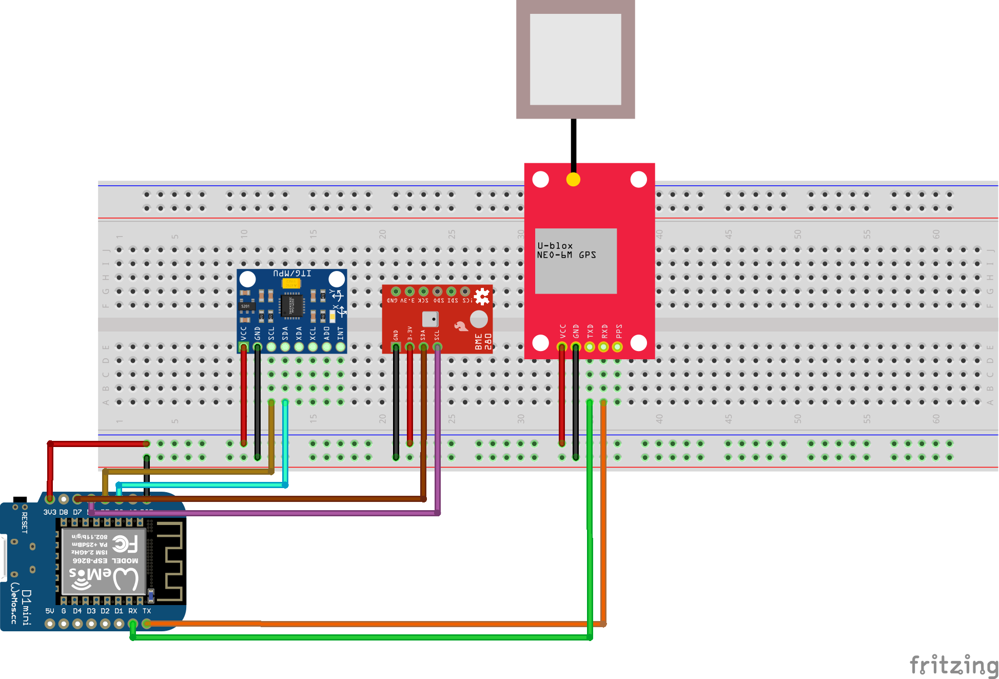
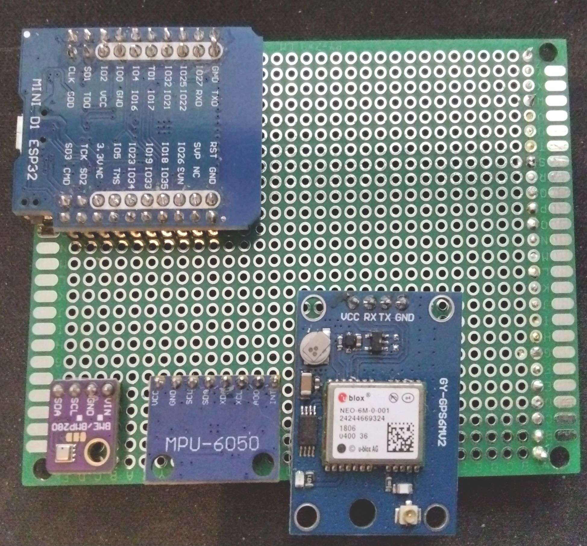

# Teilaufgabe Schüler Kampl

\textauthor{Maximilian Silvester Kampl}

## Theorie

### Eingebettete Systeme

Ein Eingebettetes System ist Teil eines viel größeren Systems wie z.B.: Handys, Autos, Waschmaschinen, usw..

Solche Systeme gibt es bereits seit den 1960. Damals baute der amerikanische Ingenieur Charles Stark Draper während des Apollo Raumprogrammes die erste integrierte Schaltung. Diese wurde dann auf dem Apollo Guidance Computer installiert um Flugdaten in Echtzeit sammeln zu können.
Später wurden Mikroprozessoren in der 1600 Serie von Volkswagen verwendet um das Kraftstoffeinspritzsystem zu steuern.
In den 70ern konnte Intel den ersten Prozessor entwickeln, welcher der Öffentlichkeit zugänglich war: den Intel 4004. Ein 4-Bit-Mikroprozessor, wlecher in Taschenrechnern und anderen kleineren elektronischen Geräte verwendet wurde.

Im Allgemeinen kann man sagen, dass ein Embedded System die Kombination von Software und Hardware ist für einen speziell programmierte Aufgabe. Obwohl man Es mit einem Computer gleichstellen kann, haben sie des öfteren keine Graphische Oberfläche für Benutzerinnen.
[vgl. @EmbeddedSystems]

#### Komponenten

Die Hauptkomponenten eines Embedded Systems sind ein Mikroprozessor oder ein Mikrocontroller. Während ein Mikroprozessor lediglich eine CPU enthält, umfasst ein Mikrocontroller zusätzlich Speicher, Peripheriegeräte, GPIOs, Flash-Speicher und viele weitere Komponenten.

![Aufbau eines Mikrocontrollers [@EmbeddedSystems]](img/Kampl/AufbauES.jpg){width=300px}

##### CPU

Die CPU (Central Processing Unit) ist die primäre Steuereinheit eines Systems. Sie besteht aus der ALU und der CU. Die ALU^[Arithmetic Logic Unit] ist der Teil der CPU, der arithmetisch-logische Operationen mit binären Daten ausführt. Die CU^[Control Unit] steuert mithilfe des internen Oszillators die Abläufe im System. Nachdem ein Befehl decodiert wurde, gibt die CU selbst weitere Befehle aus, um die korrekten Aktionen zu starten. Diese Befehle werden dann über den Bus aus dem Arbeitsspeicher abgerufen. [@EmbeddedSystems]

##### Bus

Der Bus verbindet die CPU mit den anderen Komponenten. Es gibt daher verschiedene Arten von Bussen, wie z. B. den Datenbus, den Adressbus und den Steuerbus. Je nach Prozessor können unterschiedlich viele Bits gleichzeitig übertragen werden.

	
Des weiteren kann mann Busse noch in 2 Typen nach der Breite aufteilen:

1. Parallel: Beim parallelen System gibt es mehrere Leitungen welche gleichzeitig Daten verschicken wodurch die Busbreite viel höher ist.
2. Seriell: Serielle Systeme übertragen Daten bitweise über eine einzelne Leitung, also nacheinander. Ein serieller Bus kann synchron,taktsignalbasiert, oder asynchron, durch Steuerleitungen und Protokolle koordiniert, arbeiten. Während ältere serielle Busse oft langsamer als parallele waren, sind moderne serielle Bussysteme durch höhere Taktraten und verbesserte Protokolle meist leistungsfähiger und effizienter.
[@EmbeddedSystems]
 
##### Schnittstellen

- **SPI:**^[Serial Peripheral Interface] Eine synchrone serielle Schnittstelle, ideal für die Verbindung von Peripherigeräten.

    Es besteht aus den drei Leitungen POCI^[Peripheral Out/Controller In] oder auch MISO^[Master In/Slave Out], PICO/MOSI^[Peripheral In/Controller Out | Master Out/Slave In] und der Serial Clock. Außerdem dem gibt es noch den Slave-Select, aber da dies ein äußerst problematischer Außdruck ist, nennt man es heutzutage Chip-Select. Die Chip-Select Leitung sorgt dafür, dass der Controller ein Peripherigerät zur Kommuniaktion auswählt.

    Bei der SPI-Kommunikation gibt es keinen klaren Sender oder Empfänger, sondern einen kontinuierlichen Austausch, da sowohl die Peripherie als auch der Controller gleichzeitig ein Bit übertragen. Die Peripherie steuert die Kommunikation, indem sie die SCK-Impulse generiert, während der Controller das Signal annimmt und verarbeitet. Selbst wenn noch kein Ergebnis vorliegt, misst die Peripherie die Polarität der PICO/MOSI-Leitung und bestimmt daraus das nächste Bit.
    [@EmbeddedSystems]

    ![SPI-BUS-Grafik [@Serial-Peripheral-Interface-Grafik]](img/Kampl/SPI-single-slave.svg.png){width=400px} 
    
    ![SPI-Timerdiagramm [@Serielle-Schnittstellen]](img/Kampl/TimerDiagramm-SPI.png){width=400px}

- **UART:**^[Universal Asynchronous Receiver Transmitter] Asynchrone serielle Verbindung, die ohne externen Taktgeber arbeitet.

    UART ist eine serielle  Schnittstelle, die asynchron arbeitet. Sie wurde entwickelt,  um die Kommunikation zwischen digitalen Geräten zu ermöglichen, und wird häufig in  Mikrocontrollern, Computern und anderen elektronischen Geräten verwendet. Im Gegensatz zu synchronen Schnittstellen wie SPI oder I2C benötigt UART keine zusätzliche Taktleitung, sondern synchronisiert sich durch Start- und Stop-Bits. Der Datenaustausch erfolgt über zwei Leitungen, wobei ein Gerät als Sender und das andere als Empfänger fungiert.

    UART verwendet in der Regel zwei Hauptleitungen: TX^[Transmit] zum Senden und RX^[Receive] zum Empfangen von Daten. Zusätzlich können für die Hardware-Flow-Control weitere Leitungen genutzt werden, wie RTS^[Request to Send], mit dem der Sender signalisiert, dass er bereit ist, Daten zu übertragen, und CTS^[Clear to Send], das dem Sender anzeigt, dass der Empfänger bereit ist. 
    [@EmbeddedSystems]

    ![UART-Grafik [@UART-Grafik]](img/Kampl/UART-Grafik.png){width=400px} 

    ![UART-Timerdiagramm [@Serielle-Schnittstellen]](img/Kampl/UART-TimerDiagramm.png){width=400px} 

- **I2C:**^[Inter-Integrated Circuit] Serieller Zweidraht-Bus mit Master-Slave-Kommunikation.
        
    In einem I2C-Bus gibt es mindestens einen Master und bis zu 127 Slaves. Ein Bus mit mehreren Mastern wird als Multi-Master-Bus bezeichnet. Jeder Slave benötigt eine eigene 7- oder 10-Bit-Adresse, um individuell mit einem Master kommunizieren zu können. Zusätzlich gibt es eine Broadcast-Adresse, über die alle Slaves gleichzeitig angesprochen werden können. Wie bei SPI beginnt die Kommunikation erst, wenn der Master einen Slave adressiert. Anders als bei SPI wird jedoch festgelegt, ob gesendet oder empfangen wird. Die Übertragung erfolgt durch Start- und Stopp-Bedingungen, die der Master über die Zustände der Takt- und Datenleitung steuert. Nach einer erfolgreichen Kommunikation senden die Slaves ihre Adresse und im Schreibfall ein Acknowledge.
    [@EmbeddedSystems]

    ![I2C-BUS-Grafik [@I2C-Bus-Grafik]](img/Kampl/I2C-Grafik.gif){width=400px} 

    ![I2C-Timerdiagramm [@I2C-TimerDiagramm]](img/Kampl/I2C-TimerDiagramm.png){width=400px} 

##### RAM

RAM ist eine Art Speichertyp, in welchem die Speicherzellen direkt angesprochen werden. In
diesem Zusammenhang spricht man dann von *Speicher mit wahlfreiem Zugriff*. Das heißt RAM erlaubt den Zugriff jede Speicherzelle.
RAM wird als Arbeitsspeicher verwendet, weil es eine schnelle Verarbeitung vom
Prozessor garantiert. Im Grunde unterscheidet man zwischen zwei Arten von RAMs:

- **SRAM:**^[Static RAM] Der schnellere der zwei Ram-Typen. Er speichert seine Inahlte mittels Flip-Flops und benötigt deshalb auch keine Refreshes. Jedoch ist der Einsatz von Flip-Flops äußerst Stromaufwendig und zu dem auch noch teuer. Trotzdem wird aufgrund eben dieser Kippglieder der SRAM häufig als Cache oder Puffer eingesetzt, da der Inhalt nach dem Abruf immer noch erhalten bleibt.
- **DRAM:**^[Dynamic RAM] Die einfache und billigere Variante. Der DRAM benutzt Kondensatoren als Speicherelement. Dabei muss über sogenannte Refreshes immer wieder die Spannung neugeladen werden wodurch der komplette Prozess langsamer wird. Jedoch hat er ingegensatz zum SRAM einen geringeren Stromverbrauch.
[@RAM-Zusatzmaterial]

##### ROM

Wie der RAM ist auch der ROM eine Art Speicher. ROM-Speicher holt sich den Befehlscode direkt aus den Programmspeicher. Der große Unterschied zu anderen Speicherarten ist das der ROM, meist, nur lesenden Zugriff erlaubt und nicht löschbar ist, daher auch der Name **Read Only Memory**.

- **PROM** ^[Programmable Read-Only Memory]: Dieser Speichertyp kann nur einmal beschrieben werden. Beim Programmieren werden selektiv Sicherungen durchgebrannt, sodass die gespeicherten Daten nicht mehr verändert werden können.  

- **EPROM** ^[Erasable Programmable Read-Only Memory]: Dieser Speicher kann mit UV-Licht gelöscht werden. Dazu ist ein spezielles Quarzfenster erforderlich, durch das das UV-Licht die Speicherzellen erreicht und löscht, sodass der Speicher erneut beschrieben werden kann.  

![EPROM [@EPROM]](img/Kampl/EPROM.jpg){width=300px} 

- **OTP-EPROM** ^[One-Time Programmable EPROM]: Eine spezielle Variante des EPROM, die nicht mit UV-Licht gelöscht werden kann. Das liegt daran, dass der Speicher in ein lichtundurchlässiges Gehäuse eingeschweißt ist, wodurch ein erneutes Löschen verhindert wird.  

- **Flash**: Elektronisch lösch- und beschreibbarer Speicher, der in Blöcken oder einzelnen Sektoren selektiv gelöscht werden kann. Während das Schreiben und Löschen relativ langsam ist, erfolgt das Lesen sehr schnell. Flash-Speicher ersetzt zunehmend traditionelle ROM-Typen.  

![FLASH [@FLASH]](img/Kampl/Flash.png){width=300px} 

- **EEPROM** ^[Electrically Erasable Programmable Read-Only Memory]: Dieser Speicher kann elektrisch gelöscht und erneut beschrieben werden. Er wird oft für kleine, nichtflüchtige Datenspeicher wie Seriennummern oder MAC-Adressen in elektrischen Geräten verwendet. EEPROMs benötigen im Vergleich zu Flash-Speichern weniger Pins und werden meist seriell beschrieben. 
 
[vgl. @EmbeddedSystems]

##### Register

Register sind temporäre Speicher, die teils festgelegte Verwendungszwecke (z. B. Befehls- oder Statusregister) haben und teils für allgemeine Aufgaben genutzt werden.

##### Peripherie
- **GPIO** ^[General Purpose Input/Output]: GPIO-Pins sind flexibel nutzbare Ein- und Ausgänge eines Mikrocontrollers. Sie können als digitale Eingänge zur Erfassung von Tasterzuständen oder Sensordaten sowie als digitale Ausgänge zur Steuerung von LEDs, Motoren oder anderen Komponenten genutzt werden. Manche GPIOs verfügen über zusätzliche Funktionen, wie ADC-Eingänge oder Timer-Steuerung.  

- **Timer:** Das Timer-Modul dient zur Überwachung und Steuerung zeitkritischer Prozesse. Es kann als einfacher Zähler, zur Erzeugung von PWM-Signalen oder zur Zeitmessung verwendet werden. Timer-Interrupts ermöglichen präzise Steuerungen in Echtzeitanwendungen.  

- **Watchdog:** Der Watchdog-Timer erhöht die Sicherheit eines Systems, indem er einen automatischen Neustart auslöst, wenn das System nicht in regelmäßigen Abständen auf ihn reagiert. Dies verhindert ein Hängenbleiben oder Blockieren der Software und sorgt für eine höhere Zuverlässigkeit in Embedded-Systemen. Umgangssprachlich wird er als Totmansschalter bezeichnet.

- **DMA** ^[Direct Memory Access]: Der Direct Memory Access ermöglicht es Peripheriegeräten, Daten direkt mit dem Speicher auszutauschen, ohne die CPU zu belasten. Dies beschleunigt den Datentransfer erheblich, insbesondere bei großen Datenmengen wie Audio- oder Videodaten, und verbessert die Gesamtleistung des Systems.  
[vgl. @EmbeddedSystems]

##### Firmware

Die Firmware ist eine softwarebasierte Komponente, die fest in einem elektronischen Gerät implementiert ist und auf einem nicht-flüchtigen Speicher abgelegt wird (z. B. Flash oder EEPROM). Sie verbindet Hardware mit der Anwendungssoftware.

##### Recheneinheit

- **General-Purpose-Prozessoren:** Vielseitig einsetzbar und mit hoher Rechengeschwindigkeit ausgestattet. Sie verfügen über mehrschichtige Caches und sind für allgemeine Anwendungen optimiert, weisen jedoch keine integrierte Peripherie (wie Timer oder umfangreichen Speicher) auf, was sie weniger spezialisiert macht.

- **Mikrocontroller:** In einem einzigen Chip vereint ein Mikrocontroller CPU, Speicher und Peripherieelemente (wie Bus-Treiber, PWM-Units, A/D- und D/A-Wandler). Diese enge Integration ermöglicht eine optimale Anpassung an spezifische Aufgaben in Embedded Systems, oft sogar ohne die Notwendigkeit eines externen Taktgebers, da interne Taktgeneratoren zur Verfügung stehen.
[vgl. @EmbeddedSystems]

- **Digitale Signalprozessoren (DSPs)** ^[Digitale Signalprozessoren]: Optimiert für die Echtzeit-Signalverarbeitung, bieten DSPs einen erweiterten Befehlssatz und spezielle Hardwareeinheiten – etwa Multiply-Accumulate-Einheiten (MAC) – zur effizienten Durchführung rechenintensiver Operationen, was sie ideal für Audio-, Video- und Kommunikationsanwendungen macht.

- **ASICs** ^[Application Specific Integrated Circuits]: Diese speziell für bestimmte Anwendungen entwickelten Chips sind hinsichtlich Geschwindigkeit, Energieeffizienz, Baugröße und Zuverlässigkeit hoch optimiert. Ihre unflexible Natur und die hohen Kosten bei Entwicklung und Fertigung in kleinen Stückzahlen machen sie vor allem für Massenfertigung wirtschaftlich.

- **FPGAs** ^[Field-Programmable Gate Arrays]: Programmierbare Hardwarebausteine, die vor der Verwendung nicht auf ein konkretes Verhalten festgelegt sind. FPGAs lassen sich mehrfach rekonfigurieren, was sie besonders in der Entwicklung (z. B. als Testumgebung für ASICs) attraktiv macht – wenngleich sie im Vergleich zu spezialisierten Mikrocontrollern oft teurer sind und bei gleicher Technologie eine etwas geringere Performance bieten.

#### Zusätzliche Module

- **A/D- und D/A-Wandler:**^[Analog/Digital & Digital/Analog Wandler] Ermöglichen die Umwandlung zwischen analogen und digitalen Signalen. Wichtig für Sensoranwendungen.
- **PWM:**^[Pulsweitenmodulation] Steuerung von LEDs, Motoren oder anderen Aktoren durch variable Einschaltdauer eines Signals.


### Sensoren

In unserem Projekt werden drei Sensoren verwendet, der BME280, welcher die Temperatur, den Lufdruck sowie die Luftfeuchtigkeit misst, der MPU6050 ein Beschleunigungs und Geschwindigkeits Senor und der GY-NEO6MV2-Sensor, welcher die Position des Gerätes mittels GPS^[Global Positioning System] herausfindet.


#### Temperatur - Widerstandsthermometer

Der BME280 verwendet intern einen sogenannten Widerstandstemperatursensor. Diese Art von Sensor verändert seinen elektrischen Widerstand in Abhängigkeit von der Umgebungstemperatur. Durch die Messung der Widerstandsänderungen kann die Temperatur präzise erfasst und anschließend in digitale Signale umgewandelt werden.
[vgl. S.259 @Automatisierungs-Technik]

#### Luftdruck - Piezoresistives-Drucksensor

Außerdem verwendet er intern einen piezoresistiven Drucksensor. Diese Art von Sensor enthält eine flexible Membran, die sich je nach Luftdruck verformt. Durch die Verformung ändert sich der Widerstand in der piezoresistiven Schicht, die auf der Membran aufgebracht ist. Diese Widerstandsänderung wird erfasst, in ein elektrisches Signal umgewandelt und anschließend digitalisiert. Mithilfe der im Sensor gespeicherten Kalibrierungsdaten liefert der BME280 präzise Druckmesswerte
[vgl. S.255 @Automatisierungs-Technik]


#### Luftfeuchtigkeit - Kapazitives-Hygrometer

Des weiteren verwendet der BME intern einen kapazitiven Feuchtigkeitssensor. Diese Art von Sensor nutzt die Eigenschaft, dass sich die Kapazität eines elektrischen Kondensators ändert, wenn sich der Feuchtigkeitsgehalt der Umgebungsluft verändert. Diese Kapazitätsänderung wird gemessen, in elektrische Signale umgewandelt und anschließend digitalisiert. Durch die im Sensor gespeicherten Kalibrierungsdaten werden präzise Messwerte für die relative Luftfeuchtigkeit bereitgestellt.
[@Kapazitive-Feuchtemessung]

{width=400px}

#### Beschleunigung - Accelerometer

Der MPU6050 verwendet intern einen 3-Achsen-Beschleunigungssensor, der auf der MEMS-Technologie (Micro-Electro-Mechanical Systems) basiert. Diese Art von Sensor beinhaltet winzige mechanisch bewegliche Strukturen, die auf einer festen Basis montiert sind. Wenn der Sensor einer Beschleunigung ausgesetzt wird, bewegen sich diese Strukturen relativ zur Basis, was eine Änderung der Kapazität zwischen diesen Strukturen zur Folge hat. Diese Kapazitätsänderung wird gemessen, in elektrische Signale umgewandelt und anschließend digitalisiert. So wird die Beschleunigung entlang der X-, Y- und Z-Achse präzise erfasst. [vgl. @MPU-6000]

{width=400px}

#### GPS

Das GY-NEO6MV2 verwendet ein satellitengestütztes System, um die Position auf der Erde zu bestimmen. Der Chip empfängt Signale von mehreren GPS-Satelliten und berechnet daraus die genaue Position. Dies geschieht in mehreren Schritten:

1. **Signalempfang**: Das Modul empfängt Signale von GPS-Satelliten, die Informationen über ihre Position und die aktuelle Zeit enthalten.
2. **Entfernungsberechnung**: Anhand der Laufzeit der Signale wird die Entfernung zu jedem Satelliten berechnet.
3. **Triangulation**: Mit den Entfernungsdaten von mindestens vier Satelliten wird die genaue Position (Längen- und Breitengrad) sowie die Höhe über dem Meeresspiegel bestimmt.
4. **Digitale Ausgabe**: Die berechneten Positionsdaten werden über die serielle Schnittstelle (UART) in einem standardisierten Format (NMEA) ausgegeben, das von Mikrocontrollern verarbeitet werden kann.

Das Modul verfügt über eine Keramikantenne für einen besseren Empfang.
[vgl. @GPS-Baudrate]

{width=400px}

### Prototyping mit dem EPS32
	
#### IDE

Um ein Programm erfolgreich auf dem ESP32 ausführen zu können, benötigt man eine geeignete IDE^[Integrated Development Environment]. Aber was genau ist eine IDE?

>Eine integrierte Entwicklungsumgebung (IDE) ist Software für eine optimierte Anwendungsentwicklung, die gängige Entwicklertools in einer zentralen grafischen Oberfläche vereint.
[@RedHatIDE]

Jede IDE enthält in der Regel ähnliche Standardkomponenten, darunter einen integrierten Code-Editor – also einen Texteditor mit Syntax-Highlighting und gegebenenfalls Autovervollständigung –, ein Programm zum Bauen und Kompilieren des Codes sowie einen Debugger. [vgl. @RedHatIDE]

##### Vorteile


**IDEs bieten viele Vorteile, die beim Schreiben von Code unterstützen.**

Während intelligente Code-Vervollständigung und -Generierung eher als *Nice-to-have*-Features gelten, gibt es echte Zeitersparnisse. Besonders das **Echtzeit-Parsen von Code** spart erheblich Zeit bei der Fehlersuche. Zudem beinhalten IDEs häufig Funktionen, die speziell auf eine Programmiersprache zugeschnitten sind.

Ein Beispiel dafür ist **IntelliJ**, eine von der Firma JetBrains entwickelte IDE, die speziell für Java konzipiert wurde. Sie bietet unter anderem folgende Funktionen:

- **Generierung ganzer POJO-Klassen** per Knopfdruck
- **Herunterladen von JDKs**^[Java Development Kit]
- **Darstellung von Dokumentationen** als Kommentaren im Fließtext


#### PlatformIO

Eine der bekanntesten und am weitesten verbreiteten Entwicklungsumgebungen für Mikrocontroller ist die Arduino IDE. Allerdings stießen wir bei unserem Projekt auf Anforderungen, die mehr Kontrolle über den Entwicklungs- und Upload-Prozess erforderten. Daher entschieden wir uns für eine professionellere und flexiblere Lösung: PlatformIO.

{width=400px}

{width=500px}


PlatformIO ist eine Entwicklungsumgebung, die als Erweiterung für den Texteditor Visual Studio Code genutzt wird. Sie bietet eine bessere Projektstruktur, eine fortschrittlichere Konfigurationsverwaltung und umfangreiche Unterstützung für verschiedene Mikrocontroller. Zwei zentrale Elemente sorgen dabei für einen reibungslosen Ablauf: die Hauptdatei (Main-File) und die Plattform-Konfigurationsdatei (.ini-File). Besonders die .ini-Datei spielt eine entscheidende Rolle, da sie die Projektkonfiguration festlegt und sicherstellt, dass der Upload-Prozess auf den Mikrocontroller zuverlässig und ohne Komplikationen funktioniert.

```{caption="Beispiel einer .ini Datei für ein PlatformIO Projekt" .ini}
    ; PlatformIO Project Configuration File
    ;
    ;   Build options: build flags, source filter
    ;   Upload options: custom upload port, speed and extra flags
    ;   Library options: dependencies, extra library storages
    ;   Advanced options: extra scripting
    ;
    ; Please visit documentation for the other options and examples
    ; https://docs.platformio.org/page/projectconf.html

    [env:board_name]
    platform = platform_name
    board = board_name
    framework = framework_name

    ; Zusätzliche Konfigurationsoptionen
    monitor_speed = 115200   ; Serielle Monitor-Geschwindigkeit
    upload_speed = 115200    ; Upload-Geschwindigkeit
    build_flags = -DDEBUG    ; Build-Flags hinzufügen
    lib_deps =               ; Bibliotheken hinzufügen
        library1
        library2
```

[@gpt-inifile]

##### Aufsetzen

Um PlatformIO benutzen zu können muss man die *PlatformIO IDE* in Visual Studio Code installieren. Nach der Installation und einem Neustart kann man ein erstes Projekt erstellen.

Um nun ein erstes Projekt zu erstellen muss mann einfach nur auf den PlatformIO Home Knopf drücken. Danach drückt man auf *New Project* und wählt das passende Board aus. [@PlatformIO-firststeps]

##### Tools

![Toolbar von PlatformIO [@PlatformIO-firststeps]](img/Kampl/platformio-ide-vscode-toolbar.png){width=500px}

1. **Home**: sorgt dafür, dass das Home Menü von PlatformIO. In diesem kann man seine Projekte verwalten sowie Bibiliothekten für das aktuelle hinzufügen.
2. **Build**: Kompiliert den Code des Projekts und erstellt eine Datei welche auf den Mikrocontroller hochgeladen werden kann.
3. **Upload**: Lädt die erstellte Datei von der Build Funktion auf das Festgelegte Zielgerät, in unseren Fall ein ESP32, hoch.
   1. Zuerst sucht PlatformIO nach richtigen Port. Entweder in der .ini-Datei festgelegt oder er wird automatisch erkannt.
   2. Die Firmware (.bin oder .hex Datei) wird auf das Gerät über den Port hochgeladen.
   3. Während des Uploads wird jeglicher Fortschritt im Terminal angezeigt.
4. **Clean**: Löscht alle temporären Dateien, welche  beim Build-Prozess erstellt wurden. (z.B.: kompilierte Objektdateien, die Firmware-Datei). Im Grunde wird der /.pio Ordner gelöscht.
5. **Serial Port Monitor**: Öffnet eine Konsole innerhalb von Visual Studio, welche die Kommunikation zwischen dem ESP32 und dem Computer überwacht. Wichtig dabei ist zu beachten das die Baudrate richtig eingestellt ist. Übliche Baudraten sind 9600 sowie 115200. (Baud 8-N-1 --> Ein Starbit, 8 Datenbits-Kein Paritätsbit-1 Stoppbit)
6. **Core (CLI)**: Ist eine Kommandozeilen-Toolbox, welche die vorher genannten Funktionen anbietet.
7. **Project Environment Switcher**: Erlaubt es zwischen verschiedenen Umgebungen innerhalb eines Projektes zu wechseln, falls sie vorhanden sind. Diese Umgebungen werden in der platformio.ini Datei angelegt. Das könnte ungefähr so aussehen:

```{caption="Beispiel Von Mehreren Umgebungen in PlatfromIO" .ini}
[env:esp32]
platform = espressif32
board = esp32dev
framework = arduino

[env:stm32]
platform = ststm32
board = nucleo_f401re
framework = mbed
```
[@PlatformIO-firststeps]

### Programmieren

Da wir nun eine vollständig funktionsfähige Entwicklungsumgebung besitzen und auch wissen, wie man diese einsetzt, können wir mit der tatsächlichen Programmierung starten. Wir verbinden den ESP32 mit unserem Computer oder Laptop über ein USB-Kabel und schreiben unsere ersten Code-Snippets, um zu testen, ob der Mikrocontroller ordnungsgemäß funktioniert.


```{caption="BME Testprogramm" .cpp}
// TestProgramm
void setup() {
  // Seriellen Monitor mit Baudrate 115200 starten
  Serial.begin(115200);
  Serial.println("ESP32 LED-Blinktest gestartet!");

  // LED-Setup (Standardmäßig GPIO 2 für die Onboard-LED)
  pinMode(LED_BUILTIN, OUTPUT);
}

void loop() {
  // LED ein
  Serial.println("LED AN");
  digitalWrite(LED_BUILTIN, HIGH);
  delay(500);

  // LED aus
  Serial.println("LED AUS");
  digitalWrite(LED_BUILTIN, LOW);
  delay(500);
}
```


Jetzt, da wir wissen, dass unser Gerät funktioniert, können wir mit der weiteren Entwicklung beginnen. Zuerst sollten wir jeden einzelnen Sensor separat ansprechen, um auch hier zu testen, ob die Sensoren funktionieren. Ein Schritt nach dem anderen.

#### BME280 als Temperatur, Luftdruch und Luftfeuchtigkeits Sensor

Zuvor müssen wir jedoch einige Bibliotheken hinzufügen damit wir den BME280 einfacher ansprechen können. Die verbreitetste Bibliothek ist die **Adafruit BME280 Library**. Man fügt sie dem Projekt hinzu indem man etweder man die folgende Zeile ```adafruit/Adafruit BME280 Library@^2.2.4``` unter dem Punkt **lib_deps** in der .ini-Datei hinzufügt, oder indem man PlatformIO verwendet, um die Library automatisch hinzuzufügen. Sie dient als Schnittstelle für den Sensor.

{width=500px}

Am Ende verwenden wir folgenden Code für unseren Sensor:

```{caption="BME Testprogramm" .cpp}
#include <Wire.h>
#include <Adafruit_Sensor.h>
#include <Adafruit_BME280.h>

#define SEALEVELPRESSURE_HPA (1013.25)

Adafruit_BME280 bme; 

unsigned long delayTime;

void printValues();

void setup() {
    Serial.begin(115200);
    Serial.println(F("BME280 test"));

    
    if (!bme.begin(0x76)) {
        Serial.println("Could not find a valid BME280 sensor, check wiring, address, sensor ID!");
        Serial.print("SensorID was: 0x"); Serial.println(bme.sensorID(),16);
        Serial.print("        ID of 0xFF probably means a bad address, a BMP 180 or BMP 085\n");
        Serial.print("   ID of 0x56-0x58 represents a BMP 280,\n");
        Serial.print("        ID of 0x60 represents a BME 280.\n");
        Serial.print("        ID of 0x61 represents a BME 680.\n");
        while (1) delay(10);
    }
    
    Serial.println("-- Default Test --");
    delayTime = 1000;

    Serial.println();
}


void loop() { 
    printValues();
    delay(delayTime);
}


void printValues() {
    Serial.print("Temperature = ");
    Serial.print(bme.readTemperature());
    Serial.println(" C");

    Serial.print("Pressure = ");

    Serial.print(bme.readPressure() / 100.0F);
    Serial.println(" hPa");

    Serial.print("Approx. Altitude = ");
    Serial.print(bme.readAltitude(SEALEVELPRESSURE_HPA));
    Serial.println(" m");

    Serial.print("Humidity = ");
    Serial.print(bme.readHumidity());
    Serial.println(" %");

    Serial.println();
}

```
[@BME280-Test]

##### Erklärung

Dieses Programm liest die Daten welche der BME280 Sensor bekommt aus der I2C Schnittstelle aus und bereit sie über Print-Statements schnön leserlich auf.

***Bibliotheken***

```{caption="Dependencies BME" .cpp}
#include <Wire.h>
#include <Adafruit_Sensor.h>
#include <Adafruit_BME280.h>
```

[@BME280-Test]

Dieser Teil zeigt die bereits vorhin Beschriebenen Bibliotheken mit einer zusätzlichen der **Wire-Library**. Dies ist eine Standardmäßige enthaltene Bibliothek und ermöglicht erst die I2C Kommunikation.

***Definitionen und Variablen***

```{caption="Definition und Variablen BME" .cpp}
#define SEALEVELPRESSURE_HPA (1013.25)

Adafruit_BME280 bme; 

unsigned long delayTime;

void printValues();
```

[@BME280-Test]

1. **SEALEVELPRESSURE_HPA**: Ist eine Konstante welche den Standardluftdruck auf Meereshöhe annimmt.
2. **bme**: ist ein Instanz des Objektes Adafruit_BME280 und stellt den Sensor dar.
3. **delayTime**: Ist eine Varible welche für einen delay verwendet wird.
4. **void printValues()**: Ist eine Vorwärtsdeklarierte Funktion. 

***Setup***

```{caption="Setup BME" .cpp}
void setup() {
    Serial.begin(115200);
    Serial.println(F("BME280 test"));

    
    if (!bme.begin(0x76)) {
        Serial.println("Could not find a valid BME280 sensor, check wiring, address, sensor ID!");
        Serial.print("SensorID was: 0x"); Serial.println(bme.sensorID(),16);
        Serial.print("        ID of 0xFF probably means a bad address, a BMP 180 or BMP 085\n");
        Serial.print("   ID of 0x56-0x58 represents a BMP 280,\n");
        Serial.print("        ID of 0x60 represents a BME 280.\n");
        Serial.print("        ID of 0x61 represents a BME 680.\n");
        while (1) delay(10);
    }
    
    Serial.println("-- Default Test --");
    delayTime = 1000;

    Serial.println();
}
```

[@BME280-Test]

Das Setup ist im Grunde der wichtigste Teil, da es alle wichtigen Variablen, Modi usw. intialisiert. Es selbst ist hier in drei Teile eingeteilt:

1. **Serial.begin(115200)**: Hier wird die auf 115200 gestellt damit der serielle Monitor und der Sensor kommunizieren können.
2. **if(!bme.begin(0x76))**: Hier wird der Sensor mit der Adresse 0x76 , wie im Datenblatt beschrieben, initialisiert. [@BME280-Datasheet]
3. **Fehlerbehandlung**: Falls der BME280 nicht gefunden wird oder nicht initialisiert werden kann kommt es zur Fehlerbehandlung und wenn nicht dann geht es weiter in den

***Loop***

```{caption="Loop Funktion des BME Programms" .cpp}
void loop() { 
    printValues();
    delay(delayTime);
}
```

[@BME280-Test]

Wie der Name schon verrät wird der Loop immer wieder ausgeführt. In diesem Fall hat der Loop die Funktionen `printValues()` welche nach jedem Durchlauf aufgerufen wird und `delay()`, mit der vorher erwähnten `delayTime`, welche nach jedem Loop eine Pause von einer Sekunde einlegt.

***Ausgabe***

```{caption="Ausgabe BME" .cpp}
void printValues() {
    Serial.print("Temperature = ");
    Serial.print(bme.readTemperature());
    Serial.println(" C");

    Serial.print("Pressure = ");
    Serial.print(bme.readPressure() / 100.0F);
    Serial.println(" hPa");

    Serial.print("Approx. Altitude = ");
    Serial.print(bme.readAltitude(SEALEVELPRESSURE_HPA));
    Serial.println(" m");

    Serial.print("Humidity = ");
    Serial.print(bme.readHumidity());
    Serial.println(" %");

    Serial.println();
}
```

[@BME280-Test]

Dieser Teil des Codes gibt die Messwerte auf dem Serial Monitor, in einer aufpolierten Version aus. Der Grund für die Ausgabe ist meist Debugging.

 {width=500px}

#### MPU6050 als Beschleunigungssensor

Um nun auf diesen Sensor zugreifen zu können werden wieder einige Bibliotheken benötigt welche man wieder in der Ini-Datei hinzufügen muss. Über die Unified Sensor Library wurde schon geschrieben neu ist die ```adafruit/Adafruit MPU6050 @ ^2.0.3``` Library welche die verbindung zum Beschleunigungsensor vereinfacht.

Um nun tatsächlich Daten vom Sensor zu bekommen benutzt man folgendes Programm

```{caption="MPU Beispiel" .cpp}
// Basic demo for accelerometer readings from Adafruit MPU6050

#include <Adafruit_MPU6050.h>
#include <Adafruit_Sensor.h>
#include <Wire.h>

Adafruit_MPU6050 mpu;

void setup(void) {
  Serial.begin(115200);
  while (!Serial)
    delay(10); // will pause Zero, Leonardo, etc until serial console opens

  Serial.println("Adafruit MPU6050 test!");

  // Try to initialize!
  if (!mpu.begin()) {
    Serial.println("Failed to find MPU6050 chip");
    while (1) {
      delay(10);
    }
  }
  Serial.println("MPU6050 Found!");

  mpu.setAccelerometerRange(MPU6050_RANGE_8_G);
  Serial.print("Accelerometer range set to: ");
  switch (mpu.getAccelerometerRange()) {
  case MPU6050_RANGE_2_G:
    Serial.println("+-2G");
    break;
  case MPU6050_RANGE_4_G:
    Serial.println("+-4G");
    break;
  case MPU6050_RANGE_8_G:
    Serial.println("+-8G");
    break;
  case MPU6050_RANGE_16_G:
    Serial.println("+-16G");
    break;
  }
  mpu.setGyroRange(MPU6050_RANGE_500_DEG);
  Serial.print("Gyro range set to: ");
  switch (mpu.getGyroRange()) {
  case MPU6050_RANGE_250_DEG:
    Serial.println("+- 250 deg/s");
    break;
  case MPU6050_RANGE_500_DEG:
    Serial.println("+- 500 deg/s");
    break;
  case MPU6050_RANGE_1000_DEG:
    Serial.println("+- 1000 deg/s");
    break;
  case MPU6050_RANGE_2000_DEG:
    Serial.println("+- 2000 deg/s");
    break;
  }

  mpu.setFilterBandwidth(MPU6050_BAND_21_HZ);
  Serial.print("Filter bandwidth set to: ");
  switch (mpu.getFilterBandwidth()) {
  case MPU6050_BAND_260_HZ:
    Serial.println("260 Hz");
    break;
  case MPU6050_BAND_184_HZ:
    Serial.println("184 Hz");
    break;
  case MPU6050_BAND_94_HZ:
    Serial.println("94 Hz");
    break;
  case MPU6050_BAND_44_HZ:
    Serial.println("44 Hz");
    break;
  case MPU6050_BAND_21_HZ:
    Serial.println("21 Hz");
    break;
  case MPU6050_BAND_10_HZ:
    Serial.println("10 Hz");
    break;
  case MPU6050_BAND_5_HZ:
    Serial.println("5 Hz");
    break;
  }

  Serial.println("");
  delay(100);
}

void loop() {

  /* Get new sensor events with the readings */
  sensors_event_t a, g, temp;
  mpu.getEvent(&a, &g, &temp);

}
```
[@MPU6050-Test]

##### Erklärung

Dieses Programm liest die Daten welche der MPU6050 Sensor bekommt aus der I2C Schnittstelle aus und bereit sie über Print-Statements schnön leserlich auf.

***Bibliotheken***

```{caption="Dependencies MPU" .cpp}
#include <Wire.h>
#include <Adafruit_Sensor.h>
#include <Adafruit_MPU6050.h>
```

[@MPU6050-Test]

Dieser Teil zeigt die bereits beschreibt die schon beim BME beschriebenen Bibliotheken + der MPU Bibliothek.

***Definitionen und Variablen***

```{caption="Definition und Variablen MPU" .cpp}
Adafruit_MPU6050 mpu;
```

2. **mpu**: ist ein Instanz des Objektes Adafruit_MPU6050 und stellt den Sensor dar.

***Setup***

```{caption="Setup MPU" .cpp}
void setup(void) {
  Serial.begin(115200);
  while (!Serial)
    delay(10); // will pause Zero, Leonardo, etc until serial console opens

  Serial.println("Adafruit MPU6050 test!");

  // Try to initialize!
  if (!mpu.begin()) {
    Serial.println("Failed to find MPU6050 chip");
    while (1) {
      delay(10);
    }
  }
  Serial.println("MPU6050 Found!");

  mpu.setAccelerometerRange(MPU6050_RANGE_8_G);
  Serial.print("Accelerometer range set to: ");
  switch (mpu.getAccelerometerRange()) {
  case MPU6050_RANGE_2_G:
    Serial.println("+-2G");
    break;
  case MPU6050_RANGE_4_G:
    Serial.println("+-4G");
    break;
  case MPU6050_RANGE_8_G:
    Serial.println("+-8G");
    break;
  case MPU6050_RANGE_16_G:
    Serial.println("+-16G");
    break;
  }
  mpu.setGyroRange(MPU6050_RANGE_500_DEG);
  Serial.print("Gyro range set to: ");
  switch (mpu.getGyroRange()) {
  case MPU6050_RANGE_250_DEG:
    Serial.println("+- 250 deg/s");
    break;
  case MPU6050_RANGE_500_DEG:
    Serial.println("+- 500 deg/s");
    break;
  case MPU6050_RANGE_1000_DEG:
    Serial.println("+- 1000 deg/s");
    break;
  case MPU6050_RANGE_2000_DEG:
    Serial.println("+- 2000 deg/s");
    break;
  }

  mpu.setFilterBandwidth(MPU6050_BAND_21_HZ);
  Serial.print("Filter bandwidth set to: ");
  switch (mpu.getFilterBandwidth()) {
  case MPU6050_BAND_260_HZ:
    Serial.println("260 Hz");
    break;
  case MPU6050_BAND_184_HZ:
    Serial.println("184 Hz");
    break;
  case MPU6050_BAND_94_HZ:
    Serial.println("94 Hz");
    break;
  case MPU6050_BAND_44_HZ:
    Serial.println("44 Hz");
    break;
  case MPU6050_BAND_21_HZ:
    Serial.println("21 Hz");
    break;
  case MPU6050_BAND_10_HZ:
    Serial.println("10 Hz");
    break;
  case MPU6050_BAND_5_HZ:
    Serial.println("5 Hz");
    break;
  }

  Serial.println("");
  delay(100);
}
```
[@MPU6050-Test]


1. **Serial.beginn(115200)**: Hier wird die auf 115200 gestellt damit der serielle Monitor und der Sensor kommunizieren können.
2. **if (!mpu.begin())**: Hier wird der Sensor initialisiert.
3. **mpu.setAccelerometerRange(MPU6050_RANGE_8_G)**: Ist die Auflösung des Beschleunigungssensor, also in welchen Bereich, und wie genau, gemessen wird. Desto kleiner der G-Wert^[Erdbeschleunigung] desto genauer die Auflösung und desto kleiner der Messbereich.

| G-Bereich | Max. Messwert    |
|-----------|-----------------|
| ±2G      |  19,62 m/s²     |
| ±4G      |  39,24 m/s²     |
| ±8G      |  78,48 m/s²     |
| ±16G     |  156,96 m/s²    | 

4. **mpu.setGyroRange(MPU6050_RANGE_500_DEG)**: Dieser Teil setzt den Messbereich des Gyroskops fest. Um genauer zu sein in diesen fall auf +-500 Grad/Sekunde. Auch hier gilt das Prinzip wieder, je größer der Bereich desto kleiner die Auflösung.

| Konstantenname               | Messbereich            |
|------------------------------|------------------------|
| ```MPU6050_RANGE_250_DEG```      | ±250 °/s               |
| ```MPU6050_RANGE_500_DEG```      | ±500 °/s (gesetzt)     |
| ```MPU6050_RANGE_1000_DEG```    | ±1000 °/s              |
| ```MPU6050_RANGE_2000_DEG```    | ±2000 °/s              |

5. **mpu.setFilterBandwidth(MPU6050_BAND_21_HZ)**: Hier wird die Brandweite angepasst um einzustellen Welche werte der Sensor misst und welche er nur als Rauschen wahrnimmt.


***Loop***

```{caption="Loop Funktion des MPU Sensors" .cpp}
void loop() { 
  sensors_event_t a, g, temp;
  mpu.getEvent(&a, &g, &temp);

  Serial.print("Acceleration X: ");
  Serial.print(a.acceleration.x);
  Serial.println(" m/s^2");
}
```

[@MPU6050-Test]

Der Loop ist eine grundlegende Struktur in Arduino-Sketches, die kontinuierlich ausgeführt wird, solange das Programm läuft. Hier ist eine detaillierte Erklärung der einzelnen Komponenten. 
**sensors_event_t a, g, temp**: Diese Zeile deklariert drei Variablen mit dem Typ sensors_event_t. Diese Variablen werden verwendet, um die Ereignisdaten für die Beschleunigung (a), die Drehgeschwindigkeit (g) und die Temperatur (temp) zu speichern.
**mpu.getEvent(&a, &g, &temp);**: Diese Funktion ruft die neuesten Sensordaten vom MPU6050-Sensor ab und speichert sie in den Variablen von vorher. 

Außerdem gibt der Loop wieder die Werte über Print-Statements aus um sie auf dem Serial Monitor sehen zu können.

{width=500px}

#### GY-GPSMV2 Sensor zur Bestimmung der Postition mittels GPS

Der letzte Sensor zur Realisierung ist das GPS-Modul GY-GPSMV2. Im Grunde werden für diesen Sensor keine weiteren Bibliotheken benötigt jedoch kommt dazu gleich noch mehr.
Um nun die GPS-Postion in seiner NMEA^[National Marine Electronics Association] Rohform auslesen zu können, greift man mit dem folgenden Programm auf die UART-Schnittstelle des Sensors zu.

```{caption="GY-GPSMV2 Test Programm mit Daten in Rohform" .cpp}
#define RXD2 16
#define TXD2 17

#define GPS_BAUD 9600

// Create an instance of the HardwareSerial class for Serial 2
HardwareSerial gpsSerial(2);

void setup(){
  // Serial Monitor
  Serial.begin(115200);
  
  // Start Serial 2 with the defined RX and TX pins and a baud rate of 9600
  gpsSerial.begin(GPS_BAUD, SERIAL_8N1, RXD2, TXD2);
  Serial.println("Serial 2 started at 9600 baud rate");
}

void loop(){
  while (gpsSerial.available() > 0){
    // get the byte data from the GPS
    char gpsData = gpsSerial.read();
    Serial.print(gpsData);
  }
  delay(1000);
  Serial.println("-------------------------------");
}
```
[@GPS-Testprogramm]


##### Erklärung

***Variablen für das GPS-Modul***

```{caption="GY-GPSMV2 Variablen" .cpp}
  #define RXD2 16
  #define TXD2 17
  #define GPS_BAUD 9600

  HardwareSerial gpsSerial(2);
```

1. **RXD2**: Ist eine Konstante, die den GPIO-Pin 16 für den Empfang von Daten definiert.  
2. **TXD2**: Ist eine Konstante, die den GPIO-Pin 17 für das Senden (TX) von Daten definiert.  
3. **GPS_BAUD**: Ist eine Konstante, die die Baudrate von 9600, wie im Datenblatt angegeben, für die Kommunikation mit dem Sensor festlegt. [@GPS-Baudrate]
4. **gpsSerial(2)**: Hier wird eeine Instanz des HardwareSerial Objektes auf UART-Port2 erstellt um mit dem Mikrocontroller zu kommunizieren

***Setup für das GPS-Modul***

```{caption="GY-GPSMV2 Setup" .cpp}
void setup(){
  // Serial Monitor
  Serial.begin(115200);
  
  // Start Serial 2 with the defined RX and TX pins and a baud rate of 9600
  gpsSerial.begin(GPS_BAUD, SERIAL_8N1, RXD2, TXD2);
  Serial.println("Serial 2 started at 9600 baud rate");
}
```

Wie auch schon bei den anderen Sensoren muss auch hier zuerst eine Baudrate, in diesen Fall 115200, für die Kommunikation initialisiert werden. Mithilfe von ```gpsSerial``` wird eine Serielle Verbindung zum GPS-Modul hersgestellt in welcher die Baudrate, die Standard-Konfiguration von 8-Datenbits, keine Parität, der Stoppbit und die zwei Schnittstellen übergeben werden. Desweiteren gibt es noch das Print-Statement um den Fortschritt auf dem Serial Monitor sehen zu können. 

***Loop Funktionen für das GPS-Modul (NMEA)***

```{caption="GY-GPSMV2 Test Programm mit Daten in Rohform" .cpp}
void loop(){
  while (gpsSerial.available() > 0){
    // get the byte data from the GPS
    char gpsData = gpsSerial.read();
    Serial.print(gpsData);
  }
  delay(1000);
  Serial.println("-------------------------------");
}
```

Die Loop Funktion für das GPS-Modul überprüft zuerst, ob Daten momentan verfügbar sind. Dies regelt sie mithilfe der While-Schleife: ```while (gpsSerial.available() > 0)```. Um nun die NMEA-Daten zu Printen, werden sie zuerst in einem char-Datentypen gespeichert und danach mittels ```Serial-print(gpsData);``` auf dem Serial Monitor ausgebene werden können.


***Loop Funktionen für das GPS-Modul (Aufbereitet)***

Das Proplem mit NMEA Daten ist, das sie unleserlich sind

![NMEA-Ausgabe [@GPS-Testprogramm]](img/Kampl/NMEA-Ausgabe.png){width=500px} 


Deshalb, benötigt man doch noch eine Bibliothek und zwar **TinyGPSPlus**. Man fügt wie immer diese Bibliothek in der Ini-Datei hinzu, diesesmal mit auf folgende Weise: ```mikalhart/TinyGPSPlus@^1.1.0```.

Danach wird der Code hierum erweitert:


```{caption="GY-GPSMV2 Erweiterung mit verarbeiteten Daten" .cpp}

TinyGPSPlus gps;

void loop() {
  // This sketch displays information every time a new sentence is correctly encoded.
  unsigned long start = millis();

  while (millis() - start < 1000) {
    while (gpsSerial.available() > 0) {
      gps.encode(gpsSerial.read());
    }
    if (gps.location.isUpdated()) {
      Serial.print("LAT: ");
      Serial.println(gps.location.lat(), 6);
      Serial.print("LONG: "); 
      Serial.println(gps.location.lng(), 6);
      Serial.print("SPEED (km/h) = "); 
      Serial.println(gps.speed.kmph()); 
      Serial.print("ALT (min)= "); 
      Serial.println(gps.altitude.meters());
      Serial.print("HDOP = "); 
      Serial.println(gps.hdop.value() / 100.0); 
      Serial.print("Satellites = "); 
      Serial.println(gps.satellites.value()); 
      Serial.print("Time in UTC: ");
      Serial.println(String(gps.date.year()) + "/" + String(gps.date.month()) + "/" + String(gps.date.day()) + "," + String(gps.time.hour()) + ":" + String(gps.time.minute()) + ":" + String(gps.time.second()));
      Serial.println("");
    }
  }
}
```

Die TinyGPSPlus bietet viele Funktionen zur leserlichen Darstellung der GPS-Daten. Die wichtigste von ihnen ist die  ```gps.encode()``` Funktionen welche die unleserlichen NMEA dekodiert und verarbeitet. Danach wird mithilfe eines IF-Statements darauf geachtet, ob sich die Position des Gerätes verändert hat ```if(gps.locaton.isUpdated())```. Und zum Schluss gibt es alle möglichen Daten, wie den Längen und Breitengrad, des Sensors aus.

### Datenübertragung

#### MQTT

> MQTT (Message Queuing Telemetry Transport) ist ein Nachrichtenprotokoll für eingeschränkte Netzwerke mit geringer Bandbreite und IoT-Geräte mit extrem hoher Latenzzeit. Da Message Queuing Telemetry Transport auf Umgebungen mit niedriger Bandbreite und hoher Latenz spezialisiert ist, ist es ein ideales Protokoll für die Machine-to-Machine-Kommunikation
[@Inray-GmbH]

MQTT wird häufig in IoT-Anwendungen^[Internet of Things] aufgrund eben dieser geringen benötigten Bandbreite verwendet, da es dadurch sehr zuverlässig arbeitet und selbst bei schlechter Netzwerkverbindung funktioniert.

Einige wichtige Begriffe im Zusammenhang mit MQTT sind

- **Publisher**: Der Sender, der Informationen oder Daten an den Broker schickt.
- **Subscriber**: Der Empfänger, der sich beim Broker anmeldet, um bestimmte Nachrichten zu erhalten.
- **Broker**: Ist ein Vermittler, zum Beispiel ein Server, welcher Nachrichten von Publishern/Sendern entgegennimmt und sie and Subscribern/Empfängern weiterleitet.
- **Topic**: Eine Art "Kategorien" in welchen Nachrichten veröffentlicht werden. Diese Kategorien können von von Empfänger abonniert werden um diese Nachrichten zu bekommen.

### WLAN-Mesh

Ein Mesh ist ein System/Netzwerk, welches aus mehreren WLAN-Zugangspunkten, sogenannten Access Points, besteht. Es sorgt dafür, dass diese Access Points eine lückenlose WLAN-Abdeckung zugesichert werden kann.

Um nun ein Mesh-Netzwerk nun aufbauen zu können muss man zuerst die einzelnen Knotenpunkte miteinander verbinden. Dabei ist immer mindestens einer dieser Punkte mit einem Router oder Modem verbunden um eine Verbindung mit dem Internet herzustellen. Die restlichen Knoten kommunizieren dann drahtlos untereinander. [vgl. @EK-WlanMesh]
Wenn nun ein Knoten Daten sendet werden sie von nächstgelegenen Knoten auch aufgenommen. Die Daten werden dann von Knoten zu Knoten weitergeleitet bis sie den Hauptknoten erreichen und zum Schluss im Internet landen. Dieser Prozess wird Hop-to-Hop Kommunikation genannt.[vgl. @Wikipedia-Hop]
Ein weiters wichtiges Merkmal eines Meshes ist, das sogenannte Seamless-Roaming. Dabei wechseln die einzelnen Knoten immer zu Access Point mit dem stärksten Signal ohne, dass die Verbindung unterbrochen wird. Des weiteren verfügt ein Mesh über eine Selbstheilungsfunktion. D.h.: Wenn ein Knotenpunkt, aus verschiedensten Gründen, ausfällt oder die Verbindung verliert, so sucht das System automatisch nach einer alternativen Route über andere Knotenpunkte um wieder eine stabile Verbindung aufzubauen.
[vgl. @EK-WlanMesh]

### Sonstiges

#### GitHub Actions

GitHub Actions ist ein Tool zur Automatisierung von Softwareprozessen wie dem Testen und Bereitstellen von Code. Ein zentrales Feature ist **CI/CD**^[Continuous Integration und Continuous Delivery/Deployment], das automatisch Code ändert und veröffentlicht. Nach erfolgreichem Abschluss aller Tests kann der neue Code automatisch ins Repository übertragen werden.

Actions haben noch viele weitere Funktionen da sie im Grunde eine Virtuelle Umgebung erschaffen in welcher Code ausgeführt werden kann.

Um einen **Workflow** zu erstellen, definiert man, in der vorher erstellten **YAML-Datei**, die folgende Elemente:

- **Event**: Der Auslöser des Workflows (z. B. ein neuer Code-Push).  
- **Jobs**: Die Aufgaben, die nach dem Event ausgeführt werden.  
- **Runner**: Die Umgebung, in der der Code läuft (z. B. Ubuntu, Windows, macOS).  
- **Steps & Actions**: Schritte innerhalb eines Jobs, die bestimmte Aktionen ausführen, wie z. B. das Testen oder Überprüfen des Codes.  


\newpage

## Praktische Arbeit

### Entwicklung des Prototypen

#### Benötigte Hardwarekomponenten

Um ein Projekt zu realisieren, bei dem Umweltdaten ausgelesen werden, benötigt man geeignete Komponenten, auf denen die Software zuverlässig läuft. Bei der Auswahl dieser Komponenten spielten mehrere Faktoren eine Rolle, darunter die Kosten, die Größe, die Anwendungsfälle sowie die Anzahl der verfügbaren Funktionen. Des weiteren ist zu beachten, dass die Diplomarbeit mehr ein *Proof of Concept* sein soll.

Unser finaler Prototyp sollte folgende physikalischen Messwerte erfassen können.

- Temperatur
- Luftfeuchtigkeit
- Luftdruck
- Beschleunigung und Geschwindigkeit
- Standortbestimmung mittels GPS
  - Breiten/- Längengrade
  - Meereshöhe

Nach sorgfältiger Abwägung haben wir uns schließlich für die folgenden Komponenten entschieden:

##### ESP32

  **Grund**: Der ESP32 ist ein leistungsstarker und kostengünstiger Mikrocontroller mit integrierter WLAN- und Bluetooth Funktionalität. Er bietet eine höhere Rechenleistung als ein Arduino und ist im durchschnitt auch kleiner als jener, was für die mobile Nutzung vom Vorteil ist.

  **Spezifikationen**:

     - Größe: $39mm  *  28mm  *  6mm$
     - 34 I/O Pins
     - SoC: ESP32-WROOM-32
     - Netzspannung: 5V

![ESP32-Pins [@ESP32-Datenblatt]](img/Kampl/ESP32-Pins.png){width=500px}

{width=400px}

##### BME280

  **Grund**: Der BME280 ist ein vielseitiger Sensor, welcher sowohl die Temperatur, die Luftfeuchtigkeit als auch den Luftdruck messen kann. Außerdem ist er kompakt und kostengünstig.

  **Spezifikationen**:
  
     - Größe: $9mm  *  11mm  *  2mm$
     - 4 Pins
     - Schnittstelle I2C
     - Spannung: 3.3V bis 5V

![BMEPins [@BME280-Datenblatt]](img/Kampl/BME280-Pins.png){width=300px}

##### MPU6050

  **Grund**: Der MPU6050 ist eine Kombination aus Beschleungiungssensor und Gyroskop. Damit können Bewegungen auf der X, der Y und der Z-Achse erfasst werden.

  **Spezifikationen**:

     - Größe: $25mm  *  20mm  *  7mm$
     - 8 Pins
     - Schnittstelle I2C
     - Spannung: 3.3V bis 5V

![MPUPins [@MPU6050-Datenblatt]](img/Kampl/MPU6050-Pins.png){width=500px}

##### GY-GPSMV2

  **Grund**: Das GY-GPSMV2-Modul ermöglicht die Standortbestimmung über GPS. Es bietet eine hohe Genauigkeit und eine stabile Leistung, wodurch die Postion präzise erfasst werden kann.

  **Spezifikationen**:
  
     - Größe: $16mm  *  12.2mm  *  2.4mm$
     - 3 Pins
     - Schnittstelle UART
     - Spannung: 3.3V

{width=300px}

#### Kosten

| Anzahl | Ort        | Produkt             | Einzelpreis | Lieferkosten | Preis gesamt |
|--------|-----------|----------------------|------------:|------------:|-------------:|
| 3      | Ali-Express | GY-NEO6MV2         | 3.19 €      | 2.46 €      | 12.03 €      |
| 3      | AZ         | BME280              | 3.47 €      | 5.98 €      | 16.39 €      |
| 32     | Reichelt   | Lochrasterplatinen  | 13.21 €     | 6.65 €      | 19.86 €      |
| 3      | AZ         | GY-521              | 2.50 €      | 5.30 €      | 12.79 €      |
| 1      | Amazon     | ET-Starterkit       | 16.13 €     | 3.99 €      | 20.12 €      |

| Preis Hardware insgesamt |
|--------|
|  81.19 € |


#### Zusammenbau des Prototyps

Nachdem nun alle Einzelteile vorhanden sind, kann mit dem Zusammenbau begonnen werden. Bevor jedoch die Komponenten verbunden werden, ist es wichtig, einen detaillierten Plan zu erstellen. Zur Erstellung dieses Plans habe ich die Software **Fritzing** verwendet.

{width=400px}

##### Was ist Fritzing?

> Fritzing ist ein benutzerfreundliches Werkzeug, das einen intuitiven und nachhaltigen Einstieg in die Elektronik und das Physical Computing ermöglicht. Die Software stellt elektronische Komponenten wie Sensoren, Steckplatinen oder Mikrocontroller realistisch dar und erleichtert das Erstellen von Schaltplänen sowie die Dokumentation elektronischer Prototypen. Dies schafft eine wichtige Grundlage für die Kommunikation und den Austausch im Rahmen eines Projekts. 

[@Was-ist-Fritzing]

##### Aufbau des Prototyps auf dem Breadboard

Nach der Modellierung des Grundaufbaus in **Fritzing** können wir den Prototypen physisch auf einem **Breadboard** (Steckplatine) aufbauen. Dies ist ein wichtiger Schritt, um die einzelnen Komponenten zu überprüfen und die Programmierung zu starten.

{width=400px}

#### Endprodukt

Um ein überzeugendes und funktionales Endprodukt zu erhalten, ist noch ein letzter Schritt erforderlich: Das Übertragen des Prototyps auf eine Lochrasterplatine. Dies bietet mehrere Vorteile. Zum einen entstehen keine losen Kabelverbindungen, wodurch die Stabilität und Langlebigkeit des Produkts erhöht wird. Zum anderen ermöglicht die feste Verlötung, das Gerät kompakt zu gestalten und an nahezu jedem beliebigen Ort sicher und unkompliziert zu platzieren.

{width=400px}

### Programmierung des Prototypen

Nun, da wir ein vollständig aufgebautes Gerät besitzen, können wir mit der Programmierung des Prototypen beginnen. Wie bereits in der theoretischen Ausarbeitung besprochen, verwenden wir hierfür **PlatformIO**. Die Initialisierungsdatei sieht wie folgt aus:

```{caption="Ini-File des Prototypen" .cpp}
; PlatformIO Project Configuration File
;
;   Build options: build flags, source filter
;   Upload options: custom upload port, speed and extra flags
;   Library options: dependencies, extra library storages
;   Advanced options: extra scripting
;
; Bitte besuchen Sie die Dokumentation für weitere Optionen und Beispiele:
; https://docs.platformio.org/page/projectconf.html

[env:esp32dev]
platform = espressif32
board = wemos_d1_mini32
board_build.partitions = min_spiffs.csv
framework = arduino
monitor_speed = 115200
lib_deps = 
    adafruit/Adafruit Unified Sensor@^1.1.14
    adafruit/Adafruit BME280 Library@^2.2.4
    knolleary/PubSubClient@^2.8
    adafruit/Adafruit MPU6050@^2.0.3
    arduino-libraries/Arduino_JSON@^0.1.0
    mikalhart/TinyGPSPlus@^1.1.0
    painlessmesh/painlessMesh@^1.4.5
    ArduinoJson
    arduinoUnity
    TaskScheduler
    AsyncTCP
```

In dieser Datei werden viele Konfigurationen festgelegt, damit das Programm richtig gebaut werden kann. Der verwendete Mikrocontroller ist der **wemos_d1_mini32**, der auf der Plattform **espressif32** basiert. Als Framework wird **arduino** verwendet. Die Monitor-Geschwindigkeit ist auf **115200** Baud festgelegt. 
Zudem werden verschiedene Bibliotheken eingebunden, die für die Funktionalität des Prototypen notwendig sind. 

#### Gesamtes Programm

Im Theorie Teil wurde bereits umfangreich darauf eingegangen, wie die Programmierung der Sensoren funktioniert, werde ich hier nicht mehr darauf eingehen, jedoch wurden einige Programmteile noch nicht erklärt und werden hier aufgeführt. Zuvor jedoch, hier unser Programm welches:

1. Die Daten aus der Sensoren ausliest.
2. Die ausgelesenen Daten an den Server mittels MQTT schickt.
3. Ein Mesh-Netzwerk benutz, um eine stabile Internetverbindung zu bewahren.

```{caption="Programm des Protoypen" .cpp}
#include "Arduino.h"
#include "Wire.h"
#include "SPI.h"
#include "Adafruit_Sensor.h"
#include "Adafruit_BME280.h"
#include "PubSubClient.h"
#include "WiFi.h"
#include "Adafruit_MPU6050.h"
#include "TinyGPS++.h"
#include "painlessMesh.h"
#include <Arduino_JSON.h>

// Define the RX and TX pins for Serial 2
#define RXD2 16
#define TXD2 17
#define GPS_BAUD 9600

// --- Constants & Credentials ---
const char *ssid = "You lost the Game";
const char *password = "Achtzehn";
const char *mqtt_server = "mqtt.contrude.eu";
const char *mqtt_username = "contrude";
const char *mqtt_password = "HaG1$Vk&62!cWv";
const char *mqtt_domain = "contrude/";
// Number for this node and also number for the container
int nodeNumber = 1;
const int ship_number = 1;
const int mqtt_port = 1883;


String mqtt_publish = String(mqtt_domain) + ship_number + "/" + nodeNumber;

// --- MESH Details ---
#define MESH_PREFIX "CONTRUDE_MESH" 
#define MESH_PORT 5555 

// --- Objects ---
Adafruit_BME280 bme;
Adafruit_MPU6050 mpu;
HardwareSerial gpsSerial(2);
WiFiClient espClient;
PubSubClient client(espClient);
TinyGPSPlus gps;

Scheduler userScheduler;
painlessMesh mesh;


// String to send to other nodes with sensor readings
String readings;

// --- Timing ---
unsigned long currentTime, lastTime = 0;
const unsigned long interval = 1000;

// --- Function Declarations ---
void setup_wifi();
void reconnect();
void publishSensorData();
void printBMEData();
void printMPUData();
void printGPSData();
void initBME();
void initMPU();
void initGPS();
void checkGPS();
String getReadings();
void sendMessage();

// Create tasks: to send messages and get readings
Task taskSendMessage(TASK_SECOND * 5 , TASK_FOREVER, &sendMessage);

String getReadings() {
  JSONVar jsonReadings;
  jsonReadings["node"] = nodeNumber;
  jsonReadings["temp"] = bme.readTemperature();
  jsonReadings["hum"] = bme.readHumidity();
  jsonReadings["pres"] = bme.readPressure()/100.0F;
  readings = JSON.stringify(jsonReadings);
  return readings;
}

void sendMessage() {
  String msg = getReadings();
  mesh.sendBroadcast(msg);
}


void receivedCallback(uint32_t from, String &msg) {
  Serial.printf("Received from %u msg=%s\n", from, msg.c_str());
  JSONVar myObject = JSON.parse(msg.c_str());
  int node = myObject["node"];
  double temp = myObject["temp"];
  double hum = myObject["hum"];
  double pres = myObject["pres"];
  Serial.print("Node: ");
  Serial.println(node);
  Serial.print("Temperature: ");
  Serial.print(temp);
  Serial.println(" C");
  Serial.print("Humidity: ");
  Serial.print(hum);
  Serial.println(" %");
  Serial.print("Pressure: ");
  Serial.print(pres);
  Serial.println(" hpa");
}

void newConnectionCallback(uint32_t nodeId) {
  Serial.printf("New Connection, nodeId = %u\n", nodeId);
}

void changedConnectionCallback() {
  Serial.printf("Changed connections\n");
}

void nodeTimeAdjustedCallback(int32_t offset) {
  Serial.printf("Adjusted time %u. Offset = %d\n", mesh.getNodeTime(), offset);
}

void setup() {
  Serial.begin(115200);

  Serial.println("In Setup");

  // Setup Sensors
  initBME();
  initMPU();
  initGPS();


  // Setup WiFi and MQTT
  setup_wifi();
  client.setServer(mqtt_server, mqtt_port);
  

  //mesh.init(MESH_PREFIX, password, &userScheduler, MESH_PORT);
  //mesh.onReceive(&receivedCallback);
  //mesh.onNewConnection(&newConnectionCallback);
  //mesh.onChangedConnections(&changedConnectionCallback);
  //mesh.onNodeTimeAdjusted(&nodeTimeAdjustedCallback);

  //userScheduler.addTask(taskSendMessage);
  //taskSendMessage.enable();
}

void loop() {
  //mesh.update();

  if (!client.connected()) {
    reconnect();
  }
  client.loop();

  currentTime = millis();
  if (currentTime - lastTime >= interval) {
    publishSensorData();
    printMPUData();
    lastTime = currentTime;
  }
}


// Wifi and Server Segment

void setup_wifi() {
  Serial.print("Connecting to ");
  Serial.println(ssid);
  WiFi.begin(ssid, password);
  while (WiFi.status() != WL_CONNECTED) {
    delay(50);
    Serial.print(".");
  }
  Serial.println("\nWiFi connected!");
}

void reconnect() {
  while (!client.connected()) {
    Serial.print("Attempting MQTT connection...");
    if (client.connect("ESP32Client", mqtt_username, mqtt_password)) {
      Serial.println("connected");
    } else {
      Serial.print("failed, rc=");
      Serial.print(client.state());
      Serial.println(" retrying in 2 seconds...");
      delay(2000);
    }
  }
}

void publishSensorData() {
  sensors_event_t a, g, temp;
  mpu.getEvent(&a, &g, &temp);

  client.publish((String(mqtt_publish) + "/temperature").c_str(), String(bme.readTemperature()).c_str());
  client.publish((String(mqtt_publish) + "/pressure").c_str(), String(bme.readPressure()).c_str());
  client.publish((String(mqtt_publish) + "/humidity").c_str(), String(bme.readHumidity()).c_str());
  client.publish((String(mqtt_publish) + "/vibration").c_str(), String(a.acceleration.x).c_str());


}

// Initializer Segment

void initBME() {
  bme.begin(0x76);
  Serial.println("Initialized BME");
}

void initMPU() {
  mpu.begin();
  Serial.println("Initialized MPU");
}

void initGPS() {
  gpsSerial.begin(GPS_BAUD, SERIAL_8N1, RXD2, TXD2);
  Serial.println("Initialized GPS on Baudrate: " + GPS_BAUD);
}


// Debug Segment 


//void checkGPS() {
//  if (gpsSerial.available() == 0) {
//    Serial.println("No data from GPS module. Check connections.");
//  }
//}
//
void printBMEData() {
  Serial.print("Temperature: ");
  Serial.print(bme.readTemperature());
  Serial.println(" C");

  Serial.print("Pressure: ");
  Serial.print(bme.readPressure());
  Serial.println(" Pa");

  Serial.print("Humidity: ");
  Serial.print(bme.readHumidity());
  Serial.println(" %");

  Serial.println("---------------------------");
}

void printMPUData() {
  sensors_event_t a, g, temp;
  mpu.getEvent(&a, &g, &temp);

  Serial.print("Acceleration X: ");
  Serial.print(a.acceleration.x);
  Serial.println(" m/s^2");
}

void printGPSData() {
  while (gpsSerial.available() > 0) {
    gps.encode(gpsSerial.read());
  }
}
```

#### WLAN

Damit die Daten überhaupt auf den Server geschickt werden können, muss erst einmal eine Internetverbindung vorliegen. Um diese Verbindung herzustellen, brauch man den Namen des Netzwerkes die **ssid** und das Password. 
Um nun eine Verbindung aufzubauen muss man dies zwei Komponenten der WiFi-Bibliothek mittels ```WiFi.begin(ssid, password);``` weitergeben. Die restliche Arbeit erledigt die Bibliothek selbst.

```{caption="Aufbau der WLan Verbindung und Funktion zur Wiederherstellung der Verbindung" .cpp}

#include "PubSubClient.h"
#include "WiFi.h"

const char *ssid = "";
const char *password = "";


void setup_wifi() {
  Serial.print("Connecting to ");
  Serial.println(ssid);
  WiFi.begin(ssid, password);
  while (WiFi.status() != WL_CONNECTED) {
    delay(50);
    Serial.print(".");
  }
  Serial.println("\nWiFi connected!");
}
```

#### MQTT

Wie bereits in der theoretischen Ausarbeitung besprochen, ist MQTT ein Protokoll zur Übertragung von Daten, bei dem der Publisher, also der Prototyp, ein Topic abonnieren muss, um genau auf dieses Topic die Daten zu versenden.

```{caption="Senden der Sensordaten an den MQTT-Server" .cpp}
const char *mqtt_server = "mqtt.contrude.eu";
const char *mqtt_username = "contrude";
const char *mqtt_password = "HaG1$Vk&62!cWv";
const char *mqtt_domain = "contrude/";
const int ship_number = 1;
const int mqtt_port = 1883;
// Number for this node and also number for the container
int nodeNumber = 1;

String mqtt_publish = String(mqtt_domain) + ship_number + "/" + nodeNumber;

void publishSensorData() {
  sensors_event_t a, g, temp;
  mpu.getEvent(&a, &g, &temp);

  client.publish((String(mqtt_publish) + "/temperature").c_str(), String(bme.readTemperature()).c_str());
  client.publish((String(mqtt_publish) + "/pressure").c_str(), String(bme.readPressure()).c_str());
  client.publish((String(mqtt_publish) + "/humidity").c_str(), String(bme.readHumidity()).c_str());
  client.publish((String(mqtt_publish) + "/vibration").c_str(), String(a.acceleration.x).c_str());
}

void reconnect() {
  while (!client.connected()) {
    Serial.print("Attempting MQTT connection...");
    if (client.connect("ESP32Client", mqtt_username, mqtt_password)) {
      Serial.println("connected");
    } else {
      Serial.print("failed, rc=");
      Serial.print(client.state());
      Serial.println(" retrying in 2 seconds...");
      delay(2000);
    }
  }
}
```

In unserem Fall habe ich das Abonnieren des Topics so skalierbar wie möglich gemacht. Das bedeutet, dass ich das Topic aufgesplittet habe.

Das eigentliche Topic hat diese Form: **contrude/Schiffsnummer/Containernummer/Sensordatenart**.

Um es zu ermöglichen, den Prototypen in jedes Schiff und jeden Container zu platzieren, habe ich die einzelnen Teile in folgende Variablen ausgelagert:

1. ```const char *mqtt_domain = "contrude/";```
2. ```const int ship_number = 1;```
3. ```const int mqtt_port = 1883;```
4. ```int nodeNumber = 1;```

Diese einzelnen Teile habe ich dann in einem String zusammengefasst:
```String mqtt_publish = String(mqtt_domain) + ship_number + "/" + nodeNumber;```

Die `reconnect()`-Funktion stellt sicher, dass die Verbindung zum MQTT-Server bei Verbindungsabbrüchen wiederhergestellt wird.

Falls die Verbindung unterbrochen wird oder der Client nicht verbunden ist, versucht die Funktion in einer Schleife kontinuierlich, die Verbindung wieder aufzubauen.

Bei jedem Verbindungsversuch wird überprüft, ob eine erfolgreiche Verbindung hergestellt werden kann. Falls dies gelingt, wird eine Bestätigung im Serial-Monitor ausgegeben, andernfalls erfolgt ein neuer Versuch nach einer Wartezeit von zwei Sekunden. Dieses Verhalten gewährleistet eine zuverlässige Datenübertragung, auch bei Netzwerkproblemen oder Neustarts des Geräts.
[@Reconnect-Methode]

### Build-Server

Während der gesamten Diplomarbeit haben wir mehr als 500 Commits gemacht. Um auch immer eine gebaute Diplomarbeit-Pdf zu haben, auf welche wir zugreifen können wurde ein GitHub Action implementiert welche diese Aufgabe nach jedem Push für uns übernimmt.

```{caption="Build File für die Diplomarbeit" .yml}
name: Build and send diploma thesis

on:
  push:
    branches:
      - main
    paths:
      - Diplomarbeit/**
  workflow_dispatch:

jobs:
  build-send:
    runs-on: ubuntu-latest

    steps:
      - name: Checkout repository
        uses: actions/checkout@v4

      - name: Cache Docker image
        id: cache-docker
        uses: actions/cache@v4
        with:
          path: /tmp/.docker
          key: ${{ runner.os }}-docker-${{ hashFiles('**/HTLLE-DA-Vorlage/tools/docker/Dockerfile') }}
          restore-keys: | 
            ${{ runner.os }}-docker-

      - name: Create Docker cache directory
        if: steps.cache-docker.outputs.cache-hit != 'true'
        run: mkdir -p /tmp/.docker

      - name: Load cached Docker image
        if: steps.cache-docker.outputs.cache-hit == 'true'
        run: docker load -i /tmp/.docker/image.tar

      - name: Pull Docker image
        if: steps.cache-docker.outputs.cache-hit != 'true'
        run: |
          docker pull bytebang/htlle-da-env
          docker save bytebang/htlle-da-env -o /tmp/.docker/image.tar

      - name: Build diploma thesis
        run: docker run -v ${{ github.workspace }}/Diplomarbeit:/workspace bytebang/htlle-da-env

      - name: Extract commit message
        id: get_commit_message
        run: |
          echo "commit_message=$(git log -1 --pretty=%B)" >> $GITHUB_ENV   

      - name: Send diploma thesis
        uses: dawidd6/action-send-mail@v4
        with:
          server_address: ${{ secrets.SMTP_SERVER }}
          server_port: ${{ secrets.SMTP_PORT }}
          username: ${{ secrets.MAIL }}
          password: ${{ secrets.MAIL_PASSWORD }}
          subject: "Diploma thesis"
          body: ${{ env.commit_message }}
          to: ${{ secrets.TEAMS_MAIL }}
          from: ${{ secrets.MAIL }}
          attachments: Diplomarbeit/diplomarbeit.pdf
```

Die Action läuft im Hintergrund auf der neuesten Ubuntu Version um die Befehle auszuführen. Danach pulled es das nötige Docker-Image, welches von der Schule bereitgestellt wurde. Dieses Image beinhaltet alle nötigen Packages und Variablen um die Diplomarbeit zu bauen. Danach führt es denn Docker Container aus und extrahiert die Commit-Nachricht. Diese Nachricht wird zum Schluss über die Send-Mail Funktione auf den Microsoft-Teams Kanal gesendet.
