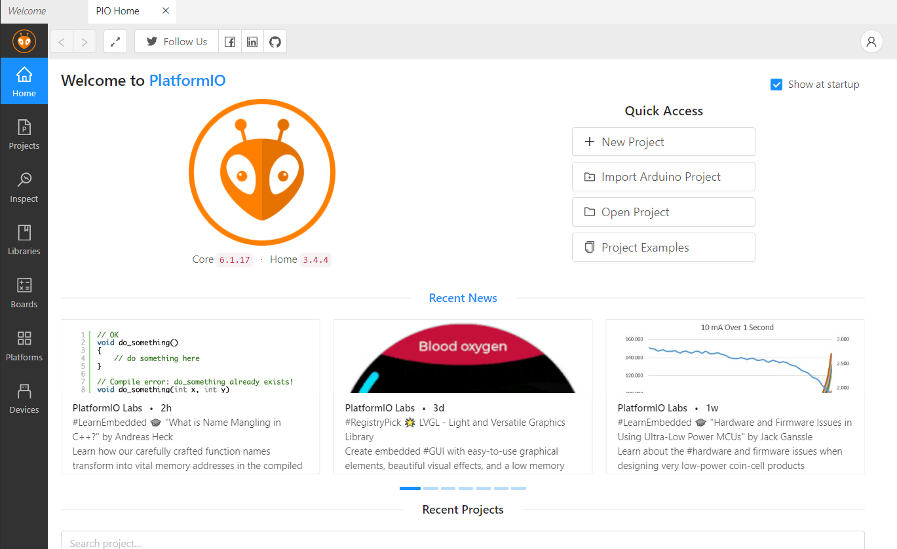

# Teilaufgabe Schüler Kampl

\textauthor{Maximilian Silvester Kampl}

## Theorie

<<<<<<< HEAD
### Benötigte Hardwarekomponenten

Um ein Projekt zu realisieren, bei dem Umweltdaten ausgelesen werden, benötigt man geeignete Komponenten, auf denen die Software zuverlässig läuft. Bei der Auswahl dieser Komponenten spielten mehrere Faktoren eine Rolle, darunter die Kosten, die Größe sowie die Anzahl der verfügbaren Funktionen.

Unser finaler Prototyp sollte folgende Messungen ermöglichen:

- Temperatur
- Luftfeuchtigkeit
- Luftdruck
- Beschleunigung und Geschwindigkeit
- Standortbestimmung mittels GPS

Nach sorgfältiger Abwägung haben wir uns schließlich für die folgenden Komponenten entschieden:

1. ***ESP32***
   - **Grund**: Der ESP32 ist ein leistungsstarker und kostengünstiger Mikrocontroller mit integrierter WLAN- und Bluetooth Funktionalität. Er bietet eine höhere Rechenleistung als ein Arduino und ist im durchschnitt auch kleiner als jener, was für die mobile Nutzung vom Vorteil ist.
2. ***BME280***
   - **Grund**: Der BME280 ist ein vielseitiger Sensor, welcher sowohl die Temperatur, die Luftfeuchtigkeit als auch den Luftdruck messen kann. Außerdem ist er kompakt und kostengünstig.
3. ***MPU6050***
   - **Grund**: Der MPU6050 ist eine Kombination aus Beschleungiungssensor und Gyroskop. Damit können Bewegungen auf der X, der Y und der Z-Achse erfasst werden.
4. ***GY-GPSMV2***
   - **Grund**: Das GY-GPSMV2-Modul ermöglicht die Standortbestimmung über GPS. Es bietet eine hohe Genauigkeit und eine stabile Leistung, wodurch die Postion präzise erfasst werden kann.
=======
### Die Welt der Hardware  (Benötigte Hardwarekomponenten)
>>>>>>> ac9d57a363895aae07ce377b2aa2e6be93514bc6

#### Kosten

| Anzahl | Ort        | Produkt             | Einzelpreis | Lieferkosten | Preis gesamt |
|--------|-----------|----------------------|------------:|------------:|-------------:|
| 3      | Ali-Express | GY-NEO6MV2         | 3,19 €      | 2,46 €      | 12,03 €      |
| 3      | AZ         | BME280              | 3,47 €      | 5,98 €      | 16,39 €      |
| 32     | Reichelt   | Lochrasterplatinen  | 13,21 €     | 6,65 €      | 19,86 €      |
| 3      | AZ         | GY-521              | 2,50 €      | 5,30 €      | 12,79 €      |
| 1      | Amazon     | ET-Starterkit       | 16,13 €     | 3,99 €      | 20,12 €      |

| Preis Hardware insgesamt |
|--------|
|  81,19 € | 

### Aufsetzung der Prototypen

#### PlatformIO

Um ein Programm erfolgreich auf dem ESP32 ausführen zu können, benötigt man eine geeignete IDE (Integrated Development Environment). Eine der bekanntesten und am weitesten verbreiteten Entwicklungsumgebungen für Mikrocontroller ist die Arduino IDE. Allerdings stießen wir bei unserem Projekt auf Anforderungen, die mehr Kontrolle über den Entwicklungs- und Upload-Prozess erforderten. Daher entschieden wir uns für eine professionellere und flexiblere Lösung: PlatformIO.

---

PlatformIO ist eine Entwicklungsumgebung, die als Erweiterung für den Texteditor Visual Studio Code genutzt wird. Sie bietet eine bessere Projektstruktur, eine fortschrittlichere Konfigurationsverwaltung und umfangreiche Unterstützung für verschiedene Mikrocontroller. Zwei zentrale Elemente sorgen dabei für einen reibungslosen Ablauf: die Hauptdatei (Main-File) und die Plattform-Konfigurationsdatei (.ini-File). Besonders die .ini-Datei spielt eine entscheidende Rolle, da sie die Projektkonfiguration festlegt und sicherstellt, dass der Upload-Prozess auf den Mikrocontroller zuverlässig und ohne Komplikationen funktioniert.

~~~~~~~~~~~~~~~~~~~~~~~~~~~~~~~~~~~~~~~~~~~~~~~{caption="Beispiel einer .ini Datei" .ini} 

    ; PlatformIO Project Configuration File
    ;
    ;   Build options: build flags, source filter
    ;   Upload options: custom upload port, speed and extra flags
    ;   Library options: dependencies, extra library storages
    ;   Advanced options: extra scripting
    ;
    ; Please visit documentation for the other options and examples
    ; https://docs.platformio.org/page/projectconf.html

    [env:board_name]
    platform = platform_name
    board = board_name
    framework = framework_name

    ; Zusätzliche Konfigurationsoptionen
    monitor_speed = 115200   ; Serielle Monitor-Geschwindigkeit
    upload_speed = 115200    ; Upload-Geschwindigkeit
    build_flags = -DDEBUG    ; Build-Flags hinzufügen
    lib_deps =               ; Bibliotheken hinzufügen
        library1
        library2

~~~~~~~~~~~~~~~~~~~~~~~~~~~~~~~~~~~~~~~~~~~~~~~ 
[@gpt-inifile]

##### Aufsetzung

Um PlatformIO benutzen zu können muss man ganz einfach die PlatformIO IDE in Visual Studio installieren. Nach der Installation und einem schnellen Neustart kann man ein erstes Projekt erstellen.

Um nun ein erstes Projekt zu erstellen muss mann einfach nur auf den PlatformIO Home Knopf drücken. Danach drückt man auf "New Project" und wähl das passende Board aus. [@PlatformIO-firststeps]

##### Tools

 

1. **Home**: sorgt dafür, dass das Home Menü von PlatformIO. In diesem kann man seine Projekte verwalten sowie Bibiliothekten für das aktuelle hinzufügen.
2. **Build**: Kompiliert den Code des Projekts und erstellt eine Datei welche auf den Mikrocontroller hochgeladen werden kann.
3. **Upload**: Lädt die erstellte Datei von der Build Funktion auf das Festgelegte Zielgerät, in unseren Fall ein ESP32, hoch. 
   1. Zuerst sucht PlatformIO nach richtigen Port. Entweder in der .ini-Datei festgelegt oder er wird automatisch erkannt.
   2. Die Firmware (.bin oder .hex Datei) wird auf das Gerät über den Port hochgeladen.
   3. Während des Uploads wird jeglicher Fortschritt im Terminal angezeigt.
4. **Clean**: Löscht alle temporären Dateien, welche  beim Build-Prozess erstellt wurden. (z.B.: kompilierte Objektdateien, die Firmware-Datei). Im Grunde wird der /.pio Ordner gelöscht.
5. **Serial Port Monitor**: Öffnet eine Konsole innerhalb von Visual Studio, welche die Kommunikation zwischen dem ESP32 und dem Computer überwacht. Wichtig dabei ist zu beachten das die Baudrate richtig eingestellt ist. Normale Baudraten sind 9600 sowie 115200.
6. **Core (CLI)**: Ist eine Kommandozeilen-Toolbox, welche die vorher genannten Funktionen anbietet.
7. **Project Environment Switcher**: Erlaubt es zwischen verschiedenen Umgebungen innerhalb eines Projektes zu wechseln, falls sie vorhanden sind. Diese Umgebungen werden in der platformio.ini Datei angelegt. Das könnte ungefähr so aussehen:

~~~~~~~~~~~~~~~~~~~~~~~~~~~~~~~~~~~~~~~~~~~~~~~{caption="BeispielVonMehrerenUmgebungen" .ini}

[env:esp32]
platform = espressif32
board = esp32dev
framework = arduino

[env:stm32]
platform = ststm32
board = nucleo_f401re
framework = mbed

~~~~~~~~~~~~~~~~~~~~~~~~~~~~~~~~~~~~~~~~~~~~~~~
[@PlatformIO-firststeps]

### C++

### Datenübertragung

#### MQTT

#### Miscalanious 

## Praktische Arbeit

### Zusammensetzen und Löten des Prototypen

### Schreiben eines MQTT Programmes

### Durchführung der Tests (kontinuirlich)

<<<<<<< HEAD
=======
### Erzeugen von Java Quellcode
>>>>>>> ac9d57a363895aae07ce377b2aa2e6be93514bc6
