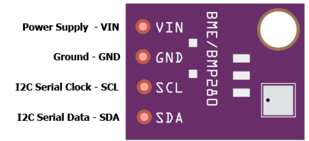

# Teilaufgabe Schüler Kampl

\textauthor{Maximilian Silvester Kampl}

## Theorie

### Benötigte Hardwarekomponenten

Um ein Projekt zu realisieren, bei dem Umweltdaten ausgelesen werden, benötigt man geeignete Komponenten, auf denen die Software zuverlässig läuft. Bei der Auswahl dieser Komponenten spielten mehrere Faktoren eine Rolle, darunter die Kosten, die Größe sowie die Anzahl der verfügbaren Funktionen.

Unser finaler Prototyp sollte folgende Messungen ermöglichen:

- Temperatur
- Luftfeuchtigkeit
- Luftdruck
- Beschleunigung und Geschwindigkeit
- Standortbestimmung mittels GPS

Nach sorgfältiger Abwägung haben wir uns schließlich für die folgenden Komponenten entschieden:

1. ***ESP32***
   - **Grund**: Der ESP32 ist ein leistungsstarker und kostengünstiger Mikrocontroller mit integrierter WLAN- und Bluetooth Funktionalität. Er bietet eine höhere Rechenleistung als ein Arduino und ist im durchschnitt auch kleiner als jener, was für die mobile Nutzung vom Vorteil ist.
   - **Spezifikationen**:
     - Größe: $39mm  *  28mm  *  6mm$
     - 34 I/O Pins
     - SoC: ESP32-WROOM-32
     - Netzspannung: 5V

![ArduinoPins [@ESP32-Datenblatt]](img/Kampl/ESP-Pins-Legende.png){width=297px}

![ArduinoPins [@ESP32-Datenblatt]](img/Kampl/ESP-Pins1.png){width=500px}

![ArduinoPins [@ESP32-Datenblatt]](img/Kampl/ESP-Pins2.png){width=500px}

1. ***BME280***
   - **Grund**: Der BME280 ist ein vielseitiger Sensor, welcher sowohl die Temperatur, die Luftfeuchtigkeit als auch den Luftdruck messen kann. Außerdem ist er kompakt und kostengünstig.
   - **Spezifikationen**:
     - Größe: $9mm  *  11mm  *  2mm$
     - 4 Pins
     - Schnittstelle I²C
     - Spannung: 3.3V bis 5V

![BMEPins [@BME280-Datenblatt]](img/Kampl/BME280-Pins.png){width=300px}

1. ***MPU6050***
   - **Grund**: Der MPU6050 ist eine Kombination aus Beschleungiungssensor und Gyroskop. Damit können Bewegungen auf der X, der Y und der Z-Achse erfasst werden.
   - **Spezifikationen**:
     - Größe: $25mm  *  20mm  *  7mm$
     - 8 Pins
     - Schnittstelle I²C
     - Spannung: 3.3V bis 5V

![MPUPins [@MPU6050-Datenblatt]](img/Kampl/MPU6050-Pins.png){width=500px}

3. ***GY-GPSMV2***
   - **Grund**: Das GY-GPSMV2-Modul ermöglicht die Standortbestimmung über GPS. Es bietet eine hohe Genauigkeit und eine stabile Leistung, wodurch die Postion präzise erfasst werden kann.
   - **Spezifikationen**:
     - Größe: $16mm  *  12.2mm  *  2.4mm$
     - 3 Pins
     - Schnittstelle UART
     - Spannung: 3.3V

{width=300px}

#### Kosten

| Anzahl | Ort        | Produkt             | Einzelpreis | Lieferkosten | Preis gesamt |
|--------|-----------|----------------------|------------:|------------:|-------------:|
| 3      | Ali-Express | GY-NEO6MV2         | 3,19 €      | 2,46 €      | 12,03 €      |
| 3      | AZ         | BME280              | 3,47 €      | 5,98 €      | 16,39 €      |
| 32     | Reichelt   | Lochrasterplatinen  | 13,21 €     | 6,65 €      | 19,86 €      |
| 3      | AZ         | GY-521              | 2,50 €      | 5,30 €      | 12,79 €      |
| 1      | Amazon     | ET-Starterkit       | 16,13 €     | 3,99 €      | 20,12 €      |

| Preis Hardware insgesamt |
|--------|
|  81,19 € |

### Eingebettete Systeme

Um zu verstehen wie die Hardware nun funktioniert muss man ersteinmal wissen was ein Embedded System ist. Ein Eingebettetes System ist Teil eines viel größeren Systems wie z.B.: Handys, Autos, Waschmaschinen, usw..

Solche Systeme gibt es bereits seit den 1960. Damals baute der amerikanische Ingenieur Charles Stark Draper während des Apollo Raumprogrammes die erste integrierte Schaltung. Diese wurde dann auf dem Apollo Guidance Computer installiert um Flugdaten in Echtzeit sammeln zu können.
Später wurden dann solche Mikroprozessoren in der 1600 Serie von Volkswagen verwendet um das Kraftstoffeinspritzsystem zu steuern.
In den 70ern konnte Intel den ersten Prozessor entwickeln, welcher der Öffentlichkeit zugänglich war: den Intel 4004. Ein 4-Bit-Mikroprozessor, wlecher in Taschenrechnern und anderen kleineren elektronischen Geräte verwendet wurde.

Im Allgemeinen kann man sagen, dass ein Embedded System die Kombination von Software und Hardware ist für einen speziell programmierte Aufgabe. Obwohl man ein ES mit einem Computer gleichstellen kann, haben sie des öfteren keine Graphische Oberfläche für Benutzer.
[@EmbeddedSystems]

#### Komponenten

Die Hauptkomponenten eines Embedded Systems sind ein Mikroprozessor oder ein Mikrocontroller. Während ein Mikroprozessor lediglich eine CPU enthält, umfasst ein Mikrocontroller zusätzlich Speicher, Peripheriegeräte, GPIOs, Flash-Speicher und viele weitere Komponenten.

##### CPU

Die CPU (Central Processing Unit) ist die primäre Steuereinheit eines Systems. Sie besteht aus der ALU und der CU. Die ALU (Arithmetic Logic Unit) ist der Teil der CPU, der arithmetisch-logische Operationen mit binären Daten ausführt. Die CU (Control Unit) steuert mithilfe des internen Oszillators die Abläufe im System. Nachdem ein Befehl decodiert wurde, gibt die CU selbst weitere Befehle aus, um die korrekten Aktionen zu starten. Diese Befehle werden dann über den Bus aus dem Arbeitsspeicher abgerufen.

##### Bus

Der Bus verbindet die CPU mit den anderen Komponenten. Es gibt daher verschiedene Arten von Bussen, wie z. B. den Datenbus, den Adressbus und den Steuerbus. Je nach Prozessor können unterschiedlich viele Bits gleichzeitig übertragen werden.
- **SPI (Serial Peripheral Interface):** Synchrone serielle Schnittstelle, ideal für die Verbindung von Peripheriegeräten. Verwendet MOSI, MISO und SCK Leitungen.
- **UART (Universal Asynchronous Receiver Transmitter):** Asynchrone serielle Verbindung, die ohne externen Taktgeber arbeitet.
- **I²C (Inter-Integrated Circuit):** Zweidraht-Bus mit Master-Slave-Kommunikation.

##### RAM

Der Arbeitsspeicher wird RAM genannt, was für Random Access Memory steht. Der RAM speichert die auszuführenden Programmbefehle. Es gibt verschiedene Arten von RAM:
- **SRAM (Static RAM):** Schneller, benötigt keinen Refresh, verbraucht jedoch mehr Energie.
- **DRAM (Dynamic RAM):** Benötigt Refresh, ist langsamer und günstiger.

##### ROM

- **PROM:** Nur einmal programmierbar.
- **EPROM:** Kann mit UV-Licht gelöscht werden.
- **OTP-EPROM:** Einmal programmierbar und nicht löschbar.
- **Flash:** Elektronisch lösch- und beschreibbar, mit selektiven Löschmöglichkeiten.
- **EEPROM:** Elektrisch löschbar und neu beschreibbar, häufig zur Speicherung kleiner Datenmengen wie Seriennummern genutzt.

##### Register

Register sind temporäre Speicher, die teils festgelegte Verwendungszwecke (z. B. Befehls- oder Statusregister) haben und teils für allgemeine Aufgaben genutzt werden.

##### Peripherie

- **GPIO (General Purpose Input/Output):** Konfigurierbar als digitale Ein- oder Ausgänge.
- **Timer:** Überwachung und Steuerung zeitkritischer Prozesse.
- **Watchdog:** Sicherheit durch Neustart bei Fehlfunktionen.
- **DMA (Direct Memory Access):** Direkter Datentransfer zwischen Speicher und Peripherie ohne CPU-Beteiligung.

##### Firmware

Die Firmware ist eine softwarebasierte Komponente, die fest in einem elektronischen Gerät implementiert ist und auf einem nicht-flüchtigen Speicher abgelegt wird (z. B. Flash oder EEPROM). Sie verbindet Hardware mit der Anwendungssoftware.

##### Recheneinheit

- **General-Purpose-Prozessoren:** Vielseitig einsetzbar, aber weniger spezialisiert.
- **Mikrocontroller:** Integrieren CPU, Speicher und Peripherie in einem Chip.
- **Digitale Signalprozessoren (DSPs):** Für Echtzeit-Signalverarbeitung optimiert.
- **ASICs:** Für spezifische Anwendungen entwickelte Chips, mit hoher Effizienz und begrenzter Flexibilität.
- **FPGAs:** Programmierbare Hardware, flexibel und rekonfigurierbar, besonders in der Entwicklung von ASICs nützlich.

#### Zusätzliche Module

- **A/D- und D/A-Wandler:** Ermöglichen die Umwandlung zwischen analogen und digitalen Signalen. Wichtig für Sensoranwendungen.
- **PWM (Pulsweitenmodulation):** Steuerung von LEDs, Motoren oder anderen Aktoren durch variable Einschaltdauer eines Signals.

### Der Prototypen

#### PlatformIO

Um ein Programm erfolgreich auf dem ESP32 ausführen zu können, benötigt man eine geeignete IDE (Integrated Development Environment). Eine der bekanntesten und am weitesten verbreiteten Entwicklungsumgebungen für Mikrocontroller ist die Arduino IDE. Allerdings stießen wir bei unserem Projekt auf Anforderungen, die mehr Kontrolle über den Entwicklungs- und Upload-Prozess erforderten. Daher entschieden wir uns für eine professionellere und flexiblere Lösung: PlatformIO.

{width=500px}

---

{width=700px}


PlatformIO ist eine Entwicklungsumgebung, die als Erweiterung für den Texteditor Visual Studio Code genutzt wird. Sie bietet eine bessere Projektstruktur, eine fortschrittlichere Konfigurationsverwaltung und umfangreiche Unterstützung für verschiedene Mikrocontroller. Zwei zentrale Elemente sorgen dabei für einen reibungslosen Ablauf: die Hauptdatei (Main-File) und die Plattform-Konfigurationsdatei (.ini-File). Besonders die .ini-Datei spielt eine entscheidende Rolle, da sie die Projektkonfiguration festlegt und sicherstellt, dass der Upload-Prozess auf den Mikrocontroller zuverlässig und ohne Komplikationen funktioniert.

```{caption="Beispiel einer .ini Datei" .ini}
    ; PlatformIO Project Configuration File
    ;
    ;   Build options: build flags, source filter
    ;   Upload options: custom upload port, speed and extra flags
    ;   Library options: dependencies, extra library storages
    ;   Advanced options: extra scripting
    ;
    ; Please visit documentation for the other options and examples
    ; https://docs.platformio.org/page/projectconf.html

    [env:board_name]
    platform = platform_name
    board = board_name
    framework = framework_name

    ; Zusätzliche Konfigurationsoptionen
    monitor_speed = 115200   ; Serielle Monitor-Geschwindigkeit
    upload_speed = 115200    ; Upload-Geschwindigkeit
    build_flags = -DDEBUG    ; Build-Flags hinzufügen
    lib_deps =               ; Bibliotheken hinzufügen
        library1
        library2
```

[@gpt-inifile]

##### Aufsetzen

Um PlatformIO benutzen zu können muss man ganz einfach die PlatformIO IDE in Visual Studio installieren. Nach der Installation und einem schnellen Neustart kann man ein erstes Projekt erstellen.

Um nun ein erstes Projekt zu erstellen muss mann einfach nur auf den PlatformIO Home Knopf drücken. Danach drückt man auf "New Project" und wähl das passende Board aus. [@PlatformIO-firststeps]

##### Tools

![Toolbar [@PlatformIO-firststeps]](img/Kampl/platformio-ide-vscode-toolbar.png){width=500px}

1. **Home**: sorgt dafür, dass das Home Menü von PlatformIO. In diesem kann man seine Projekte verwalten sowie Bibiliothekten für das aktuelle hinzufügen.
2. **Build**: Kompiliert den Code des Projekts und erstellt eine Datei welche auf den Mikrocontroller hochgeladen werden kann.
3. **Upload**: Lädt die erstellte Datei von der Build Funktion auf das Festgelegte Zielgerät, in unseren Fall ein ESP32, hoch.
   1. Zuerst sucht PlatformIO nach richtigen Port. Entweder in der .ini-Datei festgelegt oder er wird automatisch erkannt.
   2. Die Firmware (.bin oder .hex Datei) wird auf das Gerät über den Port hochgeladen.
   3. Während des Uploads wird jeglicher Fortschritt im Terminal angezeigt.
4. **Clean**: Löscht alle temporären Dateien, welche  beim Build-Prozess erstellt wurden. (z.B.: kompilierte Objektdateien, die Firmware-Datei). Im Grunde wird der /.pio Ordner gelöscht.
5. **Serial Port Monitor**: Öffnet eine Konsole innerhalb von Visual Studio, welche die Kommunikation zwischen dem ESP32 und dem Computer überwacht. Wichtig dabei ist zu beachten das die Baudrate richtig eingestellt ist. Normale Baudraten sind 9600 sowie 115200.
6. **Core (CLI)**: Ist eine Kommandozeilen-Toolbox, welche die vorher genannten Funktionen anbietet.
7. **Project Environment Switcher**: Erlaubt es zwischen verschiedenen Umgebungen innerhalb eines Projektes zu wechseln, falls sie vorhanden sind. Diese Umgebungen werden in der platformio.ini Datei angelegt. Das könnte ungefähr so aussehen:

```{caption="BeispielVonMehrerenUmgebungen" .ini}
[env:esp32]
platform = espressif32
board = esp32dev
framework = arduino

[env:stm32]
platform = ststm32
board = nucleo_f401re
framework = mbed
```

[@PlatformIO-firststeps]

### Programmieren

Da wir nun eine vollständig funktionsfähige Entwicklungsumgebung besitzen und auch wissen, wie man diese einsetzt, können wir mit der tatsächlichen Programmierung starten. Wir verbinden den ESP32 mit unserem Computer oder Laptop über ein USB-Kabel und schreiben unsere ersten Code-Snippets, um zu testen, ob der Mikrocontroller ordnungsgemäß funktioniert.

```cpp{caption="BME_TestProgramm" .cpp}
// TestProgramm
void setup() {
  // Seriellen Monitor mit Baudrate 115200 starten
  Serial.begin(115200);
  Serial.println("ESP32 LED-Blinktest gestartet!");

  // LED-Setup (Standardmäßig GPIO 2 für die Onboard-LED)
  pinMode(LED_BUILTIN, OUTPUT);
}

void loop() {
  // LED ein
  Serial.println("LED AN");
  digitalWrite(LED_BUILTIN, HIGH);
  delay(500);

  // LED aus
  Serial.println("LED AUS");
  digitalWrite(LED_BUILTIN, LOW);
  delay(500);
}

```

Jetzt, da wir wissen, dass unser Gerät funktioniert, können wir mit der weiteren Entwicklung beginnen. Zuerst sollten wir jeden einzelnen Sensor separat ansprechen, um auch hier zu testen, ob die Sensoren funktionieren. Ein Schritt nach dem anderen.

#### BME280

Zuvor müssen wir jedoch einige Bibliotheken hinzufügen damit wir den BME280 einfacher ansprechen können. Die verbreitetste Bibliothek ist die **Adafruit BME280 Library**. Man fügt sie dem Projekt hinzu indem man etweder man die folgende Zeile ```adafruit/Adafruit BME280 Library@^2.2.4``` unter dem Punkt **lib_deps** in der .ini-Datei hinzufügt, oder indem man PlatformIO verwendet, um die Library automatisch hinzuzufügen. 

{width=300px}

Außerdem benötigt man noch die ```adafruit/Adafruit BME280 Library@^2.2.4```, welche als Schnittstelle für die Sensoren dient.

Am Ende verwenden wir folgenden Code für unseren Sensor:

```cpp{caption="BME_TestProgramm" .cpp}
#include <Wire.h>
#include <Adafruit_Sensor.h>
#include <Adafruit_BME280.h>

#define SEALEVELPRESSURE_HPA (1013.25)

Adafruit_BME280 bme; 

unsigned long delayTime;

void printValues();

void setup() {
    Serial.begin(115200);
    Serial.println(F("BME280 test"));

    
    if (!bme.begin()) {
        Serial.println("Could not find a valid BME280 sensor, check wiring, address, sensor ID!");
        Serial.print("SensorID was: 0x"); Serial.println(bme.sensorID(),16);
        Serial.print("        ID of 0xFF probably means a bad address, a BMP 180 or BMP 085\n");
        Serial.print("   ID of 0x56-0x58 represents a BMP 280,\n");
        Serial.print("        ID of 0x60 represents a BME 280.\n");
        Serial.print("        ID of 0x61 represents a BME 680.\n");
        while (1) delay(10);
    }
    
    Serial.println("-- Default Test --");
    delayTime = 1000;

    Serial.println();
}


void loop() { 
    printValues();
    delay(delayTime);
}


void printValues() {
    Serial.print("Temperature = ");
    Serial.print(bme.readTemperature());
    Serial.println(" °C");

    Serial.print("Pressure = ");

    Serial.print(bme.readPressure() / 100.0F);
    Serial.println(" hPa");

    Serial.print("Approx. Altitude = ");
    Serial.print(bme.readAltitude(SEALEVELPRESSURE_HPA));
    Serial.println(" m");

    Serial.print("Humidity = ");
    Serial.print(bme.readHumidity());
    Serial.println(" %");

    Serial.println();
}

```
[@BME280-Test]

##### Erklärung

#### MPU6050

##### Erklärung

#### GY-GPSMV2

##### Erklärung

### Datenübertragung

#### MQTT

### Sonstiges


## Praktische Arbeit

### Zusammensetzen und Löten des Prototypen

### Schreiben eines MQTT Programmes

### Durchführung der Tests (kontinuirlich)

### Erzeugen von Java Quellcode

