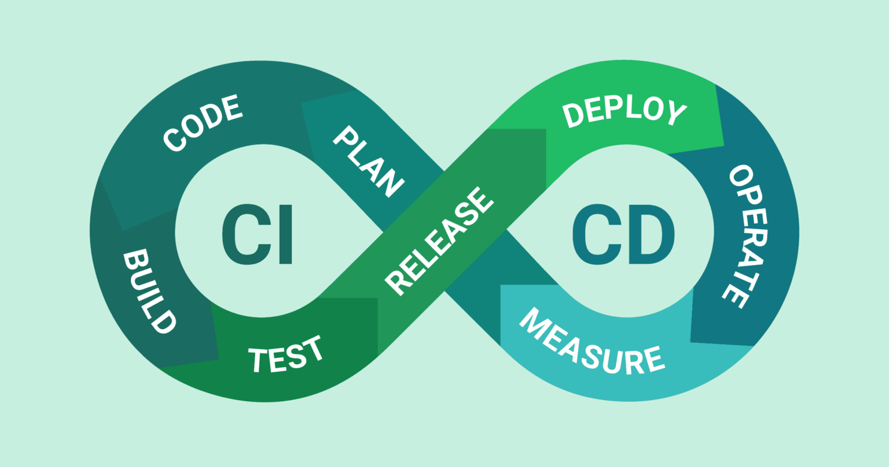

# Teilaufgabe Schüler Schrempf

\textauthor{Marko Daniel Schrempf}

## Theorie

### Datenspeicherung- und Visualisierung

Eine Datenbank ermöglicht die Speicherung und Verwaltung von zusammenhängenden Daten. Hier können große Datenmengen übersichtlich dargestellt werden. Es gibt verschiedenste Datenbankkonzepte, welche auf ihre eigene Art und Weise Vor- und Nachteile bringen. In dieser Ausarbeitung wird sich auf zwei funktional unterschiedliche Arten fokussiert.

#### Relational

In einem relationalen Datenbanksystem werden Daten in Form von Tabellen gespeichert. Jede Tabelle hat eine Relation zu einer anderen Tabelle, entweder inhaltich oder strukturell. Durch diese Beziehungen, wenn sie richtig definiert sind, werden Redundanzen vermieden. Um solche Beziehungen richtig aufzubauen gibt es das Konzept der Normalisierung.

@Nachhilfe-Team
> Die Normalisierung von relationalen Datenbanken ist ein Vorgehen, bei dem die Ausgangstabelle in mehrere kleine Tabellen zerlegt wird. Dann werden sie über Fremdschlüssel in Beziehung gesetzt. Ziel einer solchen Normalisierung ist das Erschaffen einer redundanzfreien Datenspeicherung, die Vermeidung von Anomalien, sowie die Erstellung eines klar strukturierten Datenbankmodells.

Der entscheidende Vorteil von RDBs ist, dass sie eine gemeinsame standardisierte Sprache für die Datenabfrage- und verarbeitung besitzen - SQL. In relationalen Datenbanken werden primär Informationen persistiert, welche auf längere Zeit vorhanden bleiben und auf die nicht in kurzen Zeitintervallen zugegriffen wird.

#### Zeitreihe

In einem zeitreihen basierten Datenbanksystem werden Daten mit einem korrespondierenden Zeitstempel versehen. In anderen DBs ist das Speichern einer Zeitmarke per Wert zwar auch möglich, jedoch weist eine TSDB jedem einzelnen Wert automatisch einen eindeutigen Timestamp zu und vermerkt den daraus resultierenden Datensatz in einer Historie. In dieser ist der gesamte zeitliche Verlauf des Attributs festgehalten.

Zeitreihen DBs sind optimiert auf viele schreib und lese Operationen und sind nicht auf das verändern bzw. löschen der Datensätze ausgelegt. Je nach DBMS können verschiedene Erfassungszeiträume und somit auch die Granularitiät des Timestamps definiert werden. Dies kann von Millisekunden bis hin zu Tagen gehen. Außerdem gibt es keine einheitliche Query-Sprache. In TSDBs werden Metriken, Sensordaten und generell Werte mit hoher Änderungsrate persistiert. [@Computerweekly]

Ein Sonderfall der TSDB ist die Round Robin Database (RRD). Diese löscht alte Datensets nach einer definierten Zeit und / oder aggregiert sie auf einen Wert zusammen. [@joojscript]

#### Visualisierungsarten

@aws-datenvisualisierung
> Datenvisualisierung ist der Prozess der Verwendung visueller Elemente wie Diagramme, Grafiken oder Karten zur Darstellung von Daten. Sie übersetzt komplexe, umfangreiche oder numerische Daten in eine visuelle Darstellung, die leichter zu verarbeiten ist.

Um Rohdaten verständlich zu machen, im Kontext betrachten zu können und etwaige Korrelationen zwischen verschiedenen Datensets sichtbar zu machen, ist es notwendig, die oben genannten Methoden anzuwenden. Hierbei ist eine unkomplizierte Grafik als Endprodukt das Ziel.

Um solch ein Ergebnis zu erreichen, müssen vorhandene Daten bereinigt, gefiltert und ausgewählt werden. Beim Erstellen der Visualisierungen muss eine Verzerrung der Daten hinsichtlich Trivialisierung, Überspitzung und menschlichen Vorurteilen vermeiden werden. [@aws-datenvisualisierung]

### CI/CD

{width=100%} [@bestarion]

CI / CD ist ein Konzept, welches Entwicklerteams, dazu anregt, kontinuirlich und in kürzeren Abständen Dinge am Code zu ändern, diesen zu verbessern und zu automatisieren. Wie oben dargestellt, ist es ein nie endender Kreislauf. Man unterscheidet zwei Komponenten voneinander: Continuous integration und Continuous delivery.

Unter CI versteht man das tatsächliche Entwickeln, Testen und Hochladen des Codes in das VCS. Dies wird durch verschiedene Methoden und Prozesse erleichtert, wie zum Beispiel automatisches Testen des Programms oder agiles Projektmanagement.

Das Testen einer Applikation ist ein essenzieller Weg zum Erfolg. CI befasst sich unter anderem mit den Wegen, wie ich mein Programm auf besten Wege prüfen kann. Mit dieser Technologie wird der Grundstein für unter anderem automatisches Unit-, Integration-, Regression-, Performancetesten gelegt.

Unter CD versteht man das deployn von Software auf verschiedene Umgebungen. Hier fallen, wie oben angedeuted, Testumgebungen auch darunter, sowie Entwicklungsumgebungen und Produktivsysteme. Dieser ganze Prozess ist im nun komplett automatisiert und wird bei verschiedenen Events getriggert.[@bestarion]

Um dieses sehr mächtige Konzept voll auszuschöpfen werden Pipelines angelegt. Diese verrichten die Arbeit, welche ansonsten manuell verrichtet werden müsste. Hier ein kleiner Ausblick:

1. Definierte Tests aufsetzten und ausführen
2. Code packages erstellen
3. Verschiedene Umgebungen mittels Umgebungsvariablen vorbereiten
4. Code deployn
5. Versionen releasen

#### Docker

Um solch ein großes Konzept überhaupt realisieren zu können, muss man sich ein Stück weit von der bisherigen Softwareentwicklung lossagen. Hier kommen Microservices und die Containerization ins Spiel.

Microservices sind nun Teile eines Produkts. Früher gab es nur eine einzige große Software die mit ihren Teilen als ein Ganzes funktionierte. Heutzutage werden diese Teile identifiziert und jeder Baustein wird für sich issoliert programmiert. Dies bietet mehrere Vorteile. Bei einer konzeptionellen oder technischen Umstellung kann die einzelne Komponente leicht ausgetauscht und durch eine neue ersetzt werden. Außerdem ist die gesamte Software als auch einzelne Teile leicht Skallierbar. Jedes einzelne Elemnt läuft in seiner dezidierten Umgebung, welche nur den Kernel mit dem OS teilt und deswegen auch unabhängig auf verschiedenen Systemen einsatzbereit ist. Solch eien dezidierte Umgebung besteht aus Systembibliotheken, Abhängikeiten, Umgebungsvariablen und eventuellen eigenproduzierten Code der zu hostenden Anwendung. Dies ist ein Container. Es gilt: Funktioniert der Container, und somit auch der in ihm definierte Microservice auf einem System, so tut er es auch überall anders. Außerdem können Container auch leicht in Clouds deployed und gehosted werden. Solch ein Aspekt ist vorallem in Zeiten immer stärker werdenden Cloud-Computings immer wichtiger.

Ein Container benutzt die Virtualisierungstools des Linuxkernels um Ressourcen zu teilen und verwalten. Für nicht Linux Betriebsysteme gibt es Software die den Linux Kernel simmulieren kann. Zum Beispiel WSL oder Hyper-V bei Windows. Durch die gemeinsame Nutzung des Kernels muss auch keine dezidierte Definition der benötigten Ressourcen stattfinden, da diese automatisch vom System alloziert werden. Das Konzept eines Containers ähnelt dem, einer VM. Nur mit dem wesentlichen Vorteil, dass kein komplett eigenes OS verwendet wird, sonern nur die Schritte zum produzieren eines gewissen Outputs angegeben werden. Container haben eine Abstraktionsebene zum Kernel, aber da eben kein eigenes Betriebsystem wie bei einer VM verwendet wird, gibt es auch ein marginales Sicherheitsrisiko. Malware könnte durch die gemeinsame Nutzung des Kernels eben auf diesen zugreifen und erheblichen Schaden anrichten. Um dem Vorzubeugen, gibt es etliche Third-Party Tools mit denene die Sicherheit über das schon gegebene Maß erhöht werden kann.

Soweit so viel zum Allgemeinen der Virtualisierung. Doch was hat Docker damit zu tun? Docker ist ein Open Source Projekt, welches sich auf die Containerization spezialisiert hat. Es bietet einen rießigen freien Markt (Docker Hub) zur Erstellung und Distribution von Docker Images an. Ein Image ist das zuvor genannte äquivalent zu der Definition eines Containers. Ein Image ist in Schichten aufgebaut und jede Schicht stellt einen neuen Zustand des Containers dar. Das vollständig ausgeführte und unter Umständen auch angepasste Image ist dann der laufende Container. Auf Basis eines Images können mehrere Container laufen.

Jedes Image wird in einem Dockerfile definiert. Hierbei spricht man nur von einer Datei, in welcher die Anweisungen zum Aufbau der Schichten gespeichert sind. Beim Starten des Containers interagiert die Docker CLI mit dem Dockerfile und führt die Anweisungen aus. Eine beliebte Variante ist es, ein schon bestehendes Image zu verwenden und seine eigene Applikation mit Schichten on top zu bauen.
[@ibm-docker]

Docker compose ist eine Funktionalität von Docker. Es ermöglicht die Definition von mehreren Microservices in einer YAML-Konfigurationsdatei Namens ```compose.yml```. Hier wird ein Microservice nur Service genannt. Ein Service kann wieder als Dockerfile definiert werden oder sogar das Image vom Docker Hub benutzt und in der Datei bis zu einem gewissen Maß weiter spezialisiert werden. In der ```compose.yml``` werden Ports, Secrets, zu benutzende Volumes, Networks und die Anzahl der Container des Services beschrieben. Secrets sind Umgebungsvariablen die an den entstehenden Container weitergegeben werden. Volumes werden benutzt um fixe Daten, z.B. Code, in den Container oder Daten vom Container, z.B. Datenbanken, auf dem Hostsystem zu persistieren. Da nun mehrere Microservices zwar als Bausteine definiert werden, jedoch miteinander interagierene können um ein ganzes Konstrukt zu bilden, gibt es Networks. Über diese können Tasks, wie Containerübergreifende Datenkommunikation, realisiert werden. So sieht eine ```compose.yml``` Datei grundelegend aus:

```yaml
services:
  frontend:
    image: example/webapp
    ports:
      - "443:8043"
    networks:
      - front-tier
      - back-tier
    configs:
      - httpd-config
    secrets:
      - server-certificate

  backend:
    image: example/database
    volumes:
      - db-data:/etc/data
    networks:
      - back-tier

volumes:
  db-data:
    driver: flocker
    driver_opts:
      size: "10GiB"

configs:
  httpd-config:
    external: true

secrets:
  server-certificate:
    external: true

networks:
  front-tier: {}
  back-tier: {}
```

[@docker-compose]

Ein weitere Funktionalität von Docker ist Docker Swarm. Mit diesem Tool wird eine Orchestrierungsmöglichkeit für Anwendungen mit mehr als einem Host angeboten. Hierbei kann man die Anzahl der Container per Host angeben, wo welcher Container laufen soll und vieles mehr. Beschrieben wird das Verhalten des Swarms über eine leicht anders funktionierende Version der ```compose.yml```. Jedoch ist anzumerken, dass Docker Swarm, nicht so ausgereift und mehr so etwas in der Art wie ein Notbehelf aufgrund der Nachfrage ist. Für kontrollierte udn ausführliche Ochestrierung wird ein explizit dafür ausgelegtes Framework, wie Kubernetes, empfohlen.
[@docker-swarm] [@circleci-blog]

#### Pipeline

Wie oben angedeuted nehmen Pipelines dem Programmierer sehr viel arbeit ab. Verschiedene Plattformen haben verschiedene Möglichkeiten Pipelines zu benutzen, definieren und auszuführen. Beispiele wären Jenkins oder so wie es in dieser Ausarbeitung verwendet worden ist: GitHub. GitHub bietet GitHub Actions an. Hierbei schreibt man eine YAML-Datei in der steht, was wann wie geschehen soll und legt sie im Verzeichnis ```.github/workflows``` in seinem Repository ab.

Eine GitHub Action besteht aus folgenden Komponenten:

1. Event
   - Trigger für Workflow
2. Runner
   - Runtime Environment z.B. Ubuntu
3. Job
   - Der durch das Event getriggerte Workflow
4. Steps
   - Ein Workflow hat mehrere Steps
5. Action
   - Ein Step hat mehrere Actions
   - Was in diesen Step ausgeführt wird

Hier wird eine workflow.yml dargestellt, welche eine Java-Applikation beim Push-Event testet.

```yaml
name: Test

on:
  push:

permissions:
  contents: read
  actions: read

jobs:
  test:
    runs-on: ubuntu-latest

    steps:
      - name: Checkout code
        uses: actions/checkout@v4

      - name: Set up JDK 21
        uses: actions/setup-java@v4
        with:
          java-version: '21'
          distribution: 'temurin'
          cache: maven

      - name: Run Tests
        run: mvn clean test
```

### REST API

#### Design

#### JavaScript

## Praktische Arbeit

### Datenspeicherung- und Visualisierung

#### MySQL

#### InfluxDB

#### Grafana

### CI/CD

#### Server

#### Docker

#### GitHub Action

### REST API

#### JavaScript
