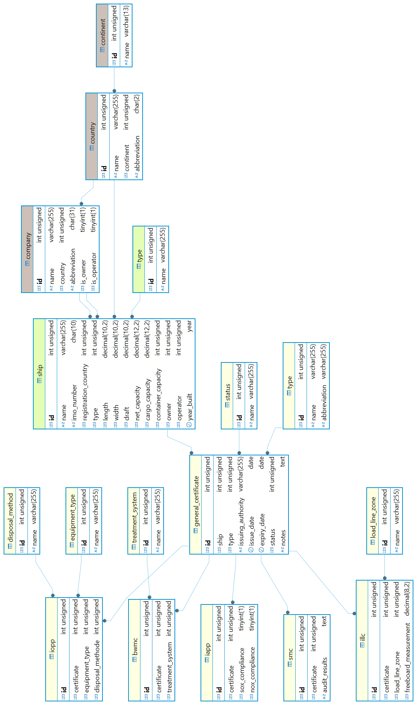
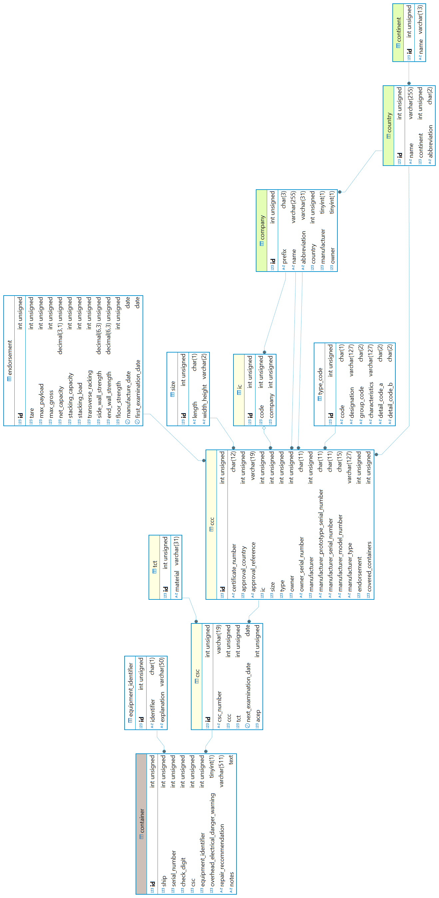
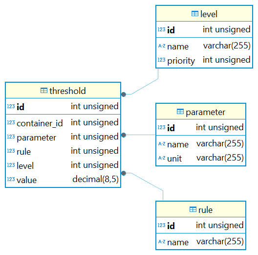
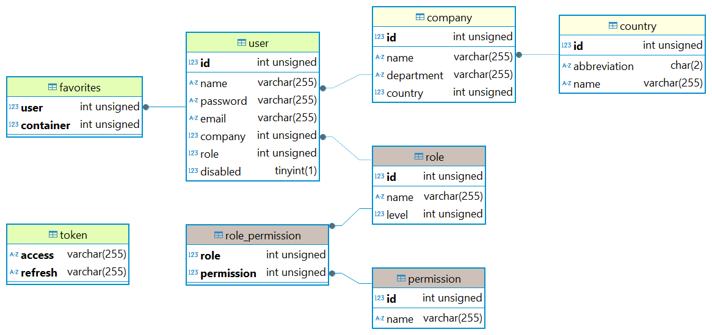
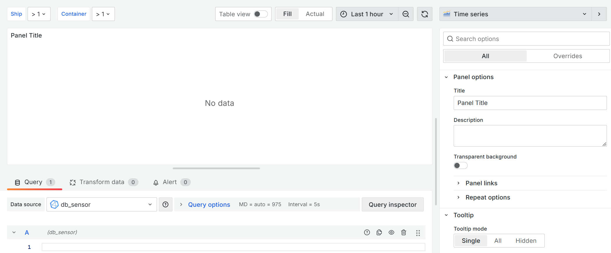
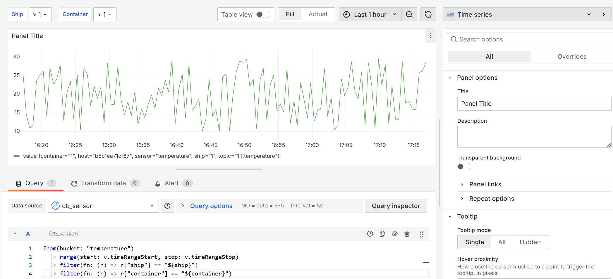
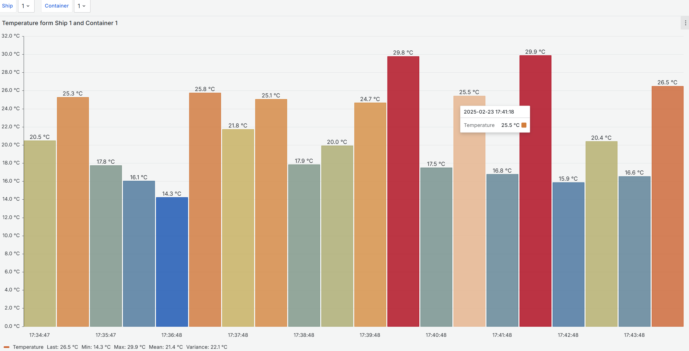

# Teilaufgabe Schüler Schrempf

\textauthor{Marko Daniel Schrempf}

## Theorie

### Datenspeicherung und Visualisierung

Eine Datenbank ermöglicht die Speicherung und Verwaltung von zusammenhängenden Daten. Hier können große Datenmengen übersichtlich abgebildet werden. Es gibt verschiedenste Datenbankkonzepte, welche auf ihre eigene Art und Weise Vor- und Nachteile bringen. In dieser Ausarbeitung wird sich auf zwei funktional unterschiedliche Arten fokussiert.

#### Relationale Datenbanken

In einem relationalen Datenbanksystem werden Daten in Form von Tabellen gespeichert. Jede Tabelle hat eine Relation zu einer anderen Tabelle, entweder inhaltich oder strukturell. Durch diese Beziehungen, wenn sie richtig definiert sind, werden Redundanzen vermieden. Um solche Beziehungen richtig aufzubauen gibt es das Konzept der Normalisierung.

> Die Normalisierung von relationalen Datenbanken ist ein Vorgehen, bei dem die Ausgangstabelle in mehrere kleine Tabellen zerlegt wird. Dann werden sie über Fremdschlüssel in Beziehung gesetzt. Ziel einer solchen Normalisierung ist das Erschaffen einer redundanzfreien Datenspeicherung, die Vermeidung von Anomalien, sowie die Erstellung eines klar strukturierten Datenbankmodells. [@Nachhilfe-Team]

Der entscheidende Vorteil von RDBs^[Relationale Datenbank] ist, dass sie eine gemeinsame standardisierte Sprache für die Datenabfrage- und verarbeitung besitzen - SQL^[Structured Query Language]. In relationalen Datenbanken werden primär Informationen persistiert, welche auf längere Zeit vorhanden bleiben und auf die nicht in kurzen Zeitintervallen zugegriffen wird.

#### Zeitreihen Datenbanken

In einem zeitreihen basierten Datenbanksystem werden Daten mit einem korrespondierenden Zeitstempel versehen. In anderen Datenbanken ist das Speichern einer Zeitmarke per Wert zwar auch möglich, jedoch weist eine TSDB^[Time Series Database] jedem einzelnen Wert automatisch einen eindeutigen Timestamp zu und vermerkt den daraus resultierenden Datensatz in einer Historie. In dieser ist der gesamte zeitliche Verlauf des Attributs festgehalten.

Zeitreihen DBs^[Datenbank] sind optimiert auf viele schreib und lese Operationen und sind nicht auf das verändern bzw. löschen der Datensätze ausgelegt. Je nach DBMS^[Datenbankmanagementsystem] können verschiedene Erfassungszeiträume und somit auch die Granularitiät des Timestamps definiert werden. Dies kann von Millisekunden bis hin zu Tagen gehen. Außerdem gibt es keine einheitliche Query-Sprache. In TSDBs werden Metriken, Sensordaten und generell Werte mit hoher Änderungsrate persistiert. [@Computerweekly]

Ein Sonderfall der TSDB ist die RRD^[Round Robin Database]. Diese löscht alte Datensets nach einer definierten Zeit und / oder aggregiert sie auf einen Wert zusammen. [@joojscript]

#### Visualisierung

> Datenvisualisierung ist der Prozess der Verwendung visueller Elemente wie Diagramme, Grafiken oder Karten zur Darstellung von Daten. Sie übersetzt komplexe, umfangreiche oder numerische Daten in eine visuelle Darstellung, die leichter zu verarbeiten ist.
[@aws-datenvisualisierung]

Um Rohdaten verständlich zu machen, im Kontext betrachten zu können und etwaige Korrelationen zwischen verschiedenen Datensets sichtbar zu machen, ist es notwendig, die oben genannten Methoden anzuwenden. Hierbei ist eine unkomplizierte Grafik als Endprodukt das Ziel.

![Beispiel einer Datenvisualisierung von Mittelwerten einer Temperaturaufzeichnung  [@kaggle-weather-data]](img/Schrempf/Weather-Data-Set.png){width=100%}

Um solch ein Ergebnis zu erreichen, müssen vorhandene Daten bereinigt, gefiltert und ausgewählt werden. Beim Erstellen der Visualisierungen muss eine Verzerrung der Daten hinsichtlich Trivialisierung, Überspitzung und menschlichen Vorurteilen vermeiden werden. [@aws-datenvisualisierung]

### Datenübertragung

#### Reverse Proxy

Ein Reverse Proxy ist zwischen den in das Internet freigeschaltenen Services und dem Internet. Somit kommuniziert ein Client nicht direkt mit den Services, sondern muss zuerst beim Reverse Proxy vorbei. Dies hat mehrere Vorteile. Die Anwendungen sind nicht direkt dem Internet ausgesetzt, was eine zusätzliche Sicherheitsebene einführt, da nie die Server IP(s), sondern nur die des Reverse Proxies ersichtlich sind. Load Balancing ist ein weiterer Aspekt einer solchen Software. Es beschreibt den Vorgang des Aufteilens der Anfragen an verschiedene Server, die aber nach außen hin als einer agieren. Somit können überlastungsbedingte Ausfälle vermieden werden. Wenn mehrere Benutzer den gleichen Inhalt abfragen wollen, kann dieser zur Leistungsverbesserung zwischengespeichert werden - Caching genannt. Diese Tätigkeit kann auch übernommen werden. [@reverse-proxy]

![Funktionsweise eines Reverse Proxies [@tls]](img/Schrempf/reverse-proxy.png){width=100%}

Niemand will seine Daten unverschlüsselt versenden. Eine oft in Kombination angebotene Lösung: SSL^[Secure Sockets Layer] bzw. TLS^[Transport Layer Security]. [@reverse-proxy] SSL ist der namentliche Vorgänger zu TLS und ermöglicht das S in HTTPS^[Hypertext Transfer Protocol Secure]. Bei SSL wird ein Handshake zwischen den Geräten durchgeführt, welcher beweisen soll, dass sie auch die sind, für die sie sich ausgeben. Außerdem werden die Daten verschlüsselt und digital signiert. TLS hieß es erst seit dem, dass nicht nur die IETF^[Internet Engineering Task Force] sondern auch Netscape daran mitentwickelten. Beide funktionieren mit einem Asymmetrisches Kryptosystem. [@ssl] [@tls]

![Funktionsweise eines TLS Handshakes [@tls]](img/Schrempf/tls-ssl-handshake.png){width=100%}

#### MQTT

MQTT^[Message Queuing Telemetry Transport] ist ein Nachrichtenprotokoll, welches dazu verwendet wird, um mit nicht stabilen Netzwerken oder mit Netzwerken mit begrenzten Ressourcen zu kommunizieren. Dieser basiert auf der Publisher-Subscriber Architektur. Der Publisher sendet seine Daten and den Broker unter einem gewissen Topic. Diese kann man semantisch aneinanderreihen um Subkategorien eines Themas zu erstellen. Man kann es sich als eine Baumstruktur vorstellen. Für ein komplett neues Thema wird ein neues Topic erstellt. Hierbei ist zu beachten, dass ein # als Platzhalter inmitten eines Pfades dienen kann. Ein Beispiel für solch eine Baumstruktur ist `town/house/kitchen`. Unter diesem Topic kann nun ein oder mehrere Werte im JSON-Format abgelegt werden. Beim Broker liegen dann die Werte auf. Ein Topic kann auch einen oder mehrere Tags haben. Diese sind Flags, welche zur weiteren Klassifizierung des Topics an es angehängt werden können. Ein Subscriber ist ein beliebiger Akteur, welcher den abgespeicherten Datensatz unter der Angabe des Topics extrahiert. [@mqtt-hivemq]

![Beispiel MQTT Topic Structure [@mqtt-hivemq]](img/Schrempf/MQTT-Topic-Structure.png){width=30%}

### Continuous Integration und Continuous Deployment

![CI / CD Ablauf [@bestarion]](img/Schrempf/CI-CD.png){width=100%}

CI / CD^[abk:CI/CD|Continuous Integration und Continuous Deployment] ist ein Konzept, welches Entwicklerteams, dazu anregt, kontinuierlich und in kürzeren Abständen Dinge am Code zu ändern, diesen zu verbessern und zu automatisieren. Wie oben dargestellt, ist es ein nie endender Kreislauf. Man unterscheidet zwei Komponenten voneinander: Die Continuous integration und das Continuous delivery.

Unter CI^[Continuous Integration] versteht man das tatsächliche Entwickeln, Testen und Hochladen des Codes in das VCS^[Version Control System]. Dies wird durch verschiedene Methoden und Prozesse erleichtert, wie zum Beispiel automatisches Testen des Programms oder agiles Projektmanagement.

Das Testen einer Applikation ist ein essenzieller Weg zum Erfolg. CI befasst sich unter anderem mit den Wegen, wie ich mein Programm auf besten Wege prüfen kann. Mit dieser Technologie wird der Grundstein für unter anderem automatisches Unit-, Integration-, Regression-, Performancetesten gelegt.

Unter CD^[Continuous Deployment] versteht man das deployen von Software auf verschiedene Umgebungen. Hier fallen, wie oben angedeutet, Testumgebungen auch darunter, sowie Entwicklungsumgebungen und Produktivsysteme. Dieser ganze Prozess ist im nun komplett automatisiert und wird bei verschiedenen Events getriggert.[@bestarion]

Um dieses sehr mächtige Konzept voll auszuschöpfen werden Pipelines angelegt. Diese verrichten die Arbeit, welche ansonsten manuell verrichtet werden müsste. Hier ein kleiner Ausblick:

1. Definierte Tests aufsetzten und ausführen
2. Code packages erstellen
3. Verschiedene Umgebungen mittels Umgebungsvariablen vorbereiten
4. Code deployen
5. Versionen releasen

#### Docker

Um solch ein großes Konzept überhaupt realisieren zu können, muss man sich ein Stück weit von der bisherigen Softwareentwicklung lossagen. Hier kommen Microservices und die Containerization ins Spiel.

Microservices sind Teile eines Produkts. Früher gab es nur einen einzigen großen Softwaremonolithen, welcher mit seinen Teilen als ein großes Ganzes funktionierte. Heutzutage werden Teile identifiziert und jeder Baustein wird für sich issoliert programmiert. Dies bietet mehrere Vorteile. Bei einer konzeptionellen oder technischen Umstellung kann die einzelne Komponente leicht ausgetauscht und durch eine neue ersetzt werden. Außerdem ist die gesamte Software als auch einzelne Teile leicht Skallierbar. Jedes einzelne Element läuft in seiner dezidierten Umgebung, welche nur den Kernel mit dem OS^[Operating System] teilt und deswegen auch unabhängig auf verschiedenen Systemen einsatzbereit ist. Solch ein dezidierte Umgebung besteht aus Systembibliotheken, Abhängikeiten, Umgebungsvariablen und eventuellen eigenproduzierten Code der zu hostenden Anwendung. Dies ist ein Container. Es gilt: Funktioniert der Container, und somit auch der in ihm definierte Microservice auf einem System, so tut er es auch überall anders. Außerdem können Container auch leicht in Clouds deployd und gehosted werden. Solch ein Aspekt ist vorallem in Zeiten immer stärker werdenden Cloud-Computings immer wichtiger. [@ibm-docker]

Ein Container benutzt die Virtualisierungstools des Linuxkernels um Ressourcen zu teilen und verwalten. Für nicht Unix-Betriebsysteme gibt es Software die den Linuxkernel simmulieren kann. Zum Beispiel WSL^[Windows-Subsystem für Linux] oder Hyper-V bei Windows. Durch die gemeinsame Nutzung des Kernels muss auch keine dezidierte Definition der benötigten Ressourcen stattfinden, da diese automatisch vom System alloziert werden. Das Konzept eines Containers ähnelt dem, einer VM^[Virtuelle Maschine]. Nur mit dem wesentlichen Vorteil, dass kein komplett eigenes OS verwendet wird, sondern nur die Schritte zum produzieren eines gewissen Outputs angegeben werden. Container haben eine Abstraktionsebene zum Kernel, aber da eben kein eigenes Betriebsystem wie bei einer VM verwendet wird, gibt es auch ein marginales Sicherheitsrisiko. Malware könnte durch die gemeinsame Nutzung des Kernels eben auf diesen zugreifen und erheblichen Schaden anrichten. Um dem Vorzubeugen, gibt es etliche Third-Party Tools mit denene die Sicherheit über das schon gegebene Maß erhöht werden kann. [@ibm-docker]

![Übersicht von Container Security Tools [@docker-security]](img/Schrempf/Container-Security-Tools.png){width=100%}

Soweit zum Allgemeinen der Virtualisierung. Doch was hat Docker damit zu tun? Docker ist ein Open Source Projekt, welches sich auf die Containerization spezialisiert hat. Es bietet einen riesigen freien Markt (Docker Hub) zur Erstellung und Distribution von Docker Images an. Es wird so verwaltet, dass es verschiedene Registries gibt. Pro Registry gibt es die verschiedenen Versionen eines Images. Ein Registry wird mit username/image-name benannt. Ein Image ist das zuvor genannte Äquivalent zu der Definition eines Containers. Ein Image ist in Schichten aufgebaut und jede Schicht stellt einen neuen Zustand des Containers dar. Das vollständig ausgeführte und unter Umständen auch angepasste Image ist dann der laufende Container. Auf Basis eines Images können mehrere Container laufen. [@ibm-docker] Jedes Image hat einen Entrypoint. In diesem wird spezifiziert, was geschehen soll, wenn der Container (zum ersten mal) gestartet wird.

Jedes Image wird in einem `Dockerfile` definiert. Hierbei spricht man nur von einer Datei, in welcher die Anweisungen zum Aufbau der Schichten gespeichert sind. Beim Starten des Containers interagiert die Docker CLI^[command line interface] mit dem `Dockerfile` und führt die Anweisungen aus. Eine beliebte Variante ist es, ein schon bestehendes Image zu verwenden und seine eigene Applikation mit Schichten on top zu bauen. [@ibm-docker]

Ein `Dockerfile` ist sehr vielseitig und bietet verschiedene Funktionen. Eine sehr wichtige sind Secrets. Diese stehen für Platzhalter, in die der Anwender Werte eingibt, welche im weiteren Programmablauf benötigt werden. Oftmals werden sie als Umgebungsvariablen realisiert. Eine wichtige Eigenschaft solch einer Einheit ist, dass es ein eigenes System ist, welches unabhängig vom Host existiert. Dementsprechend gehen im Container gespeicherte Daten und Änderungen verloren, wenn dieser heruntergefahren wird. Um dieses Problem zu beheben, gibt es Volumes. Sie dienen dazu, Daten in den Container, z.B. Code, und aus ihm heraus, z.B. Datenbanken, zu bekommen. Um aus dem Container heraus kommunizieren zu können, muss ein Portforwarding zwischen Host und Cotnainer eingestellt werden.

![Containerschichten [@docker-image-layers]](img/Schrempf/Container-Layers-Overview.png){width=80%}

![Übersicht vom Containeraufbau [@container-overview]](img/Schrempf/Container-Infrastructure-Overview.png){width=80%}

Ein Beispiel solch eines Dockerfiles ist hier zu sehen. Es baut auf das schon bestehenden Ubuntu-Image auf, installiert Python, fügt eine Datei hinzu, schaltet die benötigten Ports frei und führt das Python-Script aus. [@docker-dockerfile]

```{caption="Beispiel eines Dockerfiles" .yml}
# syntax=docker/dockerfile:1
FROM ubuntu:22.04

# install app dependencies
RUN apt-get update && apt-get install -y python3 python3-pip
RUN pip install flask==3.0.*

# install app
COPY hello.py /

# final configuration
ENV FLASK_APP=hello
EXPOSE 8000
CMD ["flask", "run", "--host", "0.0.0.0", "--port", "8000"]
```

[@docker-dockerfile]

Docker compose ist eine Funktionalität von Docker. Es ermöglicht die Definition von mehreren Microservices in einer YAML^[yet another markup language]-Konfigurationsdatei Namens `compose.yml`. Hier wird ein Microservice nur Service genannt. Ein Service kann wieder als Dockerfile definiert werden oder sogar das Image vom Docker Hub benutzt und in der Datei bis zu einem gewissen Maß weiter spezialisiert werden. In der `compose.yml` werden Ports, Secrets, zu benutzende Volumes, Networks und die Anzahl der Container des Services beschrieben. Da nun mehrere Microservices zwar als Bausteine definiert werden, jedoch miteinander interagierene können um ein ganzes Konstrukt zu bilden, gibt es die sogenanten Networks. Über diese können Tasks, wie Containerübergreifende Datenkommunikation, realisiert werden. So sieht eine `compose.yml` Datei grundelegend aus: [@docker-compose]

```{caption="Beispiel eines docker compose files" .yml}
services:
  frontend:
    image: example/webapp
    ports:
      - "443:8043"
    networks:
      - front-tier
      - back-tier
    configs:
      - httpd-config
    secrets:
      - server-certificate

  backend:
    image: example/database
    volumes:
      - db-data:/etc/data
    networks:
      - back-tier

volumes:
  db-data:
    driver: flocker
    driver_opts:
      size: "10GiB"

configs:
  httpd-config:
    external: true

secrets:
  server-certificate:
    external: true

networks:
  front-tier: {}
  back-tier: {}
```

Ein weitere Funktionalität von Docker ist Docker Swarm. Mit diesem Tool wird eine Orchestrierungsmöglichkeit für Anwendungen mit mehr als einem Host angeboten. Hierbei kann man die Anzahl der Container per Host angeben, wo welcher Container laufen soll und vieles mehr. Beschrieben wird das Verhalten des Swarms über eine leicht anders funktionierende Version der `compose.yml`. Jedoch ist anzumerken, dass Docker Swarm nicht so ausgereift und mehr so etwas in der Art wie ein Notbehelf aufgrund der Nachfrage ist. Für kontrollierte und ausführliche Ochestrierung wird ein explizit dafür ausgelegtes Framework, wie Kubernetes, empfohlen.
[@docker-swarm] [@circleci-blog]

#### Pipeline

Wie oben angedeuted, nehmen Pipelines dem Programmierer sehr viel arbeit ab. Verschiedene Plattformen haben verschiedene Möglichkeiten Pipelines zu benutzen, definieren und auszuführen. Beispiele wären Jenkins oder so wie es in dieser Ausarbeitung verwendet worden ist: GitHub. GitHub bietet GitHub Actions an. Hierbei schreibt man eine YAML-Datei in der steht, was wann wie geschehen soll und legt sie im Verzeichnis `.github/workflows` in seinem Repository ab. Wenn die Action ausgelöst wird, startet GitHub eine VM mit dem unter dem Tag `runs-on` definierten Betriebsystem, welche die weiteren definierten Tasks ausführt.

Eine GitHub Action besteht aus folgenden Komponenten:

1. Event
   - Trigger für Workflow
2. Runner
   - Runtime Environment z.B. Ubuntu
3. Job(s)
   - Die durch das Event getriggerten Workflows
4. Steps
   - Ein Workflow hat mehrere Steps
5. Action
   - Ein Step hat mehrere Actions
   - Was in diesen Step ausgeführt wird

Hier wird eine workflow.yml dargestellt, welche eine Java-Applikation beim Push-Event testet.

```{caption="Beispiel einer GitHub Action" .yaml}
name: Test

on:
  push:

permissions:
  contents: read
  actions: read

jobs:
  test:
    runs-on: ubuntu-latest

    steps:
      - name: Checkout code
        uses: actions/checkout@v4

      - name: Set up JDK 21
        uses: actions/setup-java@v4
        with:
          java-version: '21'
          distribution: 'temurin'
          cache: maven

      - name: Run Tests
        run: mvn clean test
```

Weitere mögliche automatisierte Anwengungsfälle sind:

- Einen Release bei Softwareänderungen erstellen
  - Eine App auf dem Google / Apple Store hochladen
- Den geänderten Code auf dem Produktivsystem updaten
  - Docker Images updaten und hochladen
  - Pullen der neuen Images auf dem Server

### REST API

Eine API^[Application Programming Interface] ist Programmierschnittstelle, die dafür entworfen worden ist, um autonomen Anwendungen das Kommunizieren und den Austausch von Daten zu erleichtern und zwischen ihnen zu standardisieren. REST^[Representational State Transfer] ist ein Prinzip, welches verschieden umgesetzt werden kann, als Zwischendienst zwischen dem Client und dem Backend dient und als Schnitstelle zum Abrufen von Ressourcen vom Client and den Server verwendet wird. Hierbei nutzt man URIs. Ein Uniform Resource Identifier ist dafür da, eine Ressource eindeutig zu identifizieren. [vgl. @REST-API-Design-Rulebook, S. 11]

Bei RESTful APIs sendet der Client eine Anfrage über HTTP^[Hypertext Transfer Protocol] an eine URI^[Uniform Resource Identifier] und bekommt daraufhin seine Antwort. [@redhat-rest]
Die möglichen Anfragearten des Clients nennt man HTTP-Methodes und diese sind: [@mozilla-rest]

- GET
  - Ruft eine Ressource vom Server ab, ohne den Zustand der Ressource zu verändern.
- HEAD
  - Ruft nur die Header-Informationen einer Ressource ab, ohne den eigentlichen Inhalt.
- POST
  - Sendet Daten an den Server, um eine neue Ressource zu erstellen.
- PUT
  - Erstellt eine neue Ressource oder aktualisiert eine bestehende vollständig.
- DELETE
  - Löscht eine Ressource auf dem Server.
- OPTIONS
  - Ruft Informationen über die Kommunikationsoptionen mit dem Server ab.
  - Gibt zurück, welche HTTP-Methoden und Header von einer URI unterstützt werden.
- TRACE
  - Gibt die Anfrage so zurück, wie sie der Server erhalten hat.
- PATCH
  - Aktualisiert eine Ressource teilweise, ohne sie vollständig zu ersetzen.

#### Design

Es gibt zwar verschiedene Ansätze so eine API umzusetzen, jedoch gibt es Richtlinien und Best-Practices. Die Antwort des Servers and den Client sollte in JSON^[JavaScript Object Notation] verfasst sein. Um die Skalierbarkeit der Anwendungen zu garantieren, ist eine Server nicht dazu verpflichtet, den Status einer Ressource sich zu merken. Diese Aufgabe obligt rein dem Client.
[vgl. @REST-API-Design-Rulebook, S. 3 f.]

Eine URI soll klar verständlich und strukturell aufklärend designed sein. Wenn man die URI begutachtet, soll genau ersichtlich sein, welche Ressource man bei Aufruf erhält. Der Aufbau ist in der RFC 3986 beschrieben unter dem Format:

`URI = scheme "://" authority "/" path [ "?" query ] [ "#" fragment ]`

**URI Namensregeln**:

- Ein / wird für hierachische Abhängikeiten benutzt
  - Ein / darf nicht am Ende einer URI stehen, da es sonst zu Verwirrung führen kann, ob eine neue Ressource anfängt oder nicht
- Zusammengesetzte Wörter sind mittels - zu trennen
  - Ein _ als Trennzeichen ist aufgrund der erschwerte Lesbarkeit zu vermeiden
- Groß- und Kleinschreibung
  - In Schema und Authority wird sie ignoriert
  - Im Path wird sie berücksichtigt
  - Um unnötige Probleme zu vermeiden soll die gesamte URI klein geschrieben werden
- File extensions dürfen nicht in in der URI vorkommen
- Widerspruchsfreie Namen für Subdomains.
- CRUD Namen dürfen in keinem Part der URI verwendet werden.
[vgl. @REST-API-Design-Rulebook, S. 11 - 13]

**URI Designregeln**:

- Jeder neue / bedeutet einen neuen Path und somit eine neue abfragbare Ressource.
  - Jeder einzelne Path beinhaltet eine abfragbare Ressource.
  - Paths sind mit Nomen zu benennen.
  - Paths bei denen nur ein Datenpunkt übermittelt wird, sind im Singular zu benennen.
    - Solche Paths werden Document genannt
  - Paths bei denen ein Set an Daten zurückgegeben wird, sind im Plural zu benennen.
    - Solche Paths werden Collection genannt
- Stores sind Path Variables und können anstelle eines Nomens eingesetzt werden.
  - Ein Store erzeugt keine neue URI.
  - Ein Store benennt eine Ressource in der URI.
  - Ein Store wird zur genauerene Identifikation / Spezifikation einer Ressource verwendet. (z.B. ID)
- Controller Elemente werden als letztes and die URI angehängt.
  - Sie können nicht den CRUD-Operationen zugeordnet werden.
  - Sie spiegeln aufrufbare Funktionen wider.
  - Verben sind für die Namensgebung zu verwenden.
- Eine URI soll im Schema `{collection}/{store}/{document}` aufgebaut sein.
[vgl. @REST-API-Design-Rulebook, S. 14 - 18]

**URI Optionals**:

- Queries dienen dazu, Daten anzugeben, die nicht strikt aneinander gekoppelt sind, jedoch miteinander korrelieren.
  - Der Inhalt der Base-URI darf sich nicht durch das Weglassen eines Query-Parameters verändern.
  - Sie werden auf Collections und Stores angewandt.
  - Sie dienen meistens zum Suchen / Filtern der Daten aus einer Ressource.
[vgl. @REST-API-Design-Rulebook, S. 19 f.]
- Fragemnts werden nach Queries angegeben und geben eine spezifische Sektion oder ein Element in der URI an.
  - Sie sind bei der Navigation auf der Webpage hilfreichn
  - Sie können die Status einer Webpage angeben / ändern  ohne diese neu laden zu müssen.
[@medium-uri-fragment]

Beispiele von URIs nach besprochenem Konzepten sind `https://api.contrude.eu/sensors/42/7/temperature?latest=true` oder `https://contrude.eu/ships?user=123#page2`.

#### JavaScript

Mit Frameworks wie Node.js kann auch eine frontendorientierte Sprache wie JavaScript fürs Backend genutzt werden. Ein großer Vorteil von Node.js, welcher es auch attraktiv für API-Design macht, ist seine ereignisgesteuerte, nicht-blockierende Umsetzung. Dieses mächtige Framework bietet sehr viele Packages an, was auch die Entwicklung sehr modular gestaltet. Express ist ein Modul, welches den Prozess des API Programmierens erleichtert. Anzumerken ist jedoch, dass Express keine wirkliche Funktionalität für REST-Services anbietet, sondern nur das Erstellen von Routes (path + query + fragment) ermöglicht. In die Routes muss man die selbst progammierte Middleware einbinden, welche dann als Backend fungiert, weitere Funktionen aufruft, Prozesse startet oder direkt mit Datenbanken kommuniziert.

Um eine Node.js REST-Appp zu erstellen, muss man als erstes einen Ordner seiner Wahl als ein Node.js project initialisieren. Als Package-Manager wird hier NPM verwendet.

```{caption="Initialisieren eines Node.js Projekts" .cmd}
  npm init
```

Danach können benötigte Packages installiert werden. In unserem fall Express.

```{caption="Installieren vom Express package" .cmd}
npm install express
```

Eine JS Datei mit folgendem Inhalt muss noch erstellt werden um einen REST-Express Server in der Node.js Anwendung zu starten:

```{caption="Beispiel für eine REST Schnitstelle in Node.js" .js}
import express from "express";

const app = express(); // lässt die App Express verwenden
const port = 80; // Port, auf dem der Server läuft

// Middleware
app.use(express.json());

// API-Routen
// Route, um eine JSON-Antwort bei einer GET-Anfrage an /hello zu senden
app.get("/hello", (req, res) => {
  res.status(200).json({ message: "Hello Express" });
});

// Starte den Server auf zuvor definiertem Port
app.listen(port, () => {
  console.log(`Server läuft auf Port ${port}`);
});
```

Mit dem letzten Befehl

```{caption="Starten einer Node.js Applikation" .cmd}
node app.js
```

wird die Applikation gestarted und kann auf `http://localhost:80/hello` oder mittels cURL und `curl localhost/hello` aufgerufen werden. [@medium-rest-node-js]

Das JSON, welches beim aufrufen des Endpoints ausgegeben wird, sieht so aus:

```{caption="Ausgabe eines Beispiel-REST-Endpoints" .json}
{
  "message": "Hello Express"
}
```

## Praktische Arbeit

### Datenspeicherung und Visualisierung

#### MySQL

MySQL ist ein Open-Source RDBMS, welches von Oracle verwaltet wird. Diese DB wird stetig weiterentwickelt und ist sogar optimal in der Cloud hostbar. [@talend-mysql]

MySQL verwendet zwar keine Schemas wie andere DBMS, trotzdem kann man mehrere Datenbanken innerhalb einer MySQL Instanz erstellen und somit dieses Verhalten simulieren. Irreführend ist hierbei, dass man trotzdem eine **DATABASE** und **SCHEMA** erstellen kann, obwohl sie gleich behandelt werden. [@mysql-glosar] Um möglichst lange Support-Updates mittels LTS^[Long Term Support] Versionen zu erhalten, wurde hier die MySQL 8 Version verwendet, obwohl sie offiziell noch nicht fertig ausprogrammiert ist. [@mysql-lts]

Um die in diesem Projekt verwendeten Datenbanken zu erstellen, wurden SQL-init-scripts geschrieben, welche die MySQL Instanz mit den notwendigen Tabellen initialisieren, User anlegen und Dummy Daten einfügen. Hierbei ist der Aufbau immer der gleiche:

\dirtree{%
.1 scripts.
.2 CreateDB.sql.
.2 CreateUser.sql.
.2 GrantPriveleges.sql.
.2 InsertDummyData.sql.
}

In `CreateDB.sql` ist die gesamte Struktur mitsamt  **DATABASE** und **SCHEMA** Erstellung geregelt. Anzumerken ist hier, dass **CHECK** Constraints schon in vorherigen Versionen semantisch akzeptiert, jedoch erst ab Version 8.0.16 tatsächlich umgesetzt wurden. [@mysql-8.0.16] Aufgrund dessen, und des später erklärten Microservice-Ansatzes, wurde für das gesamte Projekt die Verison 8.0.29 verwendet. Da eine Datenbank ohne Daten nur halb so viel wert ist und bei jeder einzelnen DB-Erstellung die Daten neu einzugeben sehr mühsälig werden kann, gibt es die `InsertDummyData.sql` Datei, in der die Probedaten in die DB eingfügt werden.

In `CreateUser.sql` werden die Benutzer samt ihrer Benutzergruppen und Berechtigungen erstellt. Diese Datei wurde für jede DB verwendet, da sich kein Sinn für eine Änderung der Benutzer ergab. Um den Code sicher pushen zu können, wurde ein vordefiniertes Einmapasswort für jeden Datenbankbenutzer festgelegt, welches beim ersten Login geändert werden muss. Zusätzlich wurde die Beschränkung eingeführt, dass das geänderte Passwort nicht gleich den letzten fünf sein darf. Zusätzlich darf jeder Benutzer, außer der API Benutzer, nur maximal 4 aktive Datenbankconnections gleichzeitig haben. Eingestellt wurde auch, dass eine SSL Zertifizierung, um die Sicherheit zu gewährleisten, von jedem DB-User beim Anmelden anzugeben ist. Dieses kann in den MySQL-Server eingespielt werden, wird aber auch automatisch bei Initialstart der DB generiert. Ein User wird mit 'name'@'bereich' erstellt. Wobei der Bereich der Gültigkeitsbereich des Users ist, somit kann man User auch nur für z.B. den localhost erstellen.

```{caption="Erstellen von Benutzergruppen und Benutzern in MySQL" .sql}
CREATE ROLE IF NOT EXISTS 'admin', 'developer', 'api';

CREATE USER IF NOT EXISTS 'BitSneak'@'%'
    IDENTIFIED WITH caching_sha2_password BY '123'
    DEFAULT ROLE admin
    REQUIRE SSL
    WITH MAX_USER_CONNECTIONS 4
    PASSWORD EXPIRE
    PASSWORD HISTORY 5;

CREATE USER IF NOT EXISTS 'Luca'@'%'
    IDENTIFIED WITH caching_sha2_password BY '123'
    DEFAULT ROLE developer
    REQUIRE SSL
    WITH MAX_USER_CONNECTIONS 4
    PASSWORD EXPIRE
    PASSWORD HISTORY 5;

CREATE USER IF NOT EXISTS 'Max'@'%'
    IDENTIFIED WITH caching_sha2_password BY '123'
    DEFAULT ROLE developer
    REQUIRE SSL
    WITH MAX_USER_CONNECTIONS 4
    PASSWORD EXPIRE
    PASSWORD HISTORY 5;

CREATE USER IF NOT EXISTS 'rest'@'%'
    IDENTIFIED WITH caching_sha2_password BY '123'
    DEFAULT ROLE api
    REQUIRE SSL
    PASSWORD EXPIRE
    PASSWORD HISTORY 5;
```

Um diesen Usern auch noch Rechte auf dem DBMS zu geben, gibt es die `GrantPriveleges.sql` Datei. Diese variiert pro Datenbank, da sie jeder Benutzergruppe ihre Rechte auf verschiedene Tabellen gibt. Doch der Anfangsteil ist immer der gleiche. Admins sollten vollen Zugriff erhalten und andere User erstellen und Rechte verteilen können, *ALL PRIVILEGES*, ebenso wie die Developer. Der einzige Unterschied ist jedoch, den Developern wird der Zugriff auf die Systeminterne DB, *sys*, verweigert. Der API sollen minimale Rechte für spezifische DBs gegeben werden.

```{caption="Zuweisen von Rollen zu Benutzergruppen in MySQL" .sql}
GRANT ALL PRIVILEGES ON *.* TO 'admin' WITH GRANT OPTION;

GRANT ALL PRIVILEGES ON database.* TO 'developer';

FLUSH PRIVILEGES;
```

Es gibt verschiedene Sprachen auf der Welt. Jeder Sprache beinhaltet verschiedene Zeichen, die nicht immer mit jeden Character-Set kompatibel sind. Um auch diese Daten ordnungsgemäß zu persistieren, kann man die Character-Sets einer jeden Datenbank und sogar jeder Tabelle anpassen. Außerdem gibt es die Möglichkeit, dass man die Art und Weise, wie das System Daten miteinander vergleicht, beeinflusst. Dies wird Collation genannt. Hierbei beeinflusst man z.B. das Verhalten einer WHERE Klausel, in dem man sagt, er soll den zu vergleichenden Text case sensitive vergleichen. [@DB-character-set] Da Schiffe, die darauf gelagerten Container und deren Firmen aus verschiedenen Ländern kommen, wurde hier entschieden, das utf8mb4 (eine Erweiterung von UTF-8) Character Set und die dazugehörige Collation utf8mb4_0900_bin (0900 = Unicode Collation Algorithmus, bin = Bitweises vergleichen) zu verwenden. [@mysql-character-set] Dies sieht dann wie folgt aus:

```{caption="Erstellen einer MySQL Datenbank mit abgeänderten Character Set und Collation" .sql}
CREATE DATABASE IF NOT EXISTS database DEFAULT CHARACTER SET utf8mb4 COLLATE utf8mb4_0900_bin;
CREATE SCHEMA IF NOT EXISTS schema DEFAULT CHARACTER SET utf8mb4 COLLATE utf8mb4_0900_bin;
```

##### Schiff

Jeder Container wird auf einem Schiff transportiert. Da ein Container im laufe seines Transports auf verschiedenen Schiffen sein kann und dementsprechend auch bewegt wird und auf verschiedenen Stellplätzen landet, ist es wichtig, nachzuvervolfgen, auf welchen Schiffen der Container war. In der hier gestalteten Datenbank wurden Schema für allgemeine Schiffdaten (`ship`), Zertifikate die das Schiff haben muss (`certificate`) und für die Herkunft des Transportmittels (`corporation`), angefertigt.

{width=100%}

Ein Schiff hat sehr viele Attribute wie seine Länge, Breite und Gewicht, aber auch rechtlich verbindliche Angaben wie sein Typ oder verschiedene Zertifikate die auf ihn zutreffen. In dieser Ausarbeitung ist die Schiffsdatenbank nur ein unweigerliches Nebenprodukt der Gesamtarbeit. Aufgrund dessen wurden nicht alle Zertifizierungen die ein Schiff haben kann und manch andere Eigenschaften umgesetzt, sondern es wurde nur auf das Nötigste begrenzt. Die hier implementierten Urkunden beschränken sich auf:

- ILLC^[International Load Line Certificate] [@imo]
- IOPP^[International Oil Pollution Prevention Certificate]
- BWMC^[Ballast Water Management Certificate]
- IAPP^[International Air Pollution Prevention Certificate] [@iapp]
- SMC^[Safety Management Certificate]

[@gpt-schiff-db]

##### Container

Jeder Container besitzt verschieden Parameter, welche ihn ausmachen. Nicht nur seine Größe, sondern auch seine Materialbeschaffenheiten, Tragfähigkeiten und Zulassungen sind ausschalggebend. In der hier gestalteten Datenbank wurden Schema für allgemeine Containerdaten (`container`), Größenklassifikationen des Containers (`dimension`), Zertifikate die der Container haben muss (`certificate`) und für die Herkunft des Behälters (`corporation`), angefertigt.

{width=100%}

Der Hauptfokus dieser Ausarbeitung liegt auf den Schiffcontainern. Diese haben simple Attribute wie deren Abmessungen, Seriennummern und die Firmen die sie hergestellt haben und besitzen. [@bic-code] [@icecargo] Doch wie bei den Schiffen gibt es Zertifikate, die solch eine Transporteinheit standardisieren. Dazu zählen:

- CSC^[International Convention for Save Containers]
  - Vertrag der Vereinigten Nationen und der Internationalen Seefahrtsorganisation um standardisierte Regulationen bei Containern einzuführen. [@bic-code-csc]
- CCC^[Container Construction Certificate]
  - Ist eine Zollplakette, in welcher die für diese Transporteinheit geltende Zollbestimmungen festgehalten sind. [@bic-code-csc]
- TCT^[Timber Component Treatment]
  - Gemacht von der australischen Regierung um die konforme Beschichtung und Materialbeschaffenheit der Containerböden und Vermeidung eines möglichen Schädlingsbefalls durch in dem Holzboden übergebliebenen Parasiten sicherzustellen. [@tct]
- IC^[InterContainer Codes]
  - Diese Zertifizierung bescheinigt einen Container zum Transport auf der Schiene. [@ic-codes]

##### Grenzwerte

In dieser Ausarbeitung geht es um die Überwachung eines Containers. Diese Datenbank dient dem Zweck, um nicht nur dessen Messwerte auszulesen, sondern auch um zu definieren, wann ein kritischer Wert erreicht worden ist. In der hier gestalteten DB wurde ein Schema für die Grenzwerte (`threshold`) angefertigt. Ein Grenzwert wird mit seinem Bereich in dem er gültig ist, seinem Erwartungswert, in welchen Bereich um den Erwartungswert der gelieferte Wert sein soll und die Priorität des angegebenen Limits definiert.

{width=50%}

##### User

Um ein praktikable UI^[user interface = Benutzeroberfläche] bieten zu können, muss diese eine Login-Funktion beinhalten. Userdetails müssen persistiert werden und die Datenbank dazu hat Schema für allgemeine Userdaten und dessen Tokens (`user`), Organisationsdaten des Benutzers (`corporation`) und die Rechte die der Anwender in der Applikation hat (`privilege`). Wenn ein Benutzer sich erfolgreich angemeldet hat, wernde zwei Tokens, Access und Refresh, vom Server erstellt. Wie dies geschieht wird später weiter erläutert. Im nachstehenden ERD^[Entity-Relationship-Modell] ist zu bemerken, dass die Tabelle der User-Tokens keine Verbindung zu anderen Tabellen hat und somit auch mit keinen anderen Daten verknüpft ist, zumindest scheint es so. Im Token selbst wird die Information, welchen Benutzer dieser Token gehört, welche Rechte damit verbunden sind und wie lange er gültig ist, eingebettet.

{width=100%}

#### InfluxDB

Wir verwenden MQTT um Daten vom Prototyp zum Server zu bekommen. Das von uns entworfene Gerät sendet seine Messwerte an einen MQTT Broker. In unserem Fall ist der Publisher der Hardware-Prototyp und der Subsciber ist Telegraf. Telegraf ist ein Client, in dieser speziellen Variante auch Scraper genannt, welcher von InfluxDB entworfen wurde um aktiv Datenquellen anzuzapfen und die mittels einer Konfigurationsdatei definierten Filter auf die Ursprünge anzuwenden und die dadurch extrahierten Werte an eine beliebige Applikation weiterzuleiten. Telegraf ist in der Programmiersprache Go verfasst und bietet unzählige Plugins zum empfangen, verarbeiten, aufbereiten und weitersenden der Daten an. Die Konfigurationen werden im TOML^[Tom's Obvious, Minimal Language]-Syntax geschrieben. Hier wurden die Erweiterung für MQTT, RegEx^[regular expression] zum Topic-Struktur-Filtern und InfluxDBv2 verwendet. Das Filtern der Topics hat den Sinn, dass man nur die nötigsten Daten bekommt, Overhead reduziert und auch die einzelnen Werte exakt zuweisen kann. Als erstes wird nach einem groben Gesamttopic gefiltert und temporäre Tags zum weiterverarbeiten erstellt.

```{caption="Filtern der Topics in Telegraf mittels Regex" .toml}
[[processors.regex]]
  [[processors.regex.tags]]
    key = "topic"
    pattern = "^contrude/(\\d+)/(\\d+)/([^/]+)$"
    replacement = "$1,$2,$3"
```

Nur wird jeder temporäre Tag mit einem real-funcktionalen Tag ausgewechselt. Dieser Prozess passiert drei mal. Für Schiff, Container und der Art des Sensors. Hier wird beispielhaftg nur der Schiffstag angeheftet. [@gpt-telegraf-regex]

```{caption="Ersetzen der temporären Topic-Tags durch funcktionale Tags" .toml}
[[processors.regex]]
  [[processors.regex.tags]]
    key = "topic"
    pattern = "^([^,]+),([^,]+),([^,]+)$"
    replacement = "$1"
    result_key = "ship"
```

Zum Schluss wird der transformierte Datensatz in die Datenbank eingespeist. Hierbei müssen sowohl die Verbindungsdetails und Anmeldedaten als auch die Datenbank und die Zeitstempelpräzesion bekannt gegeben werden. Zum Sicherstellen, dass nur ausgewählte Datensätze in die DB kommen, wird mittels Tagpass definiert, welchen Tag das Topic haben muss, um gespeichert zu werden. Im folgenden Beispiel muss das Topic den in der Umgebungsvariable `TEMPERATURE_TAGPASS` definierten Tagwert haben, um in den zugehörigen Temperaturbucket zu gelangen.

```{caption="Persistieren der Messwerte in die Datenbank" .toml}
[[outputs.influxdb_v2]]
  urls = ["${INFLUX_URL}:${INFLUX_PORT}"]
  token = "${INFLUX_TOKEN}"
  organization = "${INFLUX_ORG}"
  bucket = "${TEMPERATURE_BUCKET}"
  precision = "s"
  
  # Only pass data where the sensor tag is temperature
  [outputs.influxdb_v2.tagpass]
    sensor = ["${TEMPERATURE_TAGPASS}"]
```

InfluxDB ist ein zeitreihenbasierte Datenbankmanagementsystem, in welchem eine Datenbank Bucket heißt. In diesem hier benötigten Anwendungsfall gibt es für jeden einzelnen Messwert jeweils einen Bucket. Diese wären:

- temperature = Temperatur
- humidity = Luftfeuchtigkeit
- air_pressure = Luftdruck
- vibration = Vibration
- longitude = Längengrad
- latitude = Breitengrad
- altitude = Seehöhe

Außerdem gibt es InfluxDBv1 und InfluxDBv2. Bei V1 muss man für API-Zugriffe Benutzername und Passwort angeben, was unter Umständen eine Sicherheitslücke sein kann. Bei V2 wird der Gesamte API-Verkehr über Tokens geregelt. Ein entscheidender Unterschied ist auch die Abfragesprache. V1 verwendet normales SQL, V2 hingegen verwendet Flux. Dies führte zu einer erheblichen Perfomancesteigerung. [@influx-v1-vs-v2] Flux ist eine SQL ähliche Query-Sprache, jedoch sehr stark auf das Abfragen von Zeitreihen optimiert. [@flux]

#### Grafana

Grafana ist ein Open-Source-Monitoring-Tool. Sprich, man kann es zur Datenvisualisierung verschiedenster Quellen und Eingabearten verwenden und sogar Alarme ausgeben lassen, wenn gewisse Events auftreten oder Werte aus der Reihe tanzen. Somit bietet Grafana nicht nur Visualisierungsmöglichkeiten der beliebtesten Datenquellen an, sondern auch ein Benachrichtigungsystem, welche es in Summe auch zu einem bekannten Industriestandard gemacht haben. In Grafana werden Dashboard erstellt und darin Panels. Ein Panel ist eine Art der Visualisierung. Zum Beispiel Histogramme, Heatmaps oder Balkendiagramme. [@grafana-general] Außerdem bietet es den großen Vorteil, dass Dashboards und Panels als JSON abrufbar sind und somit sehr einfach importiert / exportiert werden können.

Um eine Visualisierung hinzuzufügen, muss man ein neues Dashboard und darin eine neue Visualisierung erstellen. Nun wird man gefragt, die Datenquelle zu konfigurieren. Hierfür wird das Plugin für InfluxDB verwendet und eine neue Connection zu unserer Datenbank aufgebaut. Bei den Dashboardeinstellungen kann man Variablen erstellen. Diese werden hier in weiterer Folge als Platzhalter für die Schiff- und Container IDs verwendet. Die Variablen bestehen jeweils aus einer Query, welche nur die Werte mit den angegebenen Tags herausfiltern. Dies kann nur dann geschehen, wenn die in InlfuxDB gespeicherten Werte überhaupt diese Informationen als Tags bekommen haben.

![Grafana Variablen für Schiffe und Container [@grafana-variables]](img/Schrempf/grafana-variables.png){width=100%}

Nun sieht die leere Visualisierung (Panel) so aus:

{width=100%}

Im unteren Teil kann man sehen, dass die zuvor ausgewählte Datensourse da ist und das man diese mittels Flux-Queries abfragen kann. Um ein Panel zur Temperaturvisualisierung zu gestalten, kann man die unten angegebene Query verwenden. Der Zeitraum wird im Panel selbst definiert und die Variablen können mittels einem Dropdownmenüs angepasst werden.

```{caption="Flux-Query für Temperaturwerte in Grafana" .flux}
from(bucket: "temperature")
  |> range(start: v.timeRangeStart, stop: v.timeRangeStop)
  |> filter(fn: (r) => r["ship"] == "${ship}")
  |> filter(fn: (r) => r["container"] == "${container}")
```

Nur noch auf Refresh drücken und es sieht schon so aus:

{width=100%}

Nach weiteren Anpassungen wie Achsenbeschriftung, Diagrammtyp, Diagrammtitel, Einheiten und Farben sieht das Diagramm in finaler Version so aus:

{width=100%}

### Continuous Integration und Continuous Deployment

#### Docker

In einer sich immer schneller ändernden Welt ist eine modulare Software unausweichlich um Patches rasch einzuspielen, Sicherheitslücken zu fixen und neue Features implementieren zu können. Da es leichter ist so ein System einmal zu entwerfen und dann zu erweitern als ein bestehendes Konstrukt umzugestalten, wurde hier vom Anfang an Docker verwendet um genau so eine Architektur zu erzielen. Die gesamte Software ist in Microservices unterteilt und kann theoretisch seperat betrieben werden. Ausnahmen hinsichtlich der Abhängigkeit/Modularität bestehen nur bei Anwendungen, die eine Andere voraussetzen z.B. ein Server eine Datenbank. Anfangs wurde überlegt, für jeden einzelnen Service ein Dockerfile zu schreiben. Ein Problem welches sich nicht lange darauf einstellte war, wie man denn all die Anwendungen gleichzeitig hochfahren könne. Eine Lösung bot hierbei Docker Compose. Nun kann man mehrere Services in einer Datei definieren und mit einem Befehl hochfahren: `docker compose up`. Da man in Docker Compose zwar einen Service aus einem Image, welches in einem eigenen Dockerfile beschrieben wurde, erstellen kann, dies jedoch bei uns keinen Sinn hatte, wurde die Strategie dahin gehend verändert, dass nur noch das Base-Image vom Docker-Hub verwendet und im gebotenen Rahmen abgewandelt wurde. Wir haben uns für die zweite Version entschieden, da wird die Base-Images nicht wirklich verändern, sondern eher Konfigurationen an ihnen durchführen. Beispiele dafür sind Volume-Mounts, Entrypoints anpassen oder Umgebungsvariablen setzen. Zusätzlich erspart das, das schreiben unzähliger Dockerfiles und man kann alles übersichtlich in einer Datei behalten. [@gpt-server-structure] Ein guter Vergleich für das gelingen unseres Ansetzes ist, dass zu Anfang nur drei Services im Einsatz waren und nun sind wir bei zwölf, welche über den Lauf der Zeit ihren Weg in unsere Anwendung gefunden haben und auch leicht einzugliedern waren. Folgende Services sind final im Einsatz:

| Image | Usage | Services | Scope |
|--|--|--|--|
| mysql:8.0.29 | MySQL Datenbanken | Schiffe, Container, Grenzwerte, Benutzer  | Datenbanken |
| influxdb:2.7-alpine | Zeitreihenbasierte Sensordatenbank | InfluxDB | Datenbanken |
| traefik:v3.1.5 | Reverse Proxy | Traefik | Backend |
| eclipse-mosquitto:openssl | MQTT Broker | MQTT | Backend |
| telegraf:1.32-alpine | Datenübermittelung von MQTT zu InfluxDB | Telegraf | Backend |
| node:22-alpine3.18 | JavaScript Applikationen | Authentifizierung, REST-API, Webanwendung | API, Frontend |
| grafana/grafana:main | Datenvisualisierung | Grafana | Frontend |

: Welche Images werden für welche Services verwendet

Da gewisse Anwendungen vertrauliche Informationen benötigen wie Passwörter, Tokens und Webaddressen wurden diese in Envirnoment-Variable-Files gespeichert. Diese Datei wird in dem Docker Compose Abschnitt `env_file` angegeben. Zu jedem Service der sensible Umgebungsvariablen benötigt, gibt es eine `.env.template` Datei. Diese Datei spezifiziert welche Environments gesetzt gehören und fungiert somit als Template. Hier werden noch keine sensiblen Informationen angegeben und somit kann sie in das VCS hochgeladen werden. Nicht nur sensibles kann hier mitgegeben werden, sondern es wird auch eine Differenzierung zwischen Produktiv- und Entwicklungsumgebungen ermöglicht.

```{caption="Definition einer Entwicklungsumgebung mittels Umgebungsvariablen" .env}
TRAEFIK_DOMAIN=traefik.localhost
API_DOMAIN=api.localhost
WEB_DOMAIN=www.localhost
```

```{caption="Definition einer Produktivumgebung mittels Umgebungsvariablen" .env}
TRAEFIK_DOMAIN=traefik.contrude.eu
API_DOMAIN=api.contrude.eu
WEB_DOMAIN=www.contrude.eu
```

Alle Services haben die gleiche Struktur und gewisse Ähnlichkeiten im Aufbau. Bei jedem Service wird das Attribut `restart` auf `unless-stopped` gesetzt. Dies bewirkt, dass bei einem schwerwiegenden Fehler, welcher den Container zum Absturz bringt, sich ein neuer Container hochfährt und Anfragen weitherin entgegengenommen werden können. Somit ist der Grundstein für eine Self-Healing-Architecture gelegt. Wenn Volumes gemounted werden, wird zur besseren Kontrolle auch spezifiziert, ob dieser Mount Read-Only oder Read-Write Rechte im Container selbst haben soll. Die Sektion `deploy` ist noch ein überbleibes aus der Phase des Projekts, als wir Docker Swarm verwendet haben, wird aber auch unter der alleinigen Nutzung von Docke Compose, zwar weniger effektiv aber doch, verwendet.

##### MySQL

Die MySQL Datenbank Services sind so konfiguriert, dass sie alle das selbe Admin (root) Passwort, welches nach der Erstanmeldung geändert werden muss, haben. Dies dient zur leichteren Erstkonfiguration und bringt aufgrund des Einmalpassworts einen gewissen Sicherheitsfaktor mit. Es werden immer zwei Volumemounts vollzogen. Einmal die Datenbank selbst, welche im Container unter dem Pfad `/var/lib/mysql` erreichbar ist, und als zweites die Datenbankscripts zum initialisieren der DB. Der Standardport einer MySQL Instanz ist 3306, aber aufgrund dessen, dass bei uns davon vier verschiedene Stück exesiteren, wurden die Ports inkremental geändert. Hier ein Beispiel der Container DB:

```{caption="Definition eines MySQL Services" .yml}
db_container:
  image: mysql:8.0.29
  environment:
    MYSQL_ROOT_PASSWORD: 123
    MYSQL_ONETIME_PASSWORD: "yes"
  restart: unless-stopped
  volumes:
    - ./databases/container/mysql:/var/lib/mysql:rw
    - ./databases/container/scripts:/docker-entrypoint-initdb.d/:ro
  ports:
    - "3308:3306"
  deploy:
    mode: global
```

##### Traefik

Traefik ist ein Open-Source Reverse Proxy und Load Balancer. Ein großer Vorteil von Traefik zu anderen Konkurenten ist, dass man nicht viel konfigurieren muss, da es aufgrund eines eigenen Service Discorvery Modus die zu routenden Anwendungen automatisch erkennt. Außerdem muss man sich nicht mehr mühselig SSL-Zertifikate kaufen, sondern kann diese sich generieren lassen. Ein kleines Kontra bringt dieses Feature aber mit sich: Da die Zertifikate nicht von einer offiziellen Autorität ausgestellt werden, werden diese in den Browsern und von manchen Libraries als unsicher geflaggt. [@traefik-overview]

![Traefik Übersicht [@traefik-overview]](img/Schrempf/traefik-overview.png){width=100%}

Um unsere Services sicher im Internet freizuschalten, verwenden wir die automatisierte Generierung von TLS Zertifikaten von Traefik, welches mit Let's Encrypt, einer Zertifizierungsauthorität, interagiert. Somit upgraden wir von HTTP zu HTTPS auf. [@traefik-lets-encrypt] Des Weiteren haben wir Traefik so konfiguriert, dass jeglicher HTTP traffic auf HTTPS umgeleitet wird. Dem Benutzer wird faktisch ein verschlüsselter Datentransfer im Sinne des größeren Wohls aufgezwungen. Außerdem wird zur Sicherheitssteigerung auch noch konfiguriert, dass nicht jeder Service ins Web geschaltet werden soll, sondern nur jene, welche expliziert erwähnt werden. Zusätzlich bietet Traefik ein Web-Dashboard an, mit welchem man eine gute Übersicht über die verwalteten Services erhält. Wir haben zwei API-Server. Einen zur Authentifizierung und einen um die Daten der Schiffe, Container, Grenz- und Messwerte zu erhalten. Um eine logische und (sicherheits-) technische Abgrenzung zu ermöglichen, werden diese zwei seprat von einander betrieben. Um auch einen Unterschied beim Aufrufen dieser im WWW^[World Wide Web] zu ermöglichen, gibt es eine Domain, aber verschiede Path-Prefixes unter denen man die Services erreichen kann. Der Prefix für die Authentifiziernungstelle lautet `/auth` und für die restlichen Angelegenheiten `/rest`. Da es mit der internen API Struktur der Server beim weiterrouten der Anfragen Probleme gibt wenn davor etwas steht, was aber nicht im API-Server selbst angegeben wurde, wird nach der Verarbeitung der Anfrage durch Traefik der Path-Prefix wieder weggeschnitten. [@gpt-traefik] Wichtig anzumerken ist auch noch, dass wenn man Environment-Files für Traefik verwendet, diese im exakt selben Ordner sein müssen wie die Docker Compose Datei in welcher Traefik definiert ist, da ansonsten der Service die Datei nicht lesen/interpretieren kann. Dies ist ein Sonderfall und trifft nur auf den hier behandelten Dienst zu.

```{caption="Definition eines Traefik Services" .yml}
traefik:
  image: traefik:v3.1.5
  env_file: .env
  restart: unless-stopped
  command:
    - "--api.dashboard=true"
    - "--providers.docker=true"
    - "--providers.docker.exposedByDefault=false"
    - "--entrypoints.websecure.address=:443"
    - "--certificatesresolvers.myresolver.acme.httpchallenge.entrypoint=websecure"
    - "--certificatesresolvers.myresolver.acme.httpchallenge=true"
    - "--certificatesresolvers.myresolver.acme.email=${CERT_EMAIL}"
    - "--certificatesresolvers.myresolver.acme.storage=/letsencrypt/acme.json"
  ports:
    - "443:443" # only HTTPS traffic
  volumes:
    - "/var/run/docker.sock:/var/run/docker.sock:ro"
    - "./letsencrypt:/letsencrypt:rw" # storage for Let's Encrypt certificates
  labels:
    traefik.enable: true
    traefik.http.routers.api.rule: Host(`${TRAEFIK_DOMAIN}`) # hostname for dashboard
    traefik.http.routers.api.service: api@internal
    traefik.http.routers.api.entrypoints: websecure # reroute all traffic to https
    traefik.http.routers.api.tls.certresolver: myresolver
    traefik.http.routers.api.middlewares: traefik-auth
    traefik.http.middlewares.traefik-auth.digestauth.users: ${DASHBOARD_AUTH} # secure dashboard with login
    traefik.http.middlewares.traefik-auth.digestauth.removeheader: true
    traefik.http.middlewares.strip-prefixes.stripPrefix.prefixes: ${AUTH_PREFIX}, ${REST_PREFIX}
  deploy:
    mode: global
```

#### Server

Um unsere Services öffentlich zugänglich machen zu können, wurde ein simpler headless Ubuntu Server (Version 24.04) aufgesetzt. Ein verlässlicher Remotezuugriff wird mithilfe der Installation von SSH ermöglicht. Da unsere gesamte Architektur auf Docker aufbaut, wurde auch diese Software dort installiert.

#### GitHub Action

Wir verwenden GitHub als VCS. Die durch diese Entscheidung möglich gewordenen Automatisierungsmöglichkeiten haben wir sehr zu unserem Vorteil genutzt. Es existieren zwei verschiedene Workflows um unser Leben zu erleichtern.

##### Server deploy

Da sämtliche Anwendungen ihren eigenen Docker Container bzw. Eintrag im Docker Compose haben, fällt es sehr leicht, unsere Arbeit zu deployen. Es gibt verschiedene Ansätze solch eine Aufgabe zu realisieren, doch wir haben uns dafür entschieden, eine SSH Verbindung zu unserem Server aufzubauen, den geänderten Code von dort aus zu pullen und um sicherzustellen das alle Dienste up to date sind die Docker Container komplett herunter- und wieder hochzufahren. Dies bringt, eine für uns vernachlässigbare, Downtime von 30s mit sich. Der angegebene Prozess muss seitens Docker so ablaufen, da Codeänderungen sonst nicht direkt im Container übernommen werden würden. Außerdem muss noch eine Änderung beim Server vorgenommen werden, um diese Art des deployens zu ermöglichen. Wenn man Docker Container auf Ubuntu starten bzw. stoppen will, muss man dies mit erhöten Rechten, sprich `sudo`, machen, was das eingeben eines Passworts voraussetzt. Dieser Prozess beinhaltet eine Benutzerinteraktion und lässt sich sehr schwer automatisieren. Das Benuzten einer GitHub Action wird erschwert. Um das Problem zu umgehen, nutzen wir eine Datei des Linuxsystems welche ermöglicht, gewisse Befehle ohne Sudo-Rechte auszuführen. Sie befindet sich in `/etc/sudoers` und man muss folgende Zeile anfügen, um ein Docker Compose Script ohne Adminrechte ausführen zu können, wobei `pi` der ausführende Benutzer ist: `pi ALL=(ALL) NOPASSWD: /usr/bin/docker compose up -d, /usr/bin/docker compose down`. [@sudo-no-pass] Der vollständige Workflow besteht aus zwei Teilen, welche jeweils die korrespondierenden Shellanweisungen ausführen.

1. Das SSH Zertifikat des Servers zu den trusted Hosts in der GitHub Action VM hinzufügen.
2. Sich in den Server mittels SSH einloggen, den aktuellsten Stand pullen und die Docker Container herunter- und hochfahren.

```{caption="Updaten der Docker Container am Server" .yml}
sshpass -p '${{ secrets.SSH_PWD }}' ssh -v -o StrictHostKeyChecking=no ${{ secrets.SSH_USER }}@${{ secrets.SSH_HOST }} <<'ENDSSH'
cd ${{ secrets.SSH_WORKDIR }}
git pull https://${{ secrets.SSH_GITHUB_PAT }}@github.com/BitSneak/Contrude.git
cd ./Server
sudo docker compose down
sudo docker compose up -d
ENDSSH
```

##### Super-Linter

Ein Linter ist eine Software, welche deinen Code analysiert und dich auf Formatierungsfehler und Codekonsistenz hinweist. Seine Aufgabe ist es, dich bei der Implementierung von Best-Practice Strategien zu unterstützen und Programmfehler vorzubeugen. Für verschiedene Programmiersprachen gibt es unterschiedliche Linter. Ein Super-Linter ist nun eine Sammlung von Lintern und dient als Gesamtpacket. Somit muss man nicht mehr für jede verwendete Programmiersprache einen implementieren, sondern kann diese Collection verwenden um gleichzeitig mehrere Sprachen abzudecken. Die zugehörige GitHub Action ist sehr simpel und sieht folgendermaßen aus: [@superlinter]

```{caption="GitHub Superlinter" .yml}
name: Super-Linter

on:
  push:

jobs:
  super-lint:
    name: Lint code base
    runs-on: ubuntu-latest
    steps:
      - name: Checkout Code
        uses: actions/checkout@v4

      - name: Lint Codebase
        uses: github/super-linter@v4
        env:
          DEFAULT_BRANCH: main
          GITHUB_TOKEN: $({ secrets.GITHUB_TOKEN })
```

### REST API

#### Authentifizierung

#### Schnitstellen
