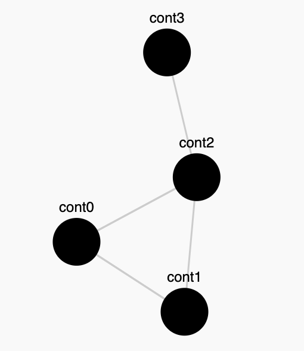
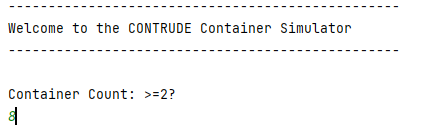
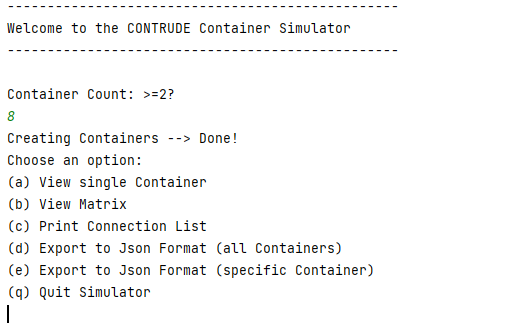
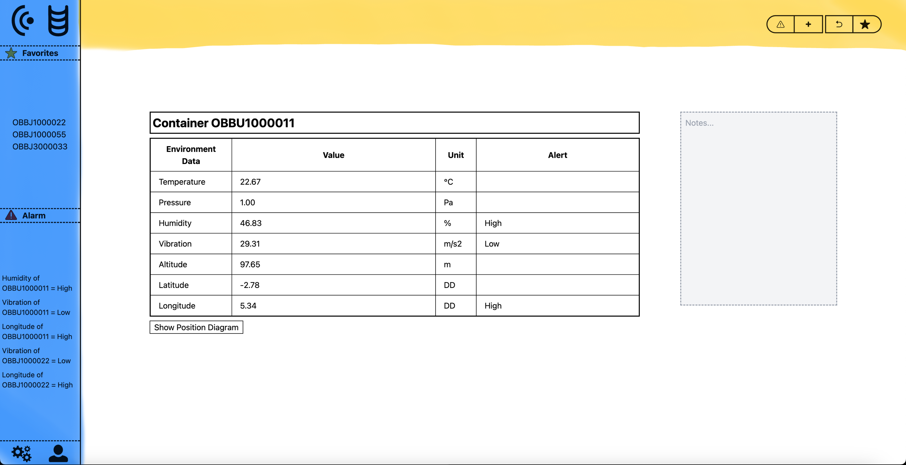
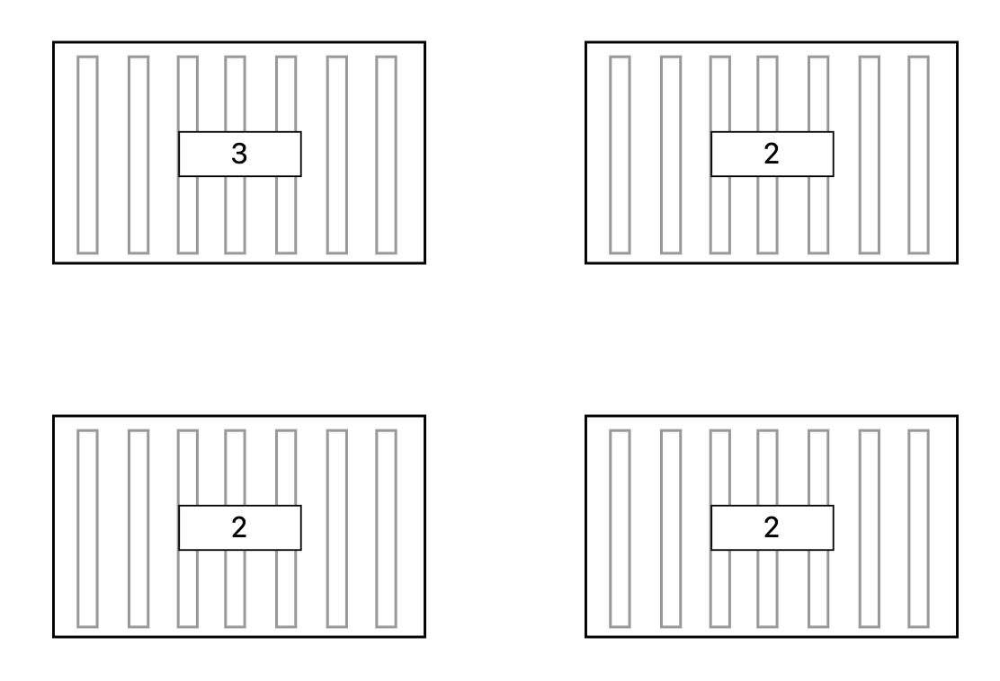
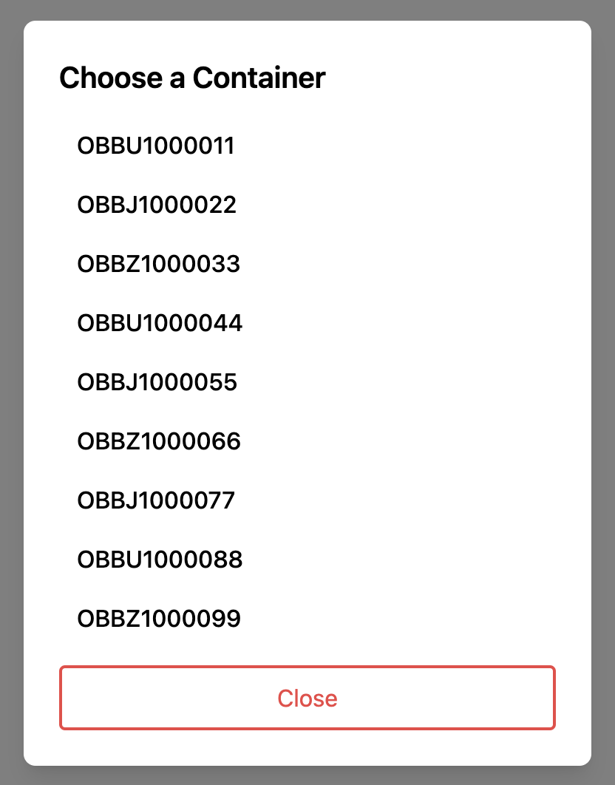
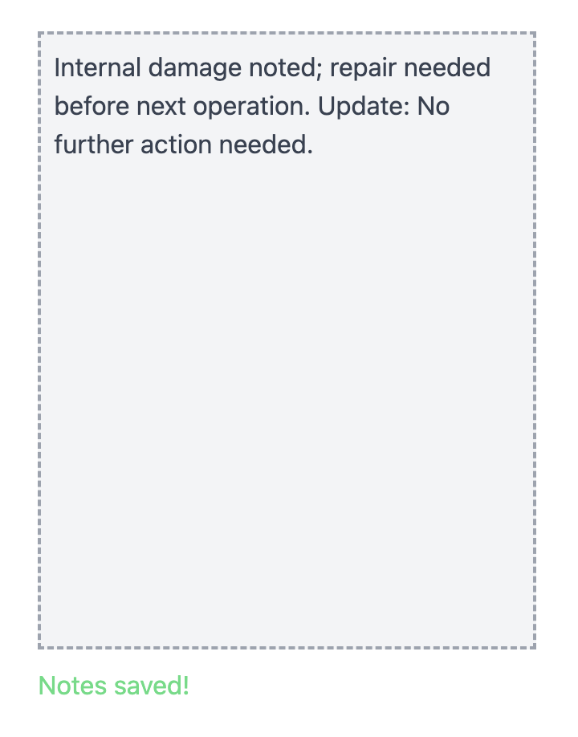
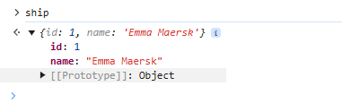
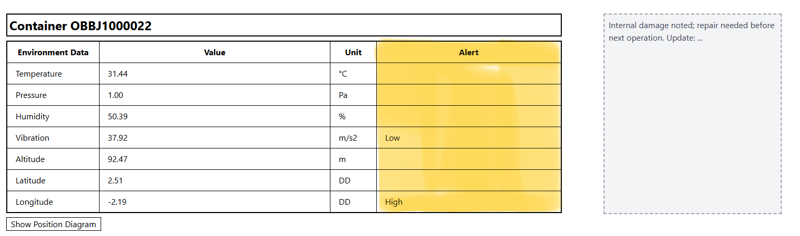

# Teilaufgabe Schüler Gekle

\textauthor{Luca Alexander Gekle}

## Theorie

### Java Container Simulator

Ein zentraler Aspekt der Diplomarbeit ist das ungefähre Identifizieren der Position eines bestimmten Containers auf einem Containerschiff.

Die Kapazität eines Schiffes wird in der Regel mit TEUs (Twenty Foot Equivalent Units) angegeben. Jeder Container ist also 20 Fuß (6,1 m) oder ca. 6 Meter lang. Containerschiffe können von weniger als tausend TEUs bis hin zu 24000 TEUs haben. [vgl. @Pfeiffer-Containerschiffe] [vgl. @IngenieurDE-Containershiffe]

![Entwicklung von Container Schiffen [@IncoDocs-TEU]](img/Gekle/Evolution-Container-Schiffe.jpg){width=75%}

Im Rahmen der Diplomarbeit werden aber nur 3 Prototypen angefertigt, welche einerseits die benötigten Umweltdaten liefern, andererseits aber auch miteinander kommunizieren. Die Komplexität eines "Containergeflechts" bestehend aus nur 3 Containern hält sich daher in Grenzen und um den vollen Umfang unserer Diplomarbeit zu veranschaulichen ist ein anderer Weg vonnöten. Dies ist, wo der Simulator ins Spiel kommt: Er übernimmt die Aufgabe, ein System an Containern ohne hunderten oder gar tausenden Prototypen darzustellen.

#### Graphentheorie

Das Endergebnis des Simulators sollt ein Graph sein, welcher dabei hilft, die Verbindungen zwischen den einzelnen Containern zu skizzieren. Die Graphentheorie, ein Teilgebiet der Mathematik, spielt hierbei eine essenzielle Rolle.

Allgemein gilt folgendes:

>Ein **Graph** G besteht aus einer Menge V von **Knoten** und einer Menge E von Knotenpaaren, welche als **Kanten** bezeichnet werden. Die Notation für einen Graphen lautet G=(V,E)G=(V,E). E und V stehen dabei für _edges_ und _vertices_, also die englischen Begriffe für Kanten und Knoten. Eine Kante {u, v} ELEMENT E verbindet die Knoten u und v. [vgl. @Uni-Bremen-Graphentheorie]

Zusätzlich muss man innerhalb der Graphentheorie zwischen Ungerichteten und Gerichteten Graphen unterscheiden. Der primäre Unterschied liegt darin, ob die Kanten als einfache Striche (ungerichtet) oder Pfeile (gerichtet) dargestellt werden. [vgl. @Studyflix-Graphentheorie] 
Bei einem gerichteten Graph ist daher die Richtung der Kante/ Beziehung zu beachten. Gilt z.B. A -> B -> C mit V={A, B, C} und E={{A,B}, {B,C}}, dann ist es nicht erlaubt, etwa von C zu B zu gehen, sondern nur von B nach C. Bei einem ungerichteten Graph gilt diese Regel nicht. Selbiges Beispiel nur ungerichtet: A - B - C; hier darf man sowohl von B nach C als auch umgekehrt von C nach B gehen.

Abschließend muss man noch auf den Zusammenhang der einzelnen Knoten schauen. Ein ungerichteter Graph ist dann zusammenhängend, wenn alle Knoten erreichbar, also es zu jedem Knoten einen Weg gibt. Ist dies nicht der Fall, gibt es sogenannte isolierte Knoten und der Graph ist nicht zusammenhängend. Bei gerichteten Graphen unterscheidet man zusätzlich zwischen schwach und stark zusammenhängenden Graphen. [vgl. @Studyflix-Graphentheorie] 
In dem Beispiel A -> B mit V={A, B} und E={A,B}, ist der Knoten A nur erreichbar, wenn man die Richtung außer Acht lässt, man spricht von einem schwach zusammenhängenden Graph. Für einen stark zusammenhängenden Graph müsste zusätzlich noch eine Kante {B, A} bestehen.

Der Containersimulator hat als Endergebnis einen **ungerichteten** Graphen wie im folgenden Bild zu sehen ist:



Anhand des beispielhaften Graphs, lässt sich also folgendes herauslesen:

- Es gibt insgesamt 4 Knoten: V = {con0, con1, con2, con3}
- Es gibt insgesamt 4 Kanten: E = {{cont0, cont1}, {cont0, cont2}, {cont1, cont2}, {cont2, cont3}}

Die Beziehungen der Knoten im ungerichteten Graphen zueinander werden mittels Adjazenzen und Inzidenzen beschrieben werden. Man spricht von inzident, wenn bei einem Knoten V und einer Kante E folgendes gilt: $V \in E$. In anderen Worten: Eine Kante E verbindet den Knoten V mit einem anderen Knoten im Graph. Zwei Knoten V und W sind miteinander adjazent bzw. benachbart, falls mit einer Kante $E \in {V, W}$ eine direkte Verbindung zwischen den beiden Knoten existiert. Auch Kanten können inzident sein, wenn sie beide zu einem gemeinsamen (benachbarten) Knoten gehören. [vgl. @Uni-Bremen-Graphentheorie]

##### Inzidenzmatrix

Unter einer Inzidenzmatrix versteht man eine n x m Matrix (n... Anzahl der Knoten V und m... Anzahl der Kanten E). Durch die Erstellung der Inzidenzmatrix lassen sich die Inzidenzen abbilden, also man erkennt, ob der jeweilige Knoten an einer Kante anliegt oder nicht. [vgl. @BWL-Lexikon-Inzidenzmatrix]

Als Beispiel eine Erweiterung des Graphs von oben:


Hier wurden die Kanten durchnummeriert um die **Inzidenzmatrix** zu erstellen:

| **V/ E**  | **1** | **2** | **3** | **4** |
| --------- | ----- | ----- | ----- | ----- |
| **cont0** | 0     | 1     | 1     | 0     |
| **cont1** | 0     | 0     | 1     | 1     |
| **cont2** | 1     | 1     | 0     | 1     |
| **cont3** | 1     | 0     | 0     | 0     |

(1... Verbindung; 0... keine Verbindung) (V... Knoten) (E... Kanten)

##### Adjazenzmatrix

Wie für Inzidenzen gibt es auch für Adjazenzen eine Matrix, hierbei werden also die Nachbarschaften der einzelnen Knoten V abgebildet. Die Matrix ist bei einer Anzahl N an Knoten V also n x m groß. Ein Vorteil der Adjazenzmatrix ist, dass die Anzahl der Kanten E keine Rolle spielt und sie sich somit sehr gut als Rechenbasis für rechnerische Verarbeitungen des dazugehörigen Graphen eignet. Auch für die Durchführung von Analysen eignet sie sich sehr gut, so kann die Matrix etwa für folgendes hergezogen werden:

- Ermittlung erreichbarer Knoten
- Errechnen von Pfadlängen
- Analyse von Schleifenfreiheit

[vgl. @BigDataInsider]

Auch hier wird wieder das Beispiel aus dem Kapitel Indizenzmatrix verwendet und so folgende Adjazenzmatrix erstellt:

| V/ W      | cont0 | cont1 | cont2 | cont3 |
| --------- | ----- | ----- | ----- | ----- |
| **cont0** | **0** | 1     | 1     | 0     |
| **cont1** | 1     | **0** | 1     | 0     |
| **cont2** | 1     | 1     | **0** | 1     |
| **cont3** | 0     | 0     | 1     | **0** |

(1... Verbindung; 0... keine Verbindung) (V... Knoten) (W... 2. Knoten)

Wenn ein Knote V = Knote W ist, also bei einer Verbindung zu sich selbst wird 0 eingetragen. Dadurch entsteht in jeder Adjazenzmatrix eines ungerichteten Graph eine 0-Diagonale, welche oben auch gekennzeichnet wurde.

#### Visualisierung von Graphen

##### DOT

Mithilfe der DOT Sprache, welche Teil von Graphviz [vgl. @Graphviz-Homepage] ist, lassen sich sehr einfach gerichtete und ungerichtete Graphen darstellen. Dies erfolgt mit sogenannten "edgeloops", wobei "->" für gerichtete und "--" für ungerichtete Graphen steht. Diese können innerhalb eines Graphen benutzt werden, welcher durch `graph{}` für einen ungerichtete oder `diagraph{}` für einen gerichteten gekennzeichnet wird. Fügt man davor ein `strict` hinzu (also z.B. `strict graph{}`) so kann man bestimmen, dass zwischen zwei Knoten immer nur eine Verbindung besteht. [vgl. @GraphViz-Documentation] 
Basierend auf der Adjazenzmatrix kann man etwa so einen einfachen Graph erstellen:

```{caption="Beispiel DOT Code"}
strict graph G {
    
  cont0 -- cont1;
  cont0 -- cont2;
  
  cont1 -- cont2;
  cont1 -- cont0;
  
  cont2 -- cont0;
  cont2 -- cont1;
  cont2 -- cont3;
  
  cont3 -- cont2;
}
```

Dieser Code würde folgendem entsprechen:


##### Dragable Graph (DG)

Der große Vorteil des dragable Graphs besteht darin, dass er interaktiv ist. Ein User kann also mit dem Mauszeiger die einzelnen Knoten hin und her bewegen, wobei auch die Kanten sich mit bewegen. Dies hilft besonders bei der Benutzerfreundlichkeit, da sich der User den Graphen so richten kann, wie es ihm gefällt, wodurch sie sich sehr gut für Datenvisualisierung eignen. Eine JavaScript Bibliothek um so einem Graph zu ermöglichen ist z.B. D3.js. [vgl. @D3js-Homepage], welcher auch in der Diplomarbeit verwendet wurde. [vgl. @gpt-DragableGraph] Des weiteren ist es eine weitere Eigenschaft des DG, dass sich Knoten nicht übereinander lagern können, da sie sich von einander abstoßen. Durch diese Mechanik spannt sich der Graph automatisch auf und sorgt für eine übersichtliche Visualisierung der Contaiener (Knoten), ohne dass sie sich gegenseitig verdecken.

### Website

#### React

Bei React handelt es sich anders als bei z.B. Angular nicht tatsächlich um ein Framework im herkömmlichen Sinne. Vielmehr ist es eine Bibliothek zum Rendern graphischer Oberflächen. React setzt sehr stark auf Komponentenorientierung, wobei zwischen klassenbasierten und funktionalen Komponenten unterschieden wird. Die Tendenz geht allerdings immer mehr in Richtung funktioneller Komponente. [vgl. @Heise-React]

Auch hier im folgenden Beispiel ist eine funktionelle Komponente der Diplomarbeits-Website zu sehen. Dies lässt sich u.a. an dem für JavaScript typischen Syntax wie das "=>" erkennen, aber auch daran, dass sogenannte Hooks (z.B. useStates) verwendet werden:

```{caption="Beispiel funktionelle Komponente LoginField" .js}
const LoginField = ({ placeholder, value, onChange, isPassword = false }) => {
  const [showPassword, setShowPassword] = useState(false);
  const togglePasswordVisibility = () => {(...)}
  return (
    <div className="relative mb-4"> 
    (...)
    </div>
  );
};
export default LoginField;
```

`LoginField` kann rein theoretisch überall eingesetzt werden, da diese Komponente an und für sich nur eine spezielle Funktion übernimmt, jedoch kann man Komponenten aber auch so gestalten, dass sie sich je nach Einsatzgebiet sich unterschiedlich verhalten (z.B. anders aussehen, verschiedene andere Komponente übernehmen etc.).

Im folgenden Code lässt sich dies auch gut erkennen. Der Code entspringt einer "Page", also einer Seite, welche der User sieht. Der Code wird aber nicht von oben bis unten durch in dieser einen Page (ebenfalls eine funktionelle Komponente) geschrieben, sondern in mehrere Komponenten aufgebrochen. Diese können dann ganz einfach in die Page eingefügt werden. (z.B. `Sidebar`, `Topbar`, `Detailspace` usw.). Betrachtet man die `Topbar` Komponente, so sieht man, dass ihr weitere Komponenten übergeben werden, welche sie dann nutzen kann. Wie eben erwähnt können die Parameter oder Komponenten welche übergeben werden von Anwendungsfall zu Anwendungsfall komplett unterschiedlich sein:

```{caption="Unterschiedliche Verwendung von funktionelle Komponenten" .js}
<div className="flex h-screen">
  <Sidebar selectedShip={selectedShip} />
  <div className="flex-grow flex flex-col">
    <Topbar // Topbar in der MainPage
      leftComponents={[
        <SearchBar key="searchbar" selectedShip={selectedShip} onSearchSubmit=
        {handleSearchSubmit}
        />,
        <ShipSelect key="shipButton" ships={ships} selectedShip={selectedShip}
          onShipChange={setSelectedShip}
        />,
      ]}
      rightComponents={[
        <GridDropDown key="gridDropdown" gridSize={gridSize} setGridSize={setGridSize}
        />,
      ]}
    />
  </div>
</div>
```

Die `Topbar`-Komponente übernimmt in einer anderen Page etwa ganz andere Komponenten wie hier zu sehen ist:

```{caption="Alternative Verwendung der Topbar Komponente" .js}
// Topbar in der DetailPage
<Topbar
  leftComponents={[<SearchBar key="searchbar" />]}
  rightComponents={[
    <DetailControl
    onGoAlertClick={handleThreshholdViewerToggle} // Pass handler
  />
  ]}
/>
```

Anders als im ersten Code, wo eine `Searchbar`-, `ShipSelect`- und `GridDropDown`-Komponente übergeben wird, wird hier etwa eine `DetailControl`-Komponente übergeben. Die Funktionalität als auch das Aussehen der `Topbar` ändert sich so. Dieses Komponenten-basierte programmieren ist das Herz von React Development.

##### Use-State & Hooks

Mit der Verwendung von funktionellen Komponenten geht jedoch folgendes verloren:

- ein dedizierter Zustand (State), welcher durch die Render-Aufrufe bestehen bleibt
- die Verwendung von Lifecycle-Funktionen, welche das Verhalten des Komponents je nach Phase des Lifecycle steuern 

[vgl. @GeeksForGeeks-useState]

Der `useState`-Hook erlaubt es nun aber, dass State zu den funktionellen Komponenten hinzugefügt wird. [vgl. @GeeksForGeeks-useState]
Es können auch mehrere State-Variablen in einer Komponente definiert werden. Ein `useState` sieht in der Regel in etwa so aus:

```{caption="Beispiel useState Variable" .js}
const [username, setUsername] = useState('User');
```

- username = aktueller Zustand
- setUsername = Funktion um den Zustand zu aktualisieren
- 'User' = Anfangswert

Mit "Hooks" kann man sich also in die jeweilige Variable "einklinken".

Es gibt in React neben der useState auch noch andere Hooks. React selbst unterteilt diese in ihrer Dokumentation wiefolgt:

- Basic Hooks
- Additional Hooks
- Library Hooks

Die 3 "Basic Hooks" sind hierbei allerdings die wichtigsten. Neben dem bereits erwähnten `useState()` gibt es auch noch:

- `useEffect()` --> für Ausführung von Side-Effects wie das Laden von Daten via API, Event-Handler oder die Konsolen Ausgabe
- `useContext()` --> ermöglicht es Daten aus einem Context-Provider zu konsumieren

[vgl. @DoubleSlash-ReactHooks]

##### React Router

Viele Webanwendungen sind sogenannte "Single-Page-Webanwendungen". Sie bestehen also aus nur einem HTML-Dokument, wobei der Inhalt dynamisch nachgeladen wird. Sogenannte SPA (Single Page Applications) beinhalten also Komponenten, welche sich wie Seiten verhalten. Um so etwas zu erstellen, muss React-Router und das Routing verwendet werden. Mithilfe des Routings werden Komponenten Routen zugeordnet. Dies stellt `react-router-dom` zur Verfügung [vgl. @FreeCodeCamp-Routing] 

Dies erfolgt über das "Route" Element:

```{caption="Beispiel Route Element" .js}
<Route path="/main" element={<MainPage />} />
```

Hierbei wird über die URL ".../main" auf die MainPage verwiesen. Gibt man in der Adresszeile eines Browsers die URL ein, würde man rein theoretisch auf der MainPage landen.

Es ist wichtig anzumerken, dass alle Routes logischerweise Teil eines Routers sein müssen. Dies würde in etwa so aussehen:

```{caption="Beispiel React Router" .js}
const router = createBrowserRouter(
  createRoutesFromElements(
    <>
    {/* Hier kommen die Routes hin */}
    </>
  )
);
```

#### Frontend Build Tool - Vite

Bei der Verwendung von React ist es empfehlenswert ein sogenanntes Build Tool zu verwenden. Dieses übernimmt die Aufgabe des "Building", worunter man den Prozess versteht, in welchem der eigene Source Code so transformiert und gebündelt wird, dass er von Browsern interpretiert werden kann. [vgl. @CodeParrot-BuildTools]

Die zentralen Aufgaben eines Build Tools sind:

- konvertieren des JavaScript/ TypeScript Codes in eine für Browser kompatible Version
- bündeln von Komponenten und Files um die Anzahl an HTTP Requests für das Laden der App zu verringern
- unnütze Zeichen (z.B. Whitespaces) löschen um Ladezeiten zu verbessern
- allgemein die Performance des Codes verbessern (z.B. mit "Tree Shaking", welches unbenutzten Code eliminiert)

[vgl. @CodeParrot-BuildTools]

Eines dieser Build Tools ist Vite, welches sich besonders durch seine Geschwindigkeit auszeichnet (vite = französisch für schnell). Zu den Gründen warum Vite mittlerweile so beliebt ist zählen u.a.:

- Geschwindigkeit --> benutzt ES, um Quellcode direkt im Browser bereitzustellen
- out-of-the-box Support für React/TypeScript/...
- optimierter Build durch die Verwendung von Rollup als Bundler 

[vgl @CodeParrot-BuildTools]

{width=100%}

Selbst aber mit dem sogenannten HMR (Hot Module Replacement --> Änderungen im Code werden sofort im Browser angezeigt) tendieren Build Tools dazu, mit wachsendem JavaScript langsamer zu werden. Hierbei ist Vite jedoch besonders. Es nutzt eine Kombination aus ES Modulen und einem virtuellen Modulsystem: [vgl. @Telerik-BuildTools]

> Wenn Sie ein Modul importieren, behandelt Vite es als virtuelles Modul. Während der Entwicklung bündelt es nicht Ihren gesamten Code in eine einzelne Datei. Stattdessen erstellt es bei Bedarf Builds für jedes Modul und stellt sie in separaten Dateien bereit. Dieser Ansatz eliminiert die Notwendigkeit eines vollständigen Bündelungsprozesses bei jeder Änderung, führt zu schnelleren Reloads und – natürlich – zu einem zufriedenen Entwickler. [vgl. @Telerik-BuildTools]

##### Erstellen eines React-Projekt mit Vite
TBA

#### Tailwind CSS

Tailwind CSS ist ein CSS Framework, welches darauf abzielt das Designen von Webanwendungen zu vereinfachen, indem vordefinierte Utility Klassen benutzt werden. [vgl. @GeeksForGeeks-TailwindCSS]

Der Unterschied zwischen Tailwind CSS und traditionellen CSS könnte z.B. so aussehen (in React):
Ohne Tailwind CSS:

```{caption="Div in HTML" .html}
<div class="search-container"> CODE </div>
```

```{caption="Traditionelles CSS für das obige Div" .css}
.search-container {
    width: 18rem; /* w-72 */
    padding-left: 0.75rem; /* pl-3 */
    height: 2.25rem; /* h-9 */
    background-color: white;
    display: flex;
    justify-content: flex-start;
    align-items: center;
    border: 2px solid black;
    border-top-left-radius: 9999px; /* rounded-l-full */
}
```

Mit Tailwind CSS:

```{caption="CSS styling eines Div mit Tailwind" .js}
<div className='w-72 pl-3 h-9 bg-white flex justify-start items-center border-2 border-black rounded-l-full'>
  CODE
</div>
```

Tailwind CSS scannt alle HTML-Dateien, JavaScript-Komponenten und andere Templates nach Klassenbezeichnern. Diese Bezeichner, die im Code verwendet werden (z. B. `w-72`, `bg-white`, `flex`), repräsentieren bestimmte Stileigenschaften. Nachdem Tailwind alle genutzten Klassen gefunden hat, generiert es die entsprechenden CSS-Regeln und schreibt sie in eine statische CSS-Datei. [vgl. @TailwindCSS-Docs-GettingStarted]

Es ist auch möglich, Tailwind CSS mit bestimmten Ereignissen zu verknüpfen. So ist es z.B. möglich folgendes zu tun:

```{caption="Hover Funktion von Tailwind CSS" .js}
<button className='bg-red-400 hover:bg-red-600'>BUTTON</button>
```

Dies sagt aus, dass im Zustand "hover", also wenn der User mit dem Mauszeiger über den Knopf hovert, der Farbton von `red-400` auf den dunkleren Rotton `red-600` geändert werden soll. Bezüglich den Farben bietet TailwindCSS allgemein eine sehr große Palette an vordefinierten Farben, welche mit Texten, Border-Liniern oder auch dem eben erwähnten `hover` kombiniert werden können. Dies lässt sich auch im Bild sehr gut erkennen:


Tailwind nennt dies Pseudo Klassen. Die 3 wichtigsten sind folgende:

- Hover --> aktiviert, wenn der User über das Element hovert
- Focus --> aktiviert, wenn der User das Element z.B. durch einen Klick in Fokus nimmt
- Active --> aktiviert, wenn der User das Element durch User aktiviert wird

[vgl. @TailwindCSS-DocsV1]

All diese Pseudo Klassen können auch mit "group-" verbunden werden, um mehrere Code-Teile gleichzeitig zu manipulieren. [vgl. @TailwindCSS-DocsV1]

Die großen Vorteile von Tailwind CSS sind also, dass keine externen CSS Files erstellt werden müssen und man sich nicht immer komplexere Klassen-Namen ausdenken muss. Auch die eingebaute Reaktionsfähigkeit spricht für das Framework. Zusätzlich bietet Tailwind eine umfassende Dokumentation, was das programmieren viel einfacher und effizienter macht. [vgl. @GeeksForGeeks-TailwindCSS]

#### REST und Axios

Die Webanwendung benötigt, damit sie ordentlich und sinnvoll funktioniert Daten aus dem Backend. Diese Daten werden über die REST (Representational State Transfer) API in das Frontend (sprich die Website) geholt.

##### REST

Die API, welche aufgrund ihrer Flexibilität, Schnelligkeit und Einfachheit berühmt wurde benutzt in der Regel das HTTP-Protokoll und überträgt die Daten mithilfe von JSON. Im Kontext einer Website wird mit dem Eingeben/Aufrufen einer URL, eine HTTP Anfrage gesendet. Die wichtigsten HTTP Befehle hierbei sind:

- GET (Abrufen)
- POST (Erstellen)
- PUT (Aktualisieren)
- DELETE (Löschen)

[vgl. @Talend-REST]

Die Anfrage geht dann beim Server ein und die REST API kümmert sich darum, dass eine Antwort gesucht und sofort zurückgeliefert wird. Die Antworten sind in der Regel im JSON (JavaScript Object Notation) Format. [vgl. @Talend-REST]

##### Kriterien für REST

Damit eine REST API gültig ist, müssen 6 Kriterien erfüllt sein:

1. Architektur --> Clients, Servern und Ressourcen bei welcher Anfragen über HTTP laufen
2. "Statelessness" --> es werden keine Client-Informationen zwischen Anfragen gespeichert
3. Cachefähige Daten --> optimiert Interaktion zwischen Client und Server
4. einheitliche Schnittstelle zwischen Komponenten --> von überall kann auf Ressourcen gleich zugegriffen werden
5. mehrschichtiges System --> organisiert einzelne Servertypen und macht Struktur für Client unsichtbar
6. Code-On-Dmand --> auf Anforderungen ausführbaren Code von Server an Client senden (optional)

[vgl. @RedHat-REST]

##### REST in REACT - Axios

Es ist durchaus möglich, HTTP Abfragen innerhalb von React ohne externer Library zu benutzen. Allerdings hat eine benutzerfreundliche externe API wie Axios durchaus seine Vorteile. Axios verwendet Promises (JavaScript Objekte welche den zukünftigen Wert einer asynchronen Funktion repräsentiert), wodurch es einfacher ist mit "asnyc functions" zu arbeiten. Auch die Tatsache, dass Axios automatisch JSON Objekte in JavaScript Objekte überführt, sprich man ersparrt sich die `.json`-Anweisung, spricht für die Verwendung davon. Zusätzliche Vorteile von Axios sind:

- eingebaute Funktionen zum Abbrechen von Abfragen
- interzeptieren (vor Senden einer Abfrage/ nach Erhalten einer Antwort logische Operationen durchführen)
- hat CSRF (Cross Site Request Forgery) Schutz
- breite Community + Support

[vgl. @GeeksForGeeks-Axios]

Weiters ist der Code mit Axios etwas einfacher zu lesen:
Ohne:

```{caption="Beispiel REST Call mit fetch-api" .js}
const response = await fetch('https://api.contrude.eu/login', { 
  method: 'POST', 
  headers: { 'Content-Type': 'application/json', }, 
  body: JSON.stringify(loginData), });
```

Mit:

```{caption="Beispiel REST Call mit Axios" .js}
const response = await axios.post('https://api.contrude.eu/login', loginData, { 
headers: { 'Content-Type': 'application/json', }, });
```

Die BaseURL und der Header sind bei jedem Call über die gesamte Website hinweg die gleichen, daher kann man in einem separaten JavaScript File eine sogenannte Axios Instanz [vgl. @gpt-AxiosVT] erstellen:
```{caption="Axios Instanz" .js}
import axios from 'axios';

const axiosInstance = axios.create({
  baseURL: 'https://api.contrude.eu',
  headers: {
    'Content-Type': 'application/json',
  },
});

export default axiosInstance;
```
[vgl. @Axios-Docs-Instance]

Diese wird dann in allen Komponenten eingebunden, in welchen man REST-Abfrage durchführt: `import axiosInstance from '../api/AxiosInstance';`

Ein Call würde dann noch vereinfachter aussehen:
```{caption="Beispiel REST Call mit Axios + Instanz" .js}
const response = await axiosinstance.post('https://api.contrude.eu/login', loginData);
```

Die Fehlerbehandlung ist durch Axios ebenfalls verbessert. So sieht fetch das Promise bei z.B. HTTP Fehlercodes wie 404 oder 500 trotzdem als erfüllt. Sprich: Der Status Code muss explizit überprüft werden. Ein Fehler wird also nur ausgelöst, wenn es sich um ein Netzwerkproblem handelt (z.B. Server nicht erreichbar). Axios sieht HTTP-Fehler aber automatisch als das, was sie sind, Fehler, und lehnt das Promise ab wodurch die Fehlerbehandlung vereinfacht wird. [vgl. @gpt-AxiosVT]

Alle Abfragen werden innerhalb von asynchronen Funktionen durchgeführt. Dies hat einerseits den Vorteil, dass der Code besser lesbar ist, da ohne `async` mit `.then` und `.catch` gearbeitet werden muss. So wird auch sogenannten "Callback-Hells" vorgebeugt, da man sich nicht in `then` Schleifen verlieren kann. Auch die Fehlerbehandlung ist aufgrund von `try/catch` einfacher und sauberer. [vgl. @gpt-WarumAsync]

## Praktische Arbeit

### Java Container Simulator

#### Klassen

##### Container
Diese Klasse ist eine etwas modifizierte POJO (Plain Old Java Object) Klasse mit folgenden Variablen:

- String `name`
- List\<Container> `adjacentContainers`(ArrayList)
- double `signalMinimum`

Die `name`-Variable aller Container ist gleich aufgebaut: "cont#", wobei # für eine beliebige Nummer steht. Dies macht die Namen nicht unnötig kompliziert und hat auch innerhalb der Konsolen-Interaktion mit dem User seinen Vorteil. In `adjacentContainers` werden alle benachbarten Container, also jene, zu welchen der ausgewählte Container eine Verbindung hat bzw. welche in seiner Nähe sind, abgespeichert. Die Variable `signalMinimum` ist eine mithilfe von `ThreadLocalRandom.current()` erstellte zufällige Double-Variable, welche für das generieren der Verbindung zwischen der einzelnen Container noch wichtig wird. `ThreadLocalRandom` wird eigentlich eher für Multithreading-Anwendungen benutzt [vgl. @Baeldung-JavaRandom], jedoch ist der Syntax um eine Zufallszahl mit "von-bis" zu generieren etwas angenehmer zu lesen:
```{caption="Zufällige Nummer mit .math und ThreadLocalRandom" .java}
// Mit Math.random
this.signalMinimum = 10 + (25 - 10) * Math.random();

// Mit ThreadLocalRandom
this.signalMinimum = ThreadLocalRandom.current().nextDouble(10, 25);
```
Der Grund hierfür ist, da `Math.random` nur eine Zahl zwischen 0 & 1 generiert, während man bei `ThreadLocalRandom` den Minimalen und Maximalen Wert einfach angeben kann.

Bezüglich Methoden hat `Container` für alle Variablen Getter und Setter und einen Konstruktor, mit welchem `name` und `signalMinimum` gesetzt werden. Mithilfe von `void addDestination(Container con)` kann ein benachbarter Container zur Liste hinzugefügt werden (die Liste wird außerhalb des Konstruktors initialisiert . Auch die `toString` wurde etwas angepasst, um die Ausgabe in der Konsole etwas besser aussehen zu lassen:
```{caption="Überarbeitung der .toString Methode von Container" .java}
@Override
public String toString() {
    StringBuilder adjacent = new StringBuilder();
    for (Container container : adjacentContainers) {
        adjacent.append(container.getName()).append(", ");
    }
  
    return "Container{" +
            "name='" + name + '\'' +
            ", adjacentContainers=" + adjacent +
            ", signalMinimum=" + signalMinimum +
            '}';
}
```
Entspricht:
```{caption="Ausgabe mittels toString von Container" .txt}
Container{name='cont1', adjacentContainers=cont0, , signalMinimum=10.753991237010691}
```
##### Ship
Dies ist die zweite Klasse, in welcher alle für den Simulator notwendigen Funktionen implementiert sind. Die Klasse selbst verwaltet drei Variablen:

- Set\<Container> `containers` (HashSet)
- ArrayList\<String> `contConList`
- int[][] `adjMatrix`

In dem HashSet werden alle in der Main Klasse generierten Container abgespeichert. In der `contConList` werden alle Verbindungen zeischen Containern im Format "A;B" abgespeichert, wobei A für Container (= Knoten im Graphen) und das Semicolon für die Verbindung (=Kante im Graphen) stehen. Das 2d-Array repräsentiert eine Adjazenzmatrix, welche u.a für das schreiben in JSON Files benötigt wird.

Mit `void addContainer (Container con)` können Container in das Set hinzugefügt werden. Weitere Methoden sind diejenigen zum Schreiben in JSON Files oder jene, welche für das Konsolen-Programm benötigt werden (z.B. `printAdjMatrix` zum Schreiben der Adjazenz Matrix). Außerdem erledigt die die Aufgabe der Erstellung der Verbindungen zwischen den einzelnen Container-Objekten.

##### Main
Der Container Simulator ist an und für sich ein Konsolen-Programm. Die Interaktion zwischen dem User und dem Simulator passiert also (fast) rein in der Konsole. Die `Main`-Klasse regelt diese. Sie erstellt die Container, basierend auf der vom User eingegebenen Menge und übergibt diese an die ebenfalls von ihr erstellten `Ship`-Klasse. Die User-Interaktion wird dann innerhalb einer `while`-Schleife fortgesetzt. Hier kann der User mehrere Buchstaben eingeben, welche für verschiedene Aktionen stehen:
```{caption="Auswahlmöglichkeiten des Simulators" .java}
System.out.println("\nChoose an option:\n" +
        "(a) View single Container\n" +
        "(b) View Matrix\n" +
        "(c) Print Connection List\n" +
        "(d) Export to Json Format (all Containers)\n" +
        "(e) Export to Json Format (specific Container)\n" +
        "(q) Quit Simulator");
in = sc.nextLine();
```
Über einen `Scanner` wird diese Eingabe dann geprüft. Das Ausführen der passenden Aktionen regelt ein `switch-case`, wobei auf ein `default` gesetzt ist, sollte die User-Eingabe inkorrekt sein. Sobald der User "q" eingibt bricht die `while`-Schleife ab, dies wird durch folgenden Ausdruck ermöglich:
```{caption="While Schleife in welcher die Main läuft" .java}
while(!in.equals("q")){}
```
#### Wie die Dummy-Daten + Verbindungen generiert werden
 Startet man das Programm so wird man als erstes zu folgendem aufgefordert:



Der User bestimmt also, wie viele Container für die Simulation erstellt werden sollen. ">=2" wurde deshalb als Bedingung eingeführt, da ein Simuliertes Schiff mit nur einem Container keinen Graph mit Knoten und Kanten entsprechen würde. Da es ja das Ziel ist, die Kommunikationsstruktur mit Kanten darzustellen, mach die Auswahl 1 wenig Sinn.

Bestätigt der User seine Eingabe mit Enter, so wird ein `Ship` Objekt erstellt. Dieses hat als Zentrale Variable ein `Container`-Set namens `containers`, worin alle Container gespeichert werden. Das Erstellen und Speichern der Container selbst passiert in der `Main` mit folgendem Code:
```{caption="Code zum Erstellen der Container" .java}
for(int i = 0; i < count; i++){
    String containerName = "cont" + i;
    ship.addContainer(new Container(containerName));
}
```
Die `count` Variable ist zu Beginn auf -1 gesetzt. Dies hat den Hintergrund, da die Namen der Container bei 0 anfangen (also mit "cont0"), der User aber die tatsächliche Anzahl eingeben soll (z.B.: Eingabe = 7 --> Container Namen: cont0 bis cont6 = 7 Stk). Wichtig ist auch anzumerken, dass nur der Container Name in `ship` gespeichert wird, da `signalMinimum` einfach dann von den Methoden selbst geholt wird, welche diese brauchen.

Nachdem die Container erstellt sind müssen noch die Verbindungen bzw. Nachbarschaften der Container bestimmt werden. Dies übernimmt folgende Methode:
```{caption="Methode welche die Verbindungen zwischen einzelnen Containern erstellt" .java}
public void sendSetSignals(Container container){
    double signal = 15;
    double randomNum = ThreadLocalRandom.current().nextDouble(0.1, 1.0);
    boolean add = ThreadLocalRandom.current().nextBoolean();
  
    if(add){
        signal = signal + randomNum;
    }else{
        signal = signal - randomNum;
    }
  
    Container origin = container;
    for(Container cont : this.containers){
        if(!cont.getName().equals(origin.getName())){
            if(cont.getSignalMinimum() <= signal && checkContConList(origin.getName(),
             cont.getName())){
                origin.addDestination(cont);
                contConList.add(extractId(origin.getName()) + ";" +
                extractId(cont.getName()));
            }
        }
    }
    redoAllMinSignals();
}
```
Als Basis-Signal wurde willkürlich 15 hergenommen, dieser Wert wird dann um einen zufälligen Wert zwischen 0.1 und 1 ebenfalls zufällig verkleinert oder vergrößert. Dann wird der momentan übergebene Container (z.B. cont5) auf `origin` gesetzt. Innerhalb der `for`-Schleife wird dann solange werden dann alle Container durchgegangen. Entspricht `cont` nicht `origin`, so wird geprüft ob das abgewandelte `signal` kleiner-gleich dem Minimum-Signal von `cont` ist. Sollte dies der Fall sein und besteht noch keine Verbindung zwischen den beiden (`checkContConList`), so gilt `cont` als Nachbar von `origin` und wird dementsprechend auch als solcher festgehalten. Es ist wichtig anzumerken, dass diese Methode von der `main` innerhalb einer `for-each` Schleife aufgerufen wird, also jeder erstellte Container einmal `origin` ist.

Was würde es nun bewirken, wenn `randomNum` weiter verstreut wird (z.B, 0.1 bis 10)? Würde man diese Umstellung im Simulator umsetzten, dann steigt der Wert um welchen das Basis-Signal (15) erhöht werden KANN (auch eine Verringerung ist natürlich möglich). Dies bedeutet, dass der Wahrscheinlichkeit, dass folgender Fall entritt: `cont.getSignalMinimum() <= signal => TRUE` steigt, was wiederum bedeutet, dass die Vernetzung zwischen den Containern dichter wird. Anders sinkt die Eintritts-Wahrscheinlichkeit des Ausdrucks, wenn `randomNum` verringert wird (z.B. auf 0.01 bis 0.1).

#### Verwendung der Daten (Funktionen des Simulators)
Ist die Anzahl der Container erst einmal eingegeben, so wird der User mit folgendem konfrontiert:



Der User hat nun also die Wahl zwischen sechs verschiedenen Funktionalitäten des Containers.

##### View single Container
Möchte man zu einem Container die Details einsehen, wie etwa welche Nachbar-Container dieser besitzt kann mit (a) dies gemacht werden. Der User wird gefragt, welchen Container er einsehen möchte, hierbei wird auch deutlich gemacht, dass die Eingabe des Users `cont#` sein sollte wobei der Hashtag für eine Zahl steht. Der Eingelesene Name wird dann mit der `checkIfContainerWithNameExists`-Methode des `ship` überprüft, gibt diese NULL zurück, so wird dem User mitgeteilt, dass für den eingegebenen Namen kein Container existiert, ansonsten wird wird über die `getSingleContainer` (ebenfalls von `ship`) das gesamte Container Objekt zurückgegeben und mithilfe der Veränderten `.toString` ausgegeben.

##### View Matrix
Teil des `ship` ist ebenfalls eine Adjazenzmatrix, welche nach dem Erstellen der Container und deren Vernetzungen in der `void fillAdjMatrix()` von `ship` angelegt wird. Dies geschieht durch zwei `for-each`-Schleifen:

- Die Erste geht alle Container der `containers`-Set durch (=`origin`)
- Die Zweite geht alle benachbarten Container von `origin` durch, welche mittels dem Getter von `adjacentContainers` hergeholt werden (=`destination`)

Von diesen beiden Variablen werden dann eine 1 in ein 2d-Array an der Position \[ID-origin]\[ID-destination]gespeichert. Was ist die ID? Die ID ist jene Zahl, welche nach dem "cont" des Namens steht (z.B: name="cont2"; ID = 2). Dies wird über eine separate Methode namens `extractID` gemacht. 
[vgl. @gpt-IdExtractor] 

Wählt der User nun "View Matrix" aus so wird sie folgendermaßen ausgegeben:
```{caption="Ausgabe der Adjazenzmatrix in der Konsole" .txt}
c  0  1  2  3
0  0  1  0  0 
1  0  0  1  0 
2  0  1  0  1 
3  0  0  1  0 
```
(Beispiel mit 4 Containern)

Für diese Ausgabe ist eine weitere Methode von `ship` verantwortlich: `void printAdjMatrix()`. Diese gibt zuerst die erste Zeile beginnend mit dem "c" aus, wobei die Länge der `for`-Schleife in welcher dies passiert, auf `containers.size()` beschränkt ist. Danach geht eine verschachtelte `for`-Schleife das 2d-Array der Adjazenzmatrix durch und gibt entwerder 0 (keine Verbindung) oder 1 (Verbindung) aus.

##### Print Connection List
Möchte der User sich über die "primitivste" Weiße, alle Verbindungen zwischen den Containern haben, so kann er sich die `contConList` von `ship` ausgeben lassen. Dies passiert über die Methode `void printContConList()`, welch die eben erwähnte Variable mit einer `for`-Schleife durchgeht und printet. Dies könnte in etwa so aussehen:
```{caption="Ausgabe der contConList in der Konsole" .txt}
cont0;cont1
cont0;cont3
cont1;cont2
cont2;cont0
```
(Beispiel mit 4 Containern)

Besonders aber in der Entwicklungsphase des Simulators war dies sehr nützlich um schnell zu sehen welcher Container von sich aus die meisten Verbindungen hatte. Dies war besonders später beim Erstellen der Dragable Graphs sehr nützlich, da dieser immer einen Container als Ausgangspunkt nimmt. Die Liste ist auch bis zu einem gewissen Grad sortiert, da beim Muster "A;B" A sich erste ändert, wenn alle Bs durch sind.

#### Exportieren in JSON files
 Es gibt zwei mögliche JSON Files, welche erstellt werden können:

- `graph.json`
- `graphSpecific.json`

Beide sind in ihrem Aufbau sehr ähnlich, dienen aber unterschiedlichen Zwecken. 

`graph.json` entspringt folgender Methode:
```{caption="parseAllContainers Methode" .java}
public JSONObject parseAllContainersToJSON(){
    JSONArray containersJSON = new JSONArray();
  
    for(Container c : containers){
        JSONObject containerJSONObject = new JSONObject();
        containerJSONObject.put("contId", c.getName());
  
        if(getAllSubs(c) != null){
            JSONArray subsOfC = getAllSubs(c);
            containerJSONObject.put("subs", subsOfC);
        }  
        containersJSON.put(containerJSONObject);
  
    }
  
    JSONObject finalJSON = new JSONObject();
    finalJSON.put("containers", containersJSON);
    return finalJSON;
}
```

Diese Methode iteriert über alle bereits bestehenden Container. Es wird jeweils ein neues `JSONObject` erstellt und mit `.put` der Name des momentanen Containers zusammen mit "contId" in das neu erstellte JSON-Objekt hinzugefügt. Nun kommt die `getAllSubs`-Methode in das Spiel: Dieser wird der aktuelle Container übergeben und sie checkt dann anhand der **Adjazenz-Matrix**, ob es "1", also Verbindungen zu anderen Container gibt. Ist dies der Fall, gibt sie ein `JSONArray` zurück, ist dies nicht der Fall, NULL. Im Fall, ein `JSON`-Array vorhanden ist, fügt die `parseAllContainersToJSON`-Methode dieses mit dem Key "subs" (Sub-Container = benachbarte Container) ebenfalls zum JSON-Objekt hinzu , bevor dieses dann selbst in das `containersJSON`-Array hinzugefügt wird. Da die Methode ein `JSONObject` zurückgeben soll (Grund: da die Export-Methode dies verlangt), wird ein abschließendes `JSONObject` erstellt, welches das Array mit dem key "containers" abspeicher.
[vgl. @HowToDoInJava-JSON & @MavenRepository-JSON]

Das zweite File, entstammt einer anderen Funktion namens `parseSpecificToJSON`:
```{caption="parseSpecificToJSON Methode" .java}
public JSONObject parseSpecificToJSON(Container origin, int depth){ 
    JSONObject originJSONObject = new JSONObject();
    originJSONObject.put("contId", origin.getName());
    
    if (depth > 0) {
        JSONArray subsArray = new JSONArray();
        JSONArray subsOfOrigin = getAllSubs(origin);
  
        if (subsOfOrigin != null) {
            for (Object sub : subsOfOrigin) {
                JSONObject subJSONObject = (JSONObject) sub;
                Container subContainer = convertJSONToContainer(subJSONObject);
  
                JSONObject subContainerJSON = parseSpecificToJSON(subContainer, depth -1);
                subsArray.put(subContainerJSON);
            }
            originJSONObject.put("subs", subsArray);
        }
    }
 return originJSONObject;
}
```
[vgl. @gpt-SpecificJson]

Diese Methode übernimmt einen Ausgangscontainer `origin` und eine Tiefe `depth`. Zeil dieser Methode ist es, bis zu einer gewissen Tiefe die Sub-Container eines Ausgangscontainers in ein JSON-Objekt zu schreiben. Angenommen der Ausgangscontainer ist "cont0" und die Tiefe ist 3, dann wird der Ausgangscontainer (Tiefe 0), seine Verbindungs-Container (Tiefe 1) und deren Verbindungs-Container (Tiefe 2) in ein JSON-File geschrieben. Es ist diese Methode, welches die Grundlage für das JSON File liefert, welches später im Dragable Graph ebenfalls verwendet wird.

Zur  Erklärung dieser Methode: Sollte eine passende Tiefe (>0) übergeben worden sein und besitzt der Ausgangs-Container Verbindungen zu Anderen, so wird eine `For`-Schleife ausgelöst, welche alle Sub-Container des `origin` durchgeht. Jedes dieser "sub Objects" wird dann in ein `JSOBObject` gecastet und daraufhin mit einer Hilfsmethode (=`convertJSONToContainer` [vgl. @gpt-SpecificJson]) in ein `Container`-Objekt umgewandelt. Nun beginnt das rekursive Aufrufen der Methode, wobei `depth` immer um eins verringert wird. Durch dieses rekursive Aufrufen wird immer einer der `subs` von dem ursprünglichen `origin`, das neue `origin` bis eben die Tiefe 0 erreicht hat und die Methode zu Ende ist. 

Das eigentliche Schreiben in die jeweiligen JSON Files übernimmt die Methode `exportToJsonFile` ([vgl. @gpt-SpecificJson]), welche folgende drei Variablen übernimmt:

- boolean `sepcific`
- int `depth`
- Container `spc`

Ist `sepcifc = false`, dann ruft die Methode `parseAllContainersToJSON` auf, ist sie TRUE `parseSpecificToJSON(spc, depth)`. Mithilfe eines `FileWriters` wird dann entweder in `graph.json` (bei `sepcifc = false`) oder in `graphSpecific.json` (bei `sepcifc = true`) geschrieben.

Das Aufrufen dieser Methode geschieht in der `Main`, wobei der User den Ausgangscontainer und die Tiefe angeben muss, sollte er "specific" wählen.

Unter folgender Annahme..:
```{caption="Beispiel für das JSON Erstellen basierend auf einem Container Geflecht mit Angabe der Tiefe und Origin" .txt}
Container Anzahl = 4
Adjazenz Matrix =
c  0  1  2  3
0  0  1  1  1 
1  1  0  0  0 
2  0  0  0  0 
3  0  0  1  0 

Origin = cont1
Tiefe = 2
```
..würden folgende 2 Files entstehen:

**graph.json**:
```{caption="Erstelltes graph.json File basierend auf den obrigen Beispiel" .java}
{"containers": [
    {"contId": "cont2"},
    {
        "contId": "cont1",
        "subs": [{"contId": "cont0"}]
    },
    {
        "contId": "cont0",
        "subs": [
            {"contId": "cont1"},
            {"contId": "cont2"},
            {"contId": "cont3"}
        ]
    },
    {
        "contId": "cont3",
        "subs": [{"contId": "cont2"}]
    }]}
```

**graphSpecific.json**:
```{caption="Erstelltes graphSpecific.json basierend auf den obrigen Beispiel" .java}
{
    "contId": "cont1",
    "subs": [{
        "contId": "cont0",
        "subs": [
            {"contId": "cont1"},
            {"contId": "cont2"},
            {"contId": "cont3"}
        ]
    }]
}
```

#### Zustandekommen des Dragable Graphs
Die Erstellung des Graphen erfolgt über die JavaScript Bibliothek D3.js, welche für ihre dynamischen Visualisierungen von Graphen berühmt ist. Das Skript übernimmt die `graphSpecific.json` und teilt den Inhalt in zwei Arrays `nodes` (=Knoten) und `links` (=Kanten) auf, wobei mit einem Hilfsobjekt gesichert wird, dass kein Container doppelt vor kommt. [vgl. @gpt-D3jsDGScript]

> D3s Kraft-gestützte Simulation (forceSimulation) berechnet die Positionen der Knoten basierend auf folgenden Kräften:
> - forceLink: Verbindet Knoten basierend auf den Links.
> - forceManyBody: Erzeugt eine Abstoßung zwischen Knoten, damit sie nicht zu dicht beieinander liegen.
> - forceCenter: Zentriert das gesamte Diagramm im SVG-Bereich.

[vgl. @gpt-D3jsDGScript]

```{caption="Verwendung eines svg-Elements um den Graphen zu rendern" .js}
const svg = d3.select('svg');
const width = window.innerWidth;
const height = window.innerHeight;

const simulation = d3.forceSimulation(nodes)
    .force('link', d3.forceLink(links).id(d => d.id).distance(100))
    .force('charge', d3.forceManyBody().strength(-300))
    .force('center', d3.forceCenter(width / 2, height / 2));
```
[vgl. @gpt-D3jsDGScript]

Wie bereits erwähnt entstammen die Kanten aus dem `links`-Array. Die Container selbst, erscheinen in Form eines Kreises (mit ihrem Namen) als Knoten. Das Hin- und Her- ziehen dieser Knoten wird über die D3s Dragging-API umgesetzt. Zieht der User den Knoten von A nach B, so wird die Simulation neu gestartet, um die Position dynamisch anzupassen. Ist die Drag-Geste vollendet, so wird die Simulation wieder gestoppt und der Knoten verbleibt an seiner Position. Zusätzlich wird durch das Einfärben der Komponente des Graphen, der Knoten (blau) mit seinen Verbindungen (orange) zu anderen Containern (grün) hervorgehoben. Dies wird über die Klassen `highlight`, `connected` und `highlight-link` gesteuert:

```{caption="Farbsteuerung des Graphen" .js}
function highlightNode(event, selectedNode) {
    node.selectAll('circle').classed('highlight', false).classed('connected', false);
    link.classed('highlight-link', false);

    // Knoten hervorheben
    d3.select(event.currentTarget).select('circle').classed('highlight', true);

    // Verbindungen hervorheben
    link.filter(d => d.source.id === selectedNode.id || d.target.id === selectedNode.id)
        .classed('highlight-link', true);

    // Verbundene Knoten hervorheben
    node.filter(d =>
        links.some(link =>
            (link.source.id === selectedNode.id && link.target.id === d.id) ||
            (link.target.id === selectedNode.id && link.source.id === d.id)
        ))
        .select('circle')
        .classed('connected', true);
}

```
[vgl. @gpt-D3jsDGScript]

Basierend auf dem `graphSpecific.json` aus dem Kapitel *Exportieren in JSON Files* würde als Ergebnis des Dragable-Graph-Skripts folgender Graph entstehen:


Ein umfangreicherer Graph, welcher aus einer Simulation mit 16 Containern entstammt und folgende Daten hat:

- Ausgangscontainer: cont2
- Tiefe der `graphSpecific` = 2

... würde folgendermaßen aussehen:


(link... Position 1; recht... Position 2 nach Drag-and-Drpü)

### Website

#### Design der Seiten
Bevor die Website überhaupt mithilfe von React umgesetzt werden konnte, musste ein Design entworfen werden, mit welchem sich alle Beteiligten der Diplomarbeit ein Bild machen konnten, wie die Webanwendung letztendlich aussehen sollte. Die Umsetzung erfolgte über das Vektorgraphikprogramm Adobe Illustrator. 
Die Website wurde primär auf 3 Seiten aufgeteilt:

- Login Page
- Main Page
- Detail Page

##### Login Page
Die Login Page ist selbstverständlich für die Anmeldung des Users verantwortlich. Im Rahmen der Diplomarbeit beschränkt sich diese aber wirklich nur auf das Anmelden und bietet daher keine Funktion zum anlegen/ registrieren eines neuen Users. Des weiteren sollte die "vollumfangende" Version des Logos, welches ebenfalls in Adobe Illustrator erstellt wurde zu sehen sein.


##### Main Page
Hat der User sich erfolgreich eingeloggt so kommt er auf die Hauptseite oder Main Page. Hier liegt der Fokus voll und ganz auf der Visualisierung und Bereitstellung des zentralen Elements der Diplomarbeit, den Containern. Die Idee war, dass man über ein Dropdown Menu ein Grid einstellen kann. Je nachdem welches Grid ausgewählt wurde (z.B. 2x2) werden so viele Container angezeigt (im Beispiel: 4 Container, 2 oben 2 unten). Diese Container können aber mehrere Container repräsentieren. 

##### Detail Page
Klickt der User auf einen dieser auf einen Container so wird er auf die Detail Page weitergeleitet. Diese beinhält das zweite Zentrale Komponente der Diplomarbeit, die Umweltdaten. Tabellarisch werden passend zu dem ausgewählten Container die Daten angezeigt (inkl. Seriennummer). Die Tabelle selbst besteht aus folgenden Spalten: 

- Umweltdaten
- Wert
- Einheit
- ausgelöste Threshholds

Die letzte dient dazu, dass wenn z.B. ein Container zu heiß ist, dies auch symbolisiert und beschrieben wird. 

Der Erstentwurf der Website sah dann folgendermaßen aus:


(1... Login Page, 2... Main Page, 3... Detail Page)

##### Weiterentwicklung der Website
Der Erstentwurf wurde dann von den an der Diplomarbeit Beteiligten analysiert. Dies hatte das Ziel Schwächen, schlechte Design Entscheidungen und fehlende Komponente der Website aufzuzeigen. Basierend auf dem Feedback wurde dann im Rahmen einer Gruppenarbeit entschieden, welche Änderungsvorschläge tatsächlich umgesetzt werden und welche nicht.

In der Login Page wurde mittels eines Hyperlinks die Möglichkeit bereitgestellt, auf eine Impressum & Kontakt Seite zu gelangen. Die Detailpage wurde um eine Notizenfunktion erweitert, mit welcher der Usereigene Notizen zu den jeweiligen Containern verschriftlichen kann. Diese wird links neben der Tabelle zu sehen sein. 

Die Main Page wurde mit großem Abstand am stärksten verändert. Bei der Containerzoom-Funktion wurde der Button von links nach rechts verschoben, wo sie die Vor- und Zurückfunktion ersetzten. Daneben eine Anzeige des aktuellen Zooms hinzugefügt. Anstelle des Zoom Button wurde auf der linken Seite ein "ShipSelect" Button eingeführt, welcher das Wechseln des Schiffs ermöglicht. Auch wurde das Design allgemein verbessert.

Ein völlig neues Komponente war der ShipChooser-Dialog. Dieser wird aufgerufen, wenn auf einen durch das Grid angezeigten Containers geklickt wird. Angenommen ein Container repräsentiert zehn Container, dann kann über den Dialog noch ausgewählt werden, welchen Container man genau haben möchte und man wird dann zu der passenden Detail Page weitergeleitet. Das Design dieses Dialogs, wurde auch für weitere spätere Dialoge verwendet. 

#### Allgemeine Struktur des React Projekts
Alle wichtigen Folder & Files befinden sich innerhalb des `src`-Folders:

{{width=50%}

`App.jsx` und `index.css` bilden die beiden "Grundpfeiler" des React-Projekts. `App.js` ist etwa dafür verantwortlich die Routes der Website zu definieren und `ìndex.css` wird von TailwindCSS durch folgende 3 Zeilen verwendet:

```{caption="Nutzung von index.css mithilfe von TailwindCSS" .js}
@tailwind base;
@tailwind components;
@tailwind utilities;
```

Alle weiteren Files, welche die Website umfasst sind in Folder untergeordnet und werden via Imports mit dem korrekten Pfad dort importiert, wo sie benötigt werden. Diese Folder inkludieren:

- api --> enthält die Axios-Instanz
- components --> enthält alle funktionellen Komponente, welchne nicht "Pages" oder "Dialoge" sind (z.B. `LoginField`)
- dialogs --> enthält alle Dialog-Komponenten (z.B. `ContainerChooser`)
- icons --> entält die SVG-Dateien der Icons (z.B. `ShipIcon`)
- img --> enthält die Bild-Dateien (png/jpg/svg) welche nicht Icons sind (z.B. Logo)
- pages --> enthält die 3 Page-Komponenten (`LoginPage`, `MainPage`, `DetailPage`)
- util --> enthält die Scripts, welche erweiterte Funktionen übernehmen (z.B. `ContainerDistributor`)

#### Aufbau der Pages

##### Aufbau MainPage
Die MainPage selbst besteht aus 3 großen "Parent-Komponenten", welche wiederum viele andere "Child-Komponenten" benutzen. Dies bewirkt, dass die MainPage in 3 wichtige Teile geteilt wird:

- Workspace (weiß)
- Sidebar (blau)
- Topbar (gelb)


Zu den Funktionen, welche von der MainPage als ganzes übernommen werden zählen das Anzeigen eines oder mehrerer Sammel-Container(s) im `Workspace` basierend auf der Grid-Einstellung aus der `Topbar`. Auch das Suchen von spezifischen Containern und das wechseln des Schiffes werden über die `Topbar` ermöglicht.

##### Aufbau DetailPage
Wie auch die MainPage unterteilt sich die Detail Page in 3 große Komponente:

- Detailspace (vgl. mit Workspace der MainPage)
- Topbar
- Sidebar



Die `Detailspace` ist sehr "funktionsreich", da sie einerseits die Seriennummer und Umweltdaten des ausgewählten Containers anzeigt. Zusätzlich werden die Thresholds überprüft und sollte einer aktiviert sein, wird dies auch in der Tabelle angezeigt. Die Möglichkeit Notizen, welche auch gespeichert werden, hinzuzufügen zählt ebenfalls zu den Aufgaben der `DetailSpace`. In der `Topbar` ist die Suchleiste verfügbar (ohne `ShipSelect`) und die `DetailControl`-Komponente, welche Funktionen zum Anzeigen aller Threshholds und Zurückgehen zur MainPage bietet.

#### Funktionsweise der Komponenten
##### LoginField der LoginPage
Die Login Page verwaltet zwei `useState`-Variablen: `username` und `password`. Für beide dieser Daten muss ein Feld zur Verfügung gestellt werden, in welches der User schreiben kann. Diese beiden Felder sind sogenannte "**LoginFields**". Dieses Komponent verhaltet sich bei den beiden Daten etwas unterschiedlich:
```{caption="Nutzung der LoginField Komponente" .js}
<LoginField placeholder="User" value={username} onChange={(e) => setUsername(e.target.value)} />

<LoginField placeholder="PW" isPassword={true} value={password} onChange={(e) => setPassword(e.target.value)} />
```

{width=33%}

Innerhalb des Komponents wird ein HTML `input`-Tag benutzt. Input kann verschiedene Typen annehmen wie hier etwa "text" und "password". Dem `LoginField` werden auch alle weiteren wichtigen Daten für das Input übergeben wie etwa den Placeholder und den Wert (Value) den der User eingibt. Die Variable `isPassword` bestimmt ob "text" oder "password" als Passwort angenommen wird und in Folge dessen, ob der Text im `LoginField` als Plaintext oder ob der Text maskiert wird. [vgl. @GeeksForGeeks-HTMLInputTag]. Wird `onChange` innerhalb verändert, sprich der User gibt etwas neues ein oder editiert bereits eingegebenes, dann gibt das `LoginField` den neuen Wert an die Login Page zurück, wo sie dann mit `setPassword/ setUsername` des `useState` auch wieder verändert werden.

##### Workspace (MainPage)
Die **Workspace** Komponente selbst übernimmt zwei Variablen aus der MainPage: `gridSize`, welche dem aktuell ausgewählte Grid entspricht und `selectedShip`, also das momentan ausgewählte Schiff. Die zentrale Aufgabe des Workspaces, das anzeigen der Container, wird von der **renderGrid**-Methode:

```{caption="renderGrid Methode" .js}
const renderGrid = () => {
  if (containerDistribution.length === 0) {
    return <div>Loading...</div>;
  }

  const divs = [];

  for (let row = 0; row < containerDistribution.length; row++) {
    const rowDivs = [];

    for (let col = 0; col < containerDistribution[row].length; col++) {
      const containerCount =
        containerDistribution[row][col] > 0
          ? containerDistribution[row][col]
          : 0;

      rowDivs.push(
        <div
          key={`${row}-${col}`}
          className="relative flex justify-center items-center pl-10 pr-10"
          onClick={() => handleOpenDialog(row, col)} // Pass row and col to the handler
          onMouseEnter={() => setHoveredDiv(`${row}-${col}`)}
          onMouseLeave={() => setHoveredDiv(null)}
        >
          
          <div className="w-16 h-5 absolute flex justify-center items-center">
            <p
              className={`${
                hoveredDiv === `${row}-${col}` ? 'font-bold' : 'font-sans'
              }`}
            >
              {containerCount > 0 ? containerCount : 'Empty'}
            </p>
          </div>
        </div>
      );
    }

    divs.push(
      <div key={row} className="flex space-x-2">
        {rowDivs}
      </div>
    );
  }

  return divs;
};
```
[vgl. @gpt-renderGrid]

Unter der Vorrausetzung, dass die `ContainerDistribution useState` (ein Array) nicht 0 lang ist, sprich dass die Aufteilung aller **realen Container** auf die "**Sammel-Container**" (die angezeigten Container welche für mehrere stehen) von dem **ContainerDistributor** Script abgeschlossen ist, wird die Darstellung der Sammel-Container im Grid ermöglicht. Dieses Script errechnet mathematisch wie viele reale Container eines Schiffes je nach GridSize pro Sammel-Container repräsentiert werden sollen und gibt dies in einem (2)d-Array zurück. Um dies zu verdeutlichen:
```{caption="Beispiel für die Funktionalität des ContainerDistributor" .txt}
Grid = 2x2
Anzahl reale Container = 9
Repräsentierung pro Sammelcontainer (SCON):
-------------------------
SCON (links oben) = 3
SCON (rechts oben) = 2
SCON (links unten) = 2
SCON (rechts unten) = 2
------------------------
Rückgabe = [[3, 2] [2, 2]]
```



Dies erfolgt so, dass zuerst errechnet wird, wie viele Reale Container jedem Sammel-Container anfänglich zugewiesen werden sollen, indem die Anzahl der realen Container durch die Grid-Anzahl (z.B. 2x2 Grid = 4) dividiert und abgerundet wird. Danach werden die verbleibenden realen Container auf die Sammel-Container verteilt und mithilfe einer doppelten For-Schleife das Array erstellt:

```{caption="Code des ContainerDistributor Skripts" .js}
function distributeValues(gridRows, gridCols, totalValues) {
  // Calculate total number of grid cells
  const totalCells = gridRows * gridCols;

  // Calculate the base values per cell
  const baseValue = Math.floor(totalValues / totalCells);

  // Calculate remaining values to be distributed
  const remainder = totalValues % totalCells;

  // Create a grid and distribute values
  const grid = [];
  let remaining = remainder;

  for (let i = 0; i < gridRows; i++) {
    const row = [];
    for (let j = 0; j < gridCols; j++) {
      // Add base value to the cell
      let value = baseValue;

      // Distribute the remaining values
      if (remaining > 0) {
        value += 1;
        remaining -= 1;
      }

      row.push(value);
    }
    grid.push(row);
  }

  return grid;
}

export default distributeValues;
```
[vgl. @gpt-ContainerDistributorScript]

Wurde dies nun errechnet beginnt die eigentlich **renderGrid** Methode. Auch diese arbeitet mit einer verschachtelten `for`-Schleife um durch die einzelnen Grid-Spots durch zu iterieren. Hierbei ist auch das Array des ``ContainerDistributer`` wichtig, da es bestimmt wie lange die Schleifen anhalten soll. Pro Spot wird dann ein HTML-`div` zu einem Array hinzugefügt (mit `.push(<div\> <\/div>)`). Jedes dieser Divs hat durch die Rechnung $Row - Column$ (aus den For Schleifen) eine eindeutige ID welche etwa dafür wichtig ist, dass wenn man über das jeweilige Div hovert nur dieses eine hervorgehoben wird. Außerdem wird über `onClick` bestimmt, dass im Falle des klickens auf ein `div` die `handleOpenDialog` aufgerufen wird, mit welcher der Dialog zum aussuchen des richtigen realen Containers geöffnet wird.

Die zweite wichtige Methode ist also die **handleOpenDialog** Methode, welche den eben erwähnte Dialog öffnet. Sie liest mit der eindeutigen Id der Sammel-Container aus einer in einem `useEffect` erstellten Map. Diese ordnet jedem Sammel-Container mithilfe ihrer eindeutigen Id die realen Container Ids (Mehrzahl!!) zu. Die realen Ids waren zuvor in dem `useState` Array `containerIds` in zufälliger Reihenfolge gespeichert und nun werden nur die passenden in die `dialogValues useState` gespeichert. Zusätzlich wird mithilfe der `isDialogOpen useState` der Dialog wird geöffnet. Das `ContainerChooser` Element (der Dialog) ist hier zu sehen:
```{caption="ContainerChooser Komponente Nutzung" .js}
<ContainerChooser
	open={isDialogOpen}
	onClose={handleCloseDialog}
	onSelect={handleSelect}
	values={dialogValues.map(value => value.id || value)}
/>
```

Der **ContainerChooser** Dialog selbst listet die zu den Ids passenden Seriennummern der realen Container auf. Klickt man auf eine dieser Nummern wird man auf die korrekte DetailPage weitergeleitet. Die Funktionsweise des Dialogs sieht genauer wie folgt aus:

1. Klickt der User auf den Close Button so wird durch `onClick={onClose}` (innerhalb des `ContainerChooser`) im Workspace `handleCloseDialog` ausgeführt, welches den Dialog schließt
2. Klickt der User auf einen der angezeigten Seriennummern, so wird er durch `onSelect(id)` (ebenfalls innerhalb des `ContainerChooser`) so wird durch die MainPage auf die passende DetailPage weitergeleitet.

Letzteres passiert in der handleSelect Methode, welche die selectedId useState setzt, den Dialog schließt und zur DetailPage navigiert. Das Navigieren selbst wird durch das useNavigate und seiner navigate Funktion ermöglicht: [vgl. @GeeksForGeeks-useNavigate]

```{caption="handleSelect Methode" .js}
const handleSelect = (value) => {
  setSelectedId(value);
  setDialogOpen(false);
  navigate(`/detail/${value}`);
};
```



Wichtig: auch wenn ein Sammel-Container (das `div`) nur einen oder gar keinen realen Container repräsentiert wird trotzdem der Dialog geöffnet. Sollte keiner vorhanden sein, so ist nur der Close-Button zu sehen.

##### Komponenten der Topbar der MainPage
Der Nutzen der MainPage wird durch die `TopBar` sehr stark erweitert. Dies liegt vor allem an drei Dingen:

1. Sie ermöglicht das Ändern des Grids (z.B. von 2x2 auf 1x1)
2. Sie bietet eine Suchleiste, mit welcher man über die SerienNummer direkt den ContainerChooser Dialog geöffnet werden kann.
3. Sie ermöglicht es das Schiff zu wechseln.

Die `Topbar` ist konfigurierbar, dass bedeutet man kann ihr je nach Anwendungszweck verschiedene weitere Komponente übergeben. Hierbei kann man zwischen "Left" und "Right" unterscheiden, also ob man die Komponente linksbündig oder rechtsbündig haben möchte. Hier etwa die Erstellung der Topbar für die Main Page:

```{caption="Verschiedene Nutzung der Topbar Komponente in der MainPage" .js}
<Topbar
  leftComponents={[ // Hier werden die linksbündigen Komponenten gesetzt
    <SearchBar 
      key="searchbar" 
      selectedShip={selectedShip} 
      onSearchSubmit={handleSearchSubmit} 
    />,
    <ShipButton
      key="shipButton"
      ships={ships}
      selectedShip={selectedShip}
      onShipChange={setSelectedShip}
    />,
  ]}
  rightComponents={[ // Hier werden die rechtsbündigen Komponenten gesetzt
    <GridDropDown 
      key="gridDropdown" 
      gridSize={gridSize} 
      setGridSize={setGridSize} 
    />,
  ]}
/>

```
(Left... Searchbar & ShipButton; Right: GridDropDown)

Innerhalb der `Topbar` werden die Items dann mittels dem CSS `Justify-Between` und `flex`-Tags nach links bzw. rechts gedrückt. [vgl. @DeveloperMozilla-JustifyContent] Mit Tailwind CSS wurde dies so umgesetzt:

```{caption="Wie die Topbar die Komponente linksbündig und rechtsbündig plartziert werden" .html}
<div className='h-24 flex items-center justify-between pt-3 pb-3 pl-12 pr-12'>
  {/* Left */}
  <div className='flex items-center space-x-1'>
  </div>

  {/* Right */}
  <div className='flex items-center space-x-1'>
  </div>
</div>
```

Im Kontext der MainPage ist die einzige rechts positionierte Komponente das **GridDropDown**, ein Dropdown Menü, über welches das Grid der Sammel-Container geändert werden kann. Es übernimmt die `gridSize` Variable aus der MainPage (=aktuelle Grid Einstellung) und ein `setGridSize` um diese zu ändern. Fünf verschiedene Grid Optionen werden zur Verfügung gestellt: 1x1, 2x2, 2x4, 3x4 und 4x4. Diese werden in einem Array gespeichert, indem ein `label`, `rows` und `cols` definiert wird (z.B.: {label:3x4, rows:3. cols:4}). Das erscheinen des DropDowns regelt wieder eine useState Variable namens `showDropDown`. Diese wird immer auf den gegenteiligen Status des aktuellen `showDropDown` gesetzt, also wenn sie aktuell FALSE ist wird sie auf TRUE gesetzt und vice versa. TRUE bedeutet hierbei, dass das DropDown Menü angezeigt werden soll und FALSE nicht. Dies erfolgt folgendermaßen:

```{caption="Aufscheinen des Drop Down Menü basierend auf boolean showDropDown" .js}
{showDropdown && (
  <div className="absolute bg-white border border-black rounded mt-9 z-5">
    {gridOptions.map((option) => (
      <div
        key={option.label}
        onClick={() => handleSelectGrid(option.rows, option.cols)}
        className="p-2 cursor-pointer hover:bg-gray-200"
      >
        {option.label}
      </div>
    ))}
  </div>
)}
```

Ist `showDropDown` nun TRUE, kommt die `.map` Funktion zum Einsatz. Diese hilft dabei, durch jedes Objekt der `gridOptions` durch zu iterieren und pro Objekt (in diesem Fall `option`) wird ein neues HTML `List`-Item (\<li>) innerhalb einer Unordered List (\<ul>) angelegt. [vgl. @Ionos-JS-map] Jedes dieser List-Items repräsentiert eine Auswahlmöglichkeit des DropDown Menüs. Mithilfe des `labels` wird jedes eindeutig identifiziert und mittels `rows und cols` (aus dem `gridOptions` Array) wird dem User die dazu passende Grid Option angezeigt. Über `onClick` wird noch definiert, dass die `handleSelectGrid`-Methode aufgerufen werden soll, in welcher `showDropDown` wieder auf FALSE gesetzt und die `gridSize` Variable aus der MainPage über setGridSize, je nach User Auswahl neu gesetzt wird. Diese Änderung übernimmt, da es sich bei `gridSize` um eine useState-Variable handelt, dann auch die MainPage und in weiterer Folge der Workspace. Die Folge: das Grid wird neu gerendert. 

Zusätzlich soll direkt neben dem `div`, welches das Zoom-Icon representiert, ein zweites `div` erstellt werden, welches den aktuellen Status von `gridSize.rows` und `gridSize.cols` anzeigt. Der Aufbau des GridDropDowns sieht also simpel dargestellt so aus:
```{caption="HTML Aufbau GridDropDown" .html}
<div> Hier wird das ZoomIcon dargestellt </div>
{showDropDown && (<ul> 
Hier werden die Optionen des DropDowns angezeigt, aber nur wenn showDropDown positiv ist 
</ul>)}
<div> Hier wird der aktuelle Stand von gridSize angezeigt</div>
```

Das erste der beiden linken Komponenten ist das **ShipSelect** Dropdown Menü. Die Funktionsweiße dieses Drop Down Menüs ist ident zu dem Grid Drop Down Menü.[vgl. @Ionos-JS-map] Der Nutzen von dieser Komponente ist allerdings ein anderer. Hier wird es dem User ermöglicht, dass Schiff und damit die am Grid angezeigten Container zu wechseln. Anders als GridDropDown funktioniert aber die Anzeige des ausgewählten Schiffs. Dies wird nämlich auf die zweite, rechts befindende, Komponente verlagert.

Bei diesem handelt es sich um die Suchleiste, welche mithilfe der **Searchbar** Komponente dargestellt wird. Diese übernimmt das durch das `ShipSelect` ausgewählte Schiff aus der MainPage und setzt dieses neben dem HTML `input`-Tag ein, wodurch der Name des ausgewählten Schiffs angezeigt wird. Davor steht ein vordefinierter Text: "of container on Ship". Als Placeholder für das Eingabefeld wurde "Serial Number" gewählt, dadurch entsteht folgendes Design:


Hier ist links neben der Suchleiste auch das `ShipSelect`-Icon und die damit verbundene Komponente zu sehen. Die `Searchbar` verändert ihre Länge dynamisch, da der Name eines Schiffes viel länger sein kann, als der eines anderen. Dies wird in Tailwind mithilfe des CSS Attributs `flex-grow` erreicht. [vgl. @TailwindCSS-Docs-FlexGrow]

Der Kern der Suchleiste ist aber das Eingabefeld selbst. Dieses wurde unter der Beachtung erstellt, dass die Eingabe des Users maximal 11 Zeichen haben darf, da auch die Seriennummer in der Regel nur so lang ist. [vgl. @ContainerBasis-Containernummern] Aktiviert wird die Suche durch das Drücken der Enter Taste, was über das `onKeyDown`-Event des `input`-Tags erreicht wird:
```{caption="Inout Tag der Searchbar" .js}
<input
	className="border-none outline-none flex-shrink-0 w-[108px]"
	placeholder="Serial Number"
	maxLength="11"
	value={inputValue}
	onChange={(event) => setInputValue(event.target.value)}
	onKeyDown={handleEventEnter} // KeyDown Event
/>
```
[vgl. @Pluralsight-KeyboardEvents]

Es wird geschaut, ob irgendeine zufällig Taste gedrückt wurde, ist das der Fall wird die `handleEventEnter`-Methode aufgerufen und ein Event-Objekt (`event`) übergeben. Dieses wird auf `event.key === Enter` überprüft, also ob die Taste Enter gedrückt wurde. Falls das so sein sollte, wird die `onSearchSubmit`-Methode aufgerufen, die die Eingabe des Users an das übergeordnete Element, also der MainPage übergibt, welche diese dann weiter diese dann weiter verarbeitet.

##### Detailspace (DetailPage)
Den Kern der `Detailspace`-Komponente bildet ein `useState`-Array namens **TableData**. Dieses hat folgenden Aufbau:

```{caption="tableData Array useState" .js}
const [tableData, setTableData] = useState([
  { environment: "Temperature", value: "-", unit: "$^/circ$C", alert: "" },
  { environment: "Pressure", value: "-", unit: "Pa", alert: "" },
  { environment: "Humidity", value: "-", unit: "%", alert: "" },
  { environment: "Vibration", value: "-", unit: "m/s2", alert: "" },
  { environment: "Altitude", value: "-", unit: "m", alert: "" },
  { environment: "Latitude", value: "-", unit: "DD", alert: "" },
  { environment: "Longitude", value: "-", unit: "DD", alert: "" },
]);
```

Es besitzt denselben Aufbau wie die Tabelle (`table`), in welcher die Umweltdaten und Alerts der Threshholds angezeigt werden und baut daher auch auf dem Array auf. Nachdem die Umweltdaten von dem Backend gefetcht wurden, wird `value` des Arrays für jedes `environment` überschrieben, was durch die `updateTableData` Methode geschieht. Diese übernimmt den gefetchten Wert und von welchen Sensor dieser kommt (z.B. temperatur):

```{caption="updateTableData Methode" .js}
const updateTableData = (newValue, sensor) => {
  setTableData((prevData) =>
    prevData.map(item => {
      switch (sensor) {
        case "temperature":
          if (item.environment === "Temperature") {
            return { ...item, value: newValue };
          }
          break;
        case "pressure":
          // Alle weiteren Umweltdaten werden durchgegangen
          break;
        default:
          return item;
      }
      return item; // Falls keine Änderungen wird item ungeändert zurückgegeben
    })
  );
};

```
[vgl. @gpt-updateTableData]

Es wird wieder mithilfe der `.map`-Funktion durch das Array iteriert und mittels eines `Switch/Case` geschaut, um welchen Sensor es sich handelt. Einmal das richtige Case gefunden wird eine Kopie von `item` erstellt und der richtige Wert verändert. Der Grund wieso eine Kopie erstellt werden muss ist folgender:

> Eine **Shallow Copy** muss returned werden, da React nur Änderungen erkennt, wenn der Verweis auf das Objekt oder Array geändert wird, was bei direkter Mutation des ursprünglichen Objekts/Arrays nicht der Fall ist. [vgl. @gpt-updateTableData]

Weiters werden die Notizen (ein HTML `TextArea`-Element) von `Detailspace` verwaltet. Hierzu kommen zwei Methoden ins Spiel:

1. `handleBlur` --> um das Geschriebene zu speichern, sobald der User aus der `TextArea` rausklickt
2. `handleNotesChange` --> um die `useState`-Variable `notes`, welche von `handleBlur` benutzt wird mit den neuen Notizen zu überschreiben 

Das `TextArea`-Feld selbst sieht folgendermaßen aus:

```{caption="TextArea Tag des Notiz-Felds" .js}
<textarea
  className="resize-none overflow-auto text-base w-full border-2 border-dashed border-gray-400 bg-gray-100 text-gray-700 h-[385px] p-2"
  name="notes"
  id="notes"
  placeholder="Notes..."
  value={notes || ""}
  onChange={handleNotesChange}
  onBlur={handleBlur}
/>
```

Die **handleBlur**-Methode wird wie der Name vermuten lässt über `onBlur` aufgerufen. Dieses Event aktiviert sich dann, wenn etwa eine `TextArea` Fokus verliert. [vgl. @GeeksForGeeks-onBlur] Der Sinn dahinter ist, dass ein dezidierter Button extra für das Speichern der Notizen nicht benötigt wird. Der User muss einfach aus dem Notizfeld rausklicken und darunter wird dann kurz ein Text erscheinen welcher entweder "Notes saved!" oder "Failed to save notes!" sagt. Für beide dieser Aussagen gibt es eine eigene `useState`-Variable welche auf TRUE gesetzt wird, wann auch immer das jeweilige Ereignis eintritt, werden die Notes abgespeichert oder aber nicht. Auch dies wird innerhalb der `handleBlur`-Methode entschieden: Dort wird der Container im Backend mit den neuen Notizen geupdatet und je nach Status Code seitens des Servers wird entschieden, ob das Sichern erfolgreich war oder nicht. 

Dieser Info-Text bleibt aber nur für zwei Sekunden sichtbar und verschwindet dann wieder. Das ermöglicht `setTimeout`, indem etwa gesagt wird, dass die `useState`-Variable, welche bestimmt, wann der Info-Text angezeigt wird, nach 2000 Millisekunden (=2 Sek) zurück auf FALSE gesetzt werden soll, was im Umkehrschluss bedeutet, dass der Text nach dieser Zeit verschwindet:

```{caption="Verwendung von setTimeout" .js}
if (updateResponse.status === 204) {
  setSaved(true);
  setTimeout(() => { setSaved(false); }, 2000);
} else {
  setNotSaved(true);
  setTimeout(() => { setNotSaved(false); }, 2000);
}
```
[vgl. @FreeCodeCamp-setTimeOut]



##### Komponenten der Topbar der DetailPage
Die Topbar innerhalb der Detailpage ist nicht dieselbe, wie in der MainPage. Die Unterschiede sind folgende:

|                                                 | MainPage                                    | DetailPage      |
| -------------------------------- | ----------------------------------- | --------------- |
| Linksbündige Komponenten   | `Searchbar` & `Shipselect` | -     |
| Rechtsbündige Komponenten | `GridDropDown`                  | `DetailControl` |

**Detailcontrol** besteht aus folgenden 2 wichtigen Buttons:

1. Button um festgelegte Threshholds des Containers sich ausgeben zu lassen
2. Button um zur MainPage zurück zu gelangen


Die Retour Funktion nutzt wieder `useNavigate` von `react-router-dom`, indem durch das Klicken auf das `div`, welches hinter dem Retour-Icon liegt `navigate('/main')` ausgeführt wird. Dadurch gelangt der User zurück auf die MainPage.

Innerhalb von `DetailControl` versteckt sich hinter dem Alarm-Icon, welches den **Threshhold-Button** kennzeichnet, auch ein `div` in welchen `onClick={onGoAlertClick}`definiert ist. `onGoAlertClick` wird `DetailControl` von der DetailPage übergeben:

```{caption="Implementierung von DetailControl in der Topbar der DetailPage" .js}
<DetailControl
  onGoAlertClick={handleThresholdViewerToggle}
/>
```

Klickt der User also auf das Alarm-Icon, dann wird in der DetailPage die `handleThreshholdViewerToggle`-Methode aufgerufen, welche den Stand der `thresholdViewOpen useState` von FALSE auf TRUE bzw. von TRUE auf FALSE setzt. Ist diese Variable TRUE, so wird folgender Dialog geöffnet: `ThresholdViewer`.

**ThreshholdViewer** fragt für den aktuell ausgewählten Container alle Thresholds aus dem Backend ab und wandelt diese in einen gut lesbaren Zustand ("Satzform") um (=**Satzform**):


So wird z.B. angegeben, dass folgender Threshold existiert: Wenn die Latitude (Breitengrad) < als 90 Grad ist, dann befindet sich Latitude im kritischen Zustand. Wie auch der `ContainerChooser` besitzt dieser Dialog folgenden Code innerhalb eines Close `Button` : `onClick={onClose}`.

##### Sidebar
TBA

#### REST Calls mit Axios

##### Axios Instanz
Mit Ausnahme der LoginPage wird für das Abfragen von Daten immer ein "Access Token" benötigt und muss daher in die Abfrage eingefügt werden. Mit einer normalen Axios Instanz wie dieser:
```{caption="Grundbaustein der Axios Instanz" .js}
const axiosInstance = axios.create({
  baseURL: 'https://api.contrude.eu',
  headers: {
    'Content-Type': 'application/json',
  },
});

```
...würde eine Abfrage etwa so aussehen:
```{caption="REST Call mit der obrigen Axios Instanz" .js}
const accessToken = localStorage.getItem('accessToken');
const containerResponse = await axiosInstance.get(
  `/rest/container/${containerId}`,
  {
    headers: {
      authorization: `Bearer ${accessToken}`,
    },
  }
);


```
In den Header wird also immer der Access Token eingefügt. Allerdings lässt sich dies vermeiden indem in die Axios Instanz ein `interceptor` eingefügt wird, welcher bei jedem Aufruf der Instanz ausgeführt wird:
```{caption="Erweiterung der Axios Instanz mit einem request-Interceptor" .js}
// Add request interceptor to attach access token to headers
axiosInstance.interceptors.request.use(
  (config) => {
    const accessToken = localStorage.getItem('accessToken');
    if (accessToken) {
      config.headers['Authorization'] = `Bearer ${accessToken}`;
    }
    return config;
  },
  (error) => Promise.reject(error)
);
```
[vgl. @gpt-AxiosInterceptors]

Hierbei handelt es sich um einen einen `request interceptor`. Dieser überprüft ob ein Access Token vorhanden ist. Ist dies der Fall wird der Authorization Header in die Abfrage eingefügt. Der Call von oben würde dann so aussehen:
```{caption="Rest Call mit der Axios Instanz + Interceptor" .js}
const containerResponse = await axiosInstance.get(`/rest/container/${containerId}`);
```

Weiters kümmert sich die Instanz um die Refresh Token, damit im Falle das der Access Token ausläuft ein neuer angefordert und mit dem Abgelaufen ersetzt wird. Auch hierfür wurde ein `interceptor` eingefügt:
```{caption="Erweiterung der Axios Instanz mit response-Interceptor" .js}
// Add response interceptor to handle token refresh
axiosInstance.interceptors.response.use(
  (response) => response,
  async (error) => {
    if (error.response && error.response.status === 403) {
      // Token has expired, try refreshing it
      try {
        const refreshToken = localStorage.getItem('refreshToken');
        if (!refreshToken) {
          throw new Error('No refresh token found');
        }
        // Send a request to refresh the token
        const response = await axios.post('/auth/token/refresh', { refreshToken });
        // Get the new access token from the response
        const { accessToken } = response.data;
        localStorage.setItem('accessToken', accessToken);
        // Retry the original request with the new access token
        error.config.headers['Authorization'] = `Bearer ${accessToken}`;
        return axiosInstance(error.config); // Retry original request
      } catch (refreshError) {
        console.log('Error refreshing token', refreshError);
        // Handle token refresh failure (e.g., log the user out)
      }
    }
    return Promise.reject(error);
  }
);

```
[vgl. @gpt-AxiosInterceptors]

Dieser reagiert auf `responses` also Antworten: Kommt ein Status-Code vom Server zurück, so versucht er den Access Token mithilfe des Refresh Tokens zu aktualisieren. Dies funktioniert nur dann, wenn ein valider Refresh Token vorhanden ist. Sollte dies nicht der Fall sein, dann bedeutet dass, dass der User ausgeloggt wurde.

##### LoginPage
Die LoginPage ist einzigartig darin, dass die API-Calls hier nicht innerhalb eines `useEffect` , also  nicht nebenbei sondern ganz bewusst ausgeführt werden. Dies wird ausgelöst, wenn der User auf den Login Button klickt, woraufhin die vom User eingegebenen Daten benutzt werden um den Login durchzuführen. Zuerst muss der eingegeben Username in eine ID umgewandelt werden, da der eigentliche Login Call eine ID und das Passwort benötigt. Diese werden in eine Variable geschrieben. Ist der tatsächliche Call einmal ausgeführt, so wird der User mit `useNavigate()` [vgl. @GeeksForGeeks-useNavigate] an die MainPage weitergeleitet. Ist dies nicht der Fall wird fängt das `try/catch` den Fehler und der Login schlägt fehle:
```{caption="Error-Handling in der LoginPage" .js}
} catch (error) {
  console.log('Error', error);
  if (error.response) {
    setError(error.response.data?.message || 'Login failed. Please try again.');
  } else {
    setError('Network error or server is down.');
  }
}

```
Ist das Passwort falsch eingegeben, so übernimmt die Website die Antwort vom Server (falls nicht vorhanden einen vordefinierten Text) und zeigt diesen an. Handelt es sich um ein anderes Problem, so wird ein anderer Error-Text verwendet. Dieses Anzeigen erfolgt über eine `useState` Variable namens `error`, welche standardmäßig auf NULL gesetzt ist und nur durch den `catch` Block upgedatet und in weiterer Folge dieser Code ausgeführt wird, welcher die Fehlermessage anzeigt:
```{caption="Aufscheinen des Error Textes basierend auf boolean Variable error" .js}
{error && (
  <div className="text-red-500 text-center mt-4">
    {error}
  </div>
)}

```
##### MainPage
Die **MainPage** selbst (also nicht der Workspace) kommt mit zwei API Calls aus. Der erste hängt eng mit der `Searchbar` zusammen, welche so in der Page implementiert ist: 
```{caption="Searchbar Implementierung in der MainPAge" .js}
<SearchBar key="searchbar" selectedShip={selectedShip} onSearchSubmit={handleSearchSubmit}/>`
```
`OnSearchSubmit` wird in der MainPage dann ausgelöst, sobald aus der `Searchbar` eine Eingabe des Users kommt. Diese Eingabe wird dann in der `useState`-Variable `searchTerm` gespeichert. Weiters ist ein `useEffect` definiert, welches dann triggert, wenn `searchTerm` sich verändert:
```{caption="Kennzeichnung eines Trigger eines useEffect" .js}
useEffect(() => {
  // Hier passiert die Logik des useEffects
}, [searchTerm]); // Kennzeichnung, dass bei Änderung der Variable das useEffect ausgeführt werden soll

```
Hier wird die vom User in die Suchleiste eingegeben Seriennummer dem Server übergeben, welcher daraufhin die dazu passende Id zurückgibt. Mit dieser Id wird dann ein `ContainerChooser`-Dialog aufgemacht, welcher das weiterleiten auf die zur Id passenden DetailPage ermöglicht. 

Innerhalb der MainPage ist noch ein zweites `useEffect` definiert, welches mit Laden der Seite auslöst. Innerhalb von diesem werden alle verfügbaren Schiffe gefetcht. Zusätzlich wird überprüft, ob es sich bei der Antwort tatsächlich um ein Array handelt um dann mit `.length` (sofern es sich um ein Array handelt) zu überprüfen, ob es länger als null ist. Trifft auch dies zu, so wird automatisch das nullte Element als ausgewähltes Schiff (`selectedShip`) gesetzt. Dies ist wichtig, da viele weitere Komponente benötigt wird, um korrekt zu funktionieren. 

So etwa auch **Workspace**, dieses muss nämlich mithilfe der Id des ausgewählten Schiffes alle dazu passenden Container Ids fetchen. Um die Id des Schiffes zu bekommen wird kein eigener Call benötigt, da das `selectedShip` Objekt, welches innerhalb `Workspace` nur als `ship` betitelt wird, folgendermaßen aussieht:



Dadurch kann mit `ship.id` ganz einfach die Id herausgefunden werden welche dann innerhalb eines `useEffect` benutzt wird. Dieses `useEffect` (=UE1) wird durch die Änderung folgender 2 Variablen ausgelöst:

- `ship` (ausgewählte Schiff)
- `gridSize` (ausgewählte Grid Größe)

Der Grund, warum auch `gridSize` dies auslöst, liegt an Folgendem: Da ein weiteres `useEffect` (=UE2), welches mithilfe des `ContainerDistributor`-Skripts die `Map` erstellt, welche wiederum von der `renderGrid` Methode benötigt wird, als Auslöser die `useState`-Variable hat, die von UE1 befüllt wird:

- UE1 befüllt Var1
- Var1 löst UE2 aus
- UE2 = essenziel für `renderGrid`
- `renderGrid` verändert dann tatsächlich das Grid

Kurzum: Wäre `gridSize` nicht als Bedingung definiert, dann würde das Grid niemals seine Größe verändern, da die dazu benötigten Funktionen nicht funktionieren.

##### DetailPage
Innerhalb der DetailPage befinden sich alle REST API Calls in der **Detailspace** Komponente. 
Zuerst werden alle Daten des Container, welchen man sich gerade ansieht, in das Frontend geholt, wobei vor allem die Notizen essenziell sind. Diese werden benötigt um das Notizfeld innerhalb des `Detailspace` zu füllen. Dieser Call wird dann aufgerufen, wann sich die Variable `ContainerId` verändert. 

Diese wird jedoch nicht von der MainPage übergeben, sondern mithilfe von `useParams` von `react-router-dom`. Dies erfolgt folgendermaßen:
```{caption="Verwendung von useParams()" .js}
const {shipId, containerId} = useParams();
```
[vgl. @Refine-ReactRouter]

...wobei die Route durch des Router in der `App.jsx` so definiert ist:
`<Route path="detail/:shipId/:containerId" element={<DetailPage/>}></Route>`

Wird also z.B. der auf Schiff 4 sich befindende Container mit ID 2 aufgerufen (`/detail/4/2`), so ändert sich auch die Variable in welcher die ID gespeichert wird, wodurch alle (mit Ausnahme von einem) `useEffect` aufgerufen werden. Diese ID wird dann auch dazu benutzt, um die zum Container gehörende, vollständige Seriennummer zu fetchen, welche als Name des Containers angezeigt wird.

Weiters wird die zentrale Aufgabe des Anzeigen der **Umweltdaten** erfüllt. Auch dieser Call befindet sich innerhalb eines `useEffect` welches auf Änderung der `containerID` aktiviert wird. 
```{caption="Fetchen und speichern einer der sieben Umweltdaten" .js}
const environmentDataResponse = await axiosInstance.get(`/rest/sensor/${shipId}/${containerId}`);
// Temperatur
const temperatureValue=environmentDataResponse.data.sensor_data.temperature[0].value;
const temperatureSensor=environmentDataResponse.data.sensor_data.temperature[0].sensor;
updateTableData(temperatureValue, temperatureSensor);
```
Der Call liefert die zuletzt vom Prototyp selbst an das Backend gesendeten Daten zurück.

Danach werden für alle sieben Umweltdaten-Typen (Temperatur, Luftdruck, Feuchtigkeit, Vibration, Höhe, Breitengrad und Längengrad) einerseits in `___Value` der tatsächliche Wert (z.B. 20$^\circ$C), andererseits in `___Sensor` der dazugehörige Sensor (z.B. temperature) gespeichert. Die beiden Variablen werden dann mithilfe von `updateTableData` in das `tableData` Array geschrieben, dessen Werte dann auch in einem Table angezeigt werden. Die drei letzten Zeilen von dem oben stehenden Code werden also insgesamt sechs Mal wiederholt, wobei jedes Mal ein anderes Environment geupdatet wird.

Nun sind die Daten für den Container schon fast vollständig, einzig die Anzeige, ob einer der Thresholds ausgelöst wurde fehlt noch (Gelb Markiert):



Um dies ebenfalls, wie im Bild, zu befüllen musste sichergestellt werden, dass alle Threshholds bereits geladen sind, damit sie gesammelt mit den Umweltdaten verglichen werden können. Diese Thresholds werden in Satzform (siehe *Komponenten der Topbar der DetailPage*) zuerst von dem `ThresholdViwer`-Dialog an die DetailPage und von dieser an `Detailspace` weitergegeben. Im Umkehrsinn heißt dies also, dass die Thresholds nur vorhanden sind, sofern sie von dem Dialog geladen werden. Um den gesamten Code, welcher die Thresholds in die Satzform bringt, nicht doppelt schreiben zu müssen, wurde die `useState`-Variable, welche das Öffnen des `Thresholdviewer` in der DetailPage regelt auf TRUE gesetzt. Dies bewirkt dass der Dialog bei Aufruf der DetailPage immer geöffnet wird, wodurch alle Thresholds (sofern diese vorhanden sind) auf jeden Fall geladen und an `Detailspace` weitergereicht werden. Doch warum werden die Thresholds nun in dieser "Satzform" benötigt?

Der Grund ist, dass das `tableData` Array und die dazugehörigen Thresholds (in Satzform) an ein Skript übergeben wird:
```{caption="checkConditions des ConditionChecker Skripts" .js}
// Function to check the sentence and match conditions
const checkConditions = (tableData, sentences) => {
  return tableData.map((data) => {
    // Find the sentence that matches the environment
    const sentence = sentences.find((sentence) =>
      sentence.toLowerCase().includes(data.environment.toLowerCase())
    );

    if (!sentence) {
      return { ...data, alert: "" }; // No matching sentence found
    }

    // Extract condition and alert from sentence
    const [condition, result] = sentence.split(" = ");
    const conditionParts = condition.split(" ");
    const parameterValue = parseFloat(data.value);
    const comparator = conditionParts[1];
    const conditionValue = parseFloat(conditionParts[2]);

    // Evaluate condition
    let isValid = false;
    switch (comparator) {
      case ">":
        isValid = parameterValue > conditionValue;
        break;
      case "<":
        isValid = parameterValue < conditionValue;
        break;
      case "==":
        isValid = parameterValue === conditionValue;
        break;
      case "!=":
        isValid = parameterValue !== conditionValue;
        break;
      case ">=":
        isValid = parameterValue >= conditionValue;
        break;
      case "<=":
        isValid = parameterValue <= conditionValue;
        break;
      default:
        isValid = false;
        break;
    }

    return { ...data, alert: isValid ? result : "" };
  });
};
export default checkConditions;
```
[vgl. @gpt-ConditionsCheckerScript]

> Das Script nimmt die Umweltdaten aus dem `tableData`-Array und prüft für jede Zeile, ob es einen passenden Satz aus der `sentences`-Liste gibt, basierend auf dem `environment`-Wert. Wenn ein passender Satz gefunden wird, wird die Bedingung aus dem Satz extrahiert (z. B. Vergleichsoperator und Grenzwert) und mit dem Wert aus `tableData` verglichen. Ist die Bedingung erfüllt, wird das Ergebnis (z. B. "Medium" oder "Low") in das `alert`-Feld der Zeile geschrieben. Wenn die Bedingung nicht erfüllt ist oder kein passender Satz gefunden wird, bleibt das `alert`-Feld leer. 
[vgl. @gpt-ConditionsCheckerScript]

Ist dies einmal abgeschlossen, wird das `useState`-Array `tableData` mit `setTableData` mit dem durch das Skript geupdateten Array aktualisiert, was sich auch auf den Table, welchen der User sieht, auswirkt.

##### Dialoge
Dialoge sind vielseitig einsetzbar. Die beiden wichtigsten Dialoge der Website sind:

- `ContainerChooser`
- `ThresholdViewer`

Der **ContainerChooser** übernimmt ein `values` Array, welches alle für das ausgewählte Schiff verfügbaren Container-Ids beinhält. Als Sicherheitsmaßnahme, dass es sich tatsächlich um ein Array handelt wird zuerst mit:
```{caption="Überprüfung ob eine Variable tatsächlich ein Array ist" .js}
const validValues = Array.isArray(values) ? values : []
```
eine Kopie des Arrays erstellt und mit `isArray` die eben erwähnte Überprüfung durchgeführt. Dieses Array wird nun im Zuge des API Calls auch verwendet: Ziel ist es für alle Ids die passenden Seriennummer für die Container zu fetchen:
```{caption="Fetchen und speichern der Serien Nummern der Container" .js}
const fetchedSerialNumbers = [];
for (let i = 0; i < validValues.length; i++) {
  const id = validValues[i];
  const containerSerialNumberResponse = await axiosInstance.get(`/rest/container/${id}/serial-number`);
  
  const fetchedSerialNumber = containerSerialNumberResponse.data;
  fetchedSerialNumbers.push(fetchedSerialNumber);
}
setSerialNumbers(fetchedSerialNumbers);

```
Dies geschieht indem mittels einer `for`-Schleife durch das neue Array iteriert wird und pro ID die passende Seriennummer geholt wird, welche dann in das `fetchedSerialNumbers` Array eingefügt werden. Ist die Schleife zu Ende wird das Seriennummer-Array mit `setSerialNumbers` in die `serialNumber useState` gesetzt. Diese Daten innerhalb des `useState` werden dann in einer unordered List mithilfe der .map Methode aufgelistet. (siehe *Komponenten der Top Bar der MainPage*). 

Der **Thresholdviewer** Dialog benötigt um seine Funktion, das Anzeigen aller für einen Container festgelegten Thresholds, zwei Calls:

- alle Thresholds fetchen
- zusätzliche Daten zu den Thresholds fetchen

Der Erstere ist eher unkompliziert, da mithilfe der containerId (aus `useParams()` [vgl. @Refine-ReactRouter]) einfach alle zum Container gehörende Thresholds ins Frontend geholt werden. ABER: Diese kommen in folgender Form:


Es werden also nur die Ids der einzelnen Bestandteile (parameter, level, rule) überliefert. Diese müssen im Rahmen eines zweiten `useEffect` einzeln übergeben werden woraufhin der tatsächlich sinnvolle Wert geliefert wird. Sind diese alle gefetcht werden sie mit dem vom ersten Call erhaltenen `value` in folgendes Format (=Satzform) gebracht:

```{caption="Verwandlung der Threshold Daten aus dem Backend in die Satzform" .js}
Parameter Rule Value = Level
zB: Parameter = 1 (Air Pressure), Rule = 1 (>), Level = 3 (Medium) Value = 101,325
=> Air Pressure > 101,325 = Medium
```

Dies erfolgt so:
```{caption="Fetchen von Namen der Threshold-Bestandteile mit ihrer Id" .js}
for (let i = 0; i < validThresholds[i].length; i++) {
  // Parameter
  const parameterId = validThresholds[i].parameter;
  const parameterResponse = await axiosInstance.get(`/rest/threshold/parameter/${parameterId}`);
  const parameterValue = parameterResponse.data.parameter[0].name;

  // Rule
  const ruleId = validThresholds[i].rule;
  const ruleResponse = await axiosInstance.get(`/rest/threshold/rule/${ruleId}`);
  const ruleValue = ruleResponse.data.rule[0].name;

  // Level
  const levelId = validThresholds[i].level;
  const levelResponse = await axiosInstance.get(`/rest/threshold/level/${levelId}`);
  const levelValue = levelResponse.data.level[0].name;

  // Sentence
  const sentence = `${parameterValue} ${ruleValue} ${validThresholds[i].value} = ${levelValue}`;
  
  sentences.push(sentence);
}
setThresholdSentences(sentences);
onSentencesUpdate(sentences);
```
Dieser Code läuft in einer `for`-Schleife, da ja mehrere Thresholds für den Container gesetzt sein können. `validThresholds` ist ein mit `isArray` geprüftes Duplikat jenes Arrays, welches im ersten API Call die Thresholds (in Id Form) abspeichert. Zum Schluss werden in der Variable `sentences` die gefetchten Daten zusammen mit `value` in die Satzform gebracht und im `sentences`-`useState`-Array abgespeichert. Es ist dieses Array, welches vom Dialog mit `onSentencesUpdate` an die DetailPage zurück geliefert wird. 

##### Sidebar
TBA
