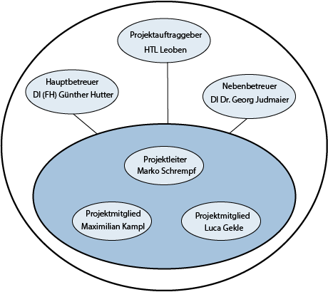

# Projekthandbuch

\textauthor{Gekle, Kampl, Schrempf}

## Entwicklungsplan

### Projektauftrag

Die Platzierung von Containern auf einem Frachtschiff ist in der Ladeliste vordefiniert. Jedoch sind die Bezeichnungen der Container vom verladenden Kranführer ohne Benutzung eines speziellen Trackingsystems nicht immer eindeutig identifizierbar. [@identecsolutions] Diese Unklarheit führt häufig zu einer falschen Platzierung der Fracht auf dem Schiff. Folglich kann der angegebene Container nicht an seinem zugewiesenen Stellplatz, sondern an einem anderen Ort gefunden werden. Es kommt auch des Öfteren vor, dass Container während des Überseetransports vom Frachtschiff abhandenkommen, jedoch wird dies erst im Eingangshafen erfasst. Das eigentliche Problem ist es jedoch, dass es nicht einfach ist, Informationen über den aktuellen Zustand des Inhalts des Containers abzurufen. Dies könnte insbesondere bei sensiblen Frachtgütern von Nachteil sein, beispielsweise bei zerbrechlichen oder temperaturempfindlichen Gütern. Der Lösungsweg für dieses Problem ist, dass in Containern installierte Mikrokontroller über ein Mesh-Netzwerk miteinander kommunizieren, deren Umweltdaten aufzeichnen und diese dann an einen Server senden. Die Daten können dann über eine Website präsentabel zur Verfügung gestellt werden.

#### Projektziele

##### Hauptziele

- Verminderung der Falschplatzierung von Containern wegen Kranverschiebung auf 5%
- Ermöglichung der Verfolgung von Container während des Überseetransports mittels GPS-Tracking
- Lesen der Umweltdaten vor und während des Transportprozesses rund um den Container
  - Temperatur
  - Luftfeuchtigkeit
  - Erschütterung
  - Luftdruck
- Entwicklung von Prototypen mit folgenden Funktionen
  - Datenübertragung
    - Auslesen der Daten
    - Ortung mittels GPS
- Erstellung eines Algorithmus zur ungefähren Bestimmung der Postion eines Containers auf dem Frachtschiff
  - Dijkstra
- Erstellen einer Webanwendung mit Benutzeroberfläche zur Darstellung und Abfrage der ausgelesenen Daten

#### Nicht-Ziele

- Mobile Anwendung
- Mehr als 3 Prototypen
- Statische Server- und Kommunikationsarchitektur

#### Projektnutzen

Unser Projekt soll nicht nur den Schiffsarbeitern und der Logistikabteilung des Hafens sondern auch den Kunden unterstützen. Des Öfteren kommt es vor, dass die Fracht auf Schiffen nicht auf ihren designierten Platz platziert wurde. Dies führt nur zu mehr Aufwand für die Schiffsarbeiter und Logistische Abteilung, da ein großer Anteil der Zeit nun für das Suchen eben dieser Container aufgebracht wird. Durch diese verschwendete Zeit, kann und wird es zu Lieferverzögerungen kommen.
Außerdem wird unser Gerät auch beim Wiederfinden oder dem generellen Verfolgen der Fracht von nutzen sein.
Für den Hafen kann dies vom Vorteil sein, wenn ein Container während des Transportes verloren geht und für die Kunden ermöglicht es einen genaueren Einblick wo ihr Paket nun genau ist.

#### Projektauftraggeber/in

Die HTL Leoben, eine technische Fachschule in Österreich überwacht und hilft uns bei der Erstellung des Projektes. Sie stellt uns Lehrkräfte zur Verfügung, welche uns fast jederzeit als Berater zur seite stehen.

#### Projekttermine

| Termin     | Inhalt                          |
|-----------:|:--------------------------------|
| 2023-11-23 | Abgabe der DA-Vorschläge |
| 2024-02-15 | Informationsveranstaltung |
| 2024-02-23 | Projektstart |
| 2024-06-12 | Erstpräsentation der Themenstellung |
| 2024-10-24 | Zweitpräsentation der Themenstellung |
| 2025-01-10 | Erstabgabe der DA |
| 2025-02-07 | Zweitabgabe der DA |
| 2025-?-? | Drittpräsentation der Themenstellung |
| 2025-03-07 | Endabgabe der DA |
| 2025-04-22 | Endpräsentation der DA |

: Projektterminübersicht

#### Projektkosten

| Meilenstein  | Kostenart | Menge  | Preis   | Gesamtkosten | Deckung durch |
|:-------------|:---------:|:------:|--------:|-------------:|---------------|
| Prototyp funktionell     | Hardware  |  3     |  27.06 € | 81.19 €      | Schüler        |
| Finale Abgabe der DA             | Druck     |  3     |   26.00 € |  53.00 €      | Schüler        |
| Finale Abgabe der DA              | Druck     |  1     |   26.00 € |  26 €      | Schulischen Betreuer           |

: Geplante Projektkosten

| Meilenstein  | Kostenart | Menge  | Preis   | Gesamtkosten | Deckung durch |
|:-------------|:---------:|:------:|--------:|-------------:|---------------|
| Prototyp funktionell     | Hardware  |  3     |  27.06 € | 81.19 €      | Schüler        |
| Finale Abgabe der DA             | Druck     |  3     |   26.00 € |  53.00 €      | Schüler        |
| Finale Abgabe der DA              | Druck     |  1     |   26.00 € |  26 €      | Schulischen Betreuer           |

: Tatsächliche Projektkosten

**Das Projekt kostet in Summe: 160.19 €**

#### Projektrisiken

| Risiko         | EW  | Auswirkungen     | Maßnahmen     |
|:--------------:|:---:| :----------------|:--------------|
| Überziehen der Kosten | 15% | Erhöhte Kosten für Schüler | Budgetierung & Ausleihung |
| Verzögerungen bei der Lieferung der Hardwarekomponenten | 60% | Prototyp wird nicht rechtzeitig zur Endpräsentation fertig | Früh genug anfangen |
| Hardwareausfall der Mikrokontroller | 30% | Keine oder fehlerhafte Umweltdaten | Ersatzsysteme |
| ISP Probleme bei DDNS | 10% | Server kann nicht ins Internet freigeschaltet werden | Austellen des Servers bei DA-Betreuer |
| Selbstgenerierte SSL-Zertifikate werden nicht anerkannt | 100% | Umständliche Implementierung | Zertifikate kaufen |

: Projektrisiken

### Projektorganisation

#### Projektbeteiligte

| Vorname     | Nachname | Organisation | Kontaktinfos                |
|:------------|:---------|:-----------  |:----------------------------|
| Luca Alexander       | Gekle    | HTL Leoben   | [201wita04@o365.htl-leoben.at](201wita04@o365.htl-leoben.at) |
| Maximilian Silvester  | Kampl    | HTL Leoben   | [201wita27@o365.htl-leoben.at](201wita27@o365.htl-leoben.at) |
| Marko Daniel       | Schrempf | HTL Leoben   | [201wita20@o365.htl-leoben.at](201wita20@o365.htl-leoben.at) |
| Günther  | Hutter    | HTL Leoben   | [hg@o365.htl-leoben.at](hg@o365.htl-leoben.at) |
| Georg  | Judmaier    | HTL Leoben   | [jg@o365.htl-leoben.at](jg@o365.htl-leoben.at) |

: Projektbeteiligte

#### Projektrollen

| Projektrolle           | Rollenbeschreibung                                 | Name              |
|------------------------|----------------------------------------------------|-------------------|
| Projektleiter          | Verantwortlicher für Einhaltung des Projektrahmens | Marko Daniel Schrempf   |
| Auftraggeber           | Auftraggeber der internen Diplomarbeit             | HTL Leoben        |
| Betreuer               | Schulischer Betreuer                               | Günther Hutter         |
| Betreuer               | Schulischer Betreuer                               | Georg Judmaier       |

: Projektrollen

{width=50%}

### Vorgehen bei Änderungen

- Wer wird informiert
  - Alle Projektbeteiligten
- Wer muss zustimmen
  - Projektleiter o. Betreuer
- Wo werden die Änderungen wie vermerkt?
  - Github Repository mittels Commits

## Meilensteine

### 2024-02-23: Genehmigung der DA

- Einreichen des Antrags durch die Schüler
- DA Dokumentation wurde ausgefüllt und unterschrieben

### 2024-05-09: Projektplan Grobentwurf fertig

- Zielsetzung ausgefüllt
- Projekplan ausgefüllt

### 2024-06-01: Hardware Komponenten Recherche fertig

- Bestimmung der Komponenten
- Preisrechnung
- Terminrechnung

### 2024-06-17: Datenbanken fertig

- Allgemeine Container Informationen
- Sensor Daten
  - Datentypen bestimmen

### 2024-06-24: Erstpräsentation der DA

- Fortschritt zusammenfassen
- Gantt-Diagramm erstellen

### 2024-07-04: Server Architektur fertig

- Server ist einsatzfähig
- REST-Schnittstelle
  - Zugriff auf DB
- Zugriff kann von überall gestattet werden
  - DDNS

### 2024-09-04: Prototyp funktionell

- Hardware Komponeten gekauft und geliefert
- Löten der Komponenten
- Datenübertragung mittels MQTT

### 2024-10-23: Zweitpräsentation der DA

- Fortschritt zusammenfassen
- Bild von ...
  - Prototyp
  - Directed-Draggable-Graph
  - Sensordatendiagramm

### 2024-11-03: Positionsalgorithmus funktionell

- Ungefähre Position des Containers
- Entfernung zu benachbarten Containern ermitteln

### 2024-11-30: (Directed Draggable) Graph Visualisierung

- Ausgehend von einen Container Entfernungen zu Anderen visualisieren
- Bewegbare Knoten

### 2025-01-31: Webanwendung funktionell

Die Webapplikation ist dann funktionell, wenn folgendes gegeben ist:

- Datenabfrage der Container Status
- Einlogen / Ausloggen möglich
- Ansprechende GUI

### 2025-03-07: Finale Abgabe der DA

- Korrektur gelesen
- Alle drei Subthemen fertig
- DA eingereicht

## Anwendungsfälle

### Daten senden

#### Kurzbeschreibung

Das Gerät übermittelt dem Server seine erfasste Daten

#### Trigger

Daten wurden registriert

#### Vorbedingung

Gerät ist aktiv

#### Nachbedingung

Daten werden in der Datenbank gespeichert

#### Akteure

- Gerät
- Server

#### Fehlersituationen

- Sensor defekt
- Verbindung zu Server kann nicht bereitgestellt werden

#### Systemzustand im Fehlerfall

Daten werden nicht geschickt

#### Standardablauf:

1. Gerät wird aktiviert
2. Sensor ermittelt Daten
3. Daten werden gesendet

#### Alternativabläufe:

- Daten werden nicht gesendet

\newpage

### Daten speichern

#### Kurzbeschreibung

Daten werden nach dem erhalten gespeichert

#### Trigger

Daten werden erhalten

#### Vorbedingung

Datenbank ist aktiv

#### Nachbedingung

Neue Einträge in der Datenbank

#### Akteure

- Gerät
- Datenbank
- Server

#### Fehlersituationen

- Daten können nicht eingefügt
- Verbindung zu Server kann nicht bereitgestellt werden

#### Systemzustand im Fehlerfall

Keine neuen Einträge

#### Standardablauf:

1. Daten erhalten
2. Daten validiert
3. Daten gespeichert

#### Alternativabläufe:

- Daten werden nicht gespeichert

\newpage

### Daten abrufen

#### Kurzbeschreibung

Daten werden von der Datenbank an die Webanwendung geschickt

#### Trigger

Neue Daten werden angefordert

#### Vorbedingung

Server ist aktiv

#### Nachbedingung

Neue Daten werden geschickt

#### Akteure

- DB
- Server
- Webanwendung

#### Fehlersituationen

- Anfrage ist nicht korrekt

#### Systemzustand im Fehlerfall

Es werden keine (neuen) Daten angezeigt

#### Standardablauf:

1. Webanwendung schickt Anfrage
2. Anfrage wird validiert
3. Daten werden übermittelt

#### Alternativabläufe:

- Anfrage wird abgelehnt

\newpage

### Daten anzeigen

#### Kurzbeschreibung

Der Benutzer kann die ermittelten Daten abrufen

#### Trigger

Benutzer lädt die Detail-Seite des Containers

#### Vorbedingung

Benutzer ist angemeldet

#### Nachbedingung

Daten werden (neu) geladen

#### Akteure

- Benutzer
- Server

#### Fehlersituationen

- Benutzer bricht die Aktion ab
- Keine Daten vorhanden
- Server antwortet nicht

#### Systemzustand im Fehlerfall

Daten können nicht angezeigt werden

#### Standardablauf:

1. Benutzer lädt die Seite
2. Benutzer meldet sich an
3. Benutzer ruft Daten ab

#### Alternativabläufe:

- Benutzer ist bereits angemeldet
