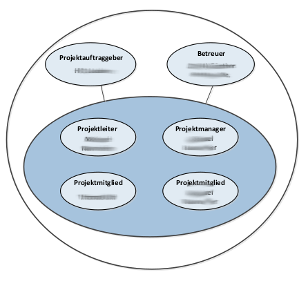

# Projekthandbuch
\textauthor{Schueler XY}

## Entwicklungsplan

### Projektauftrag

Die Platzierung der Container auf einem Frachtschiff ist in der Ladeliste vordefiniert. 
Jedoch sind die Bezeichnungen der Container vom verladenden Kranführer nicht immer eindeutig identifizierbar. 
Diese Unklarheit führt häufig zu einer falschen Platzierung der Fracht auf dem Schiff. 
Folglich kann der angegebene Container nicht an seinem zugewiesenen Stellplatz, sondern an einem anderen Ort gefunden werden. 
Zudem ist es nicht möglich, Informationen über den aktuellen Zustand des Inhalts des Containers abzurufen. 
Dies könnte insbesondere bei sensiblen Frachtgütern von Nachteil sein, beispielsweise bei zerbrechlichen Gütern. 
Es kommt auch des öfteren vor, dass Container während des Überseetransports vom Frachtschiff abhandenkommen, jedoch wird dies erst im Eingangshafen erfasst.

#### Projektziele

1) Verminderung der Falschplatzierung von Containern  wegen Kranverschiebung auf nahezu 0%
2) Ermöglichung der Verfolgung von Container während des Überseetransports mittels GPS-Tracking
3) Lesen der Umweltdaten vor und während des Transportprozesses rund um den Container
4) Erstellen eines Webservers mit Benutzeröberfläche zur Darstellung der ausgelesenen Daten
5) Entwicklung von mindesten 2 Prototypen mit folgenden Funktionen:
   1) Datenübertragung mittel MQTT
   2) Auslesen der
      1) Temperatur 
      2) Luftfeuchtigkeit
      3) Erschütterung
      4) und des Luftdruckes
   3) Ortung mittels GPS
6) Erstellungs eines Algorithmus zur Bestimmung der Postion eines Containers auf Frachtschiffen

#### Nicht-Ziele bzw. nicht Inhalte

Nicht-Ziele sind aus mehreren Gründen wichtig. Erstens helfen sie beim Erwartungsmanagement. Zweitens schaffen sie Klarheit darüber, was erledigt werden soll. Und drittens erhöhen Nicht-Ziele die Transparenz. Denn wenn man schon früh im Projekt explizit die Bereiche definiert, die das Projekt nicht bearbeiten soll, kann dadurch eine Diskussion über genau diese Randbereiche entstehen. 

#### Projektnutzen

Wie soll ein Außenstehender ein Projekt genehmigen, wenn nicht klar formuliert ist, WARUM das Projekt überhaupt durchgeführt werden soll? Auch hier ist es wichtig, möglichst konkret zu werden. Einen Projektnutzen z.B. mit „neueste Technik“ zu bezeichnen, ist nicht ausreichend.

Unser Projekt soll nicht nur den Schiffsarbeitern und der Logistikabteilung des Hafens sondern auch den Kunden helfen. Des Öfteren kommt es vor, dass die Fracht auf Schiffen nicht auf ihren designierten Platz platziert wurde. Dies führt nur zur mehr Aufwand für die Schiffsarbeiter und Logistische Abteilung, da ein großer Anteil der Zeit nun für das Suchen eben dieser Container aufgebracht wird. Durch diese Verschwendete Zeit, kann und wird es zu Lieferverzögerungen kommen.
Außerdem wird unser Gerät auch bei wiederfinden oder dem generellen verfolgen der Fracht helfen.
Für den Hafen kann dies vom Vorteil sein, wenn ein Conteiner während des Transportes verloren geht und für die Kunden ermöglicht es einen genaueren einblick wo ihr Paket nun geneua ist.

#### Projektauftraggeber/in

Hier beschreiben Sie wer der Projektauftraggeber ist. Falls es eine externe Firma ist können Sie hier eine kurze Beschreibung des Unternehmens (sofern Projektrelevant) einfügen.

Die HTL-Leoben, eine technische Fachschule in Österreich überwacht und hilft uns bei der Eerstellung des Projektes. Sie stellt uns Lehrkräfte zur Verfügung, welche uns fast jederzeit als Berater uur seite stehen.

#### Projekttermine

Welche Termine sind Fixtermine und was sollte an diesen Terminen stattfinden ? Beispiele hierfür sind z.B: Präsentationen, Projektende, Zwischenabgaben, fest eingeplante Besprechungen / Reviews (die auch Projektrelevant sind) die auf keinen Fall vergessen werden dürfen

| Termin     | Inhalt                          |
|-----------:|:--------------------------------|
| 2023-11-23 | Abgabe DA-Vorschschläge         |
| 2024-02-15 | Informationsveranstaltung       |
| 2024-02-23 | Projektstart                    |

: Projektterminübersicht

#### Projektkosten

Hier dokumentieren Sie welche Kosten fallen Für Ihr Projekt an und wer kommt für diese Kosten auf ?

| Meilenstein  | Kostenart | Menge  | Preis   | Gesamtkosten | Deckung durch |
|:-------------|:---------:|:------:|--------:|-------------:|---------------|
| Prototyp     | Personal  |  10.00 |   15.00 | 150.00      | Schüler       |
| Prototyp     | Hardware  |  1     |  254.00 | 254.00      | Projektpartner|
| DA-Schreiben | Druck     |  3     |   26.00 |  53.00      | Schüler       |

 : Geplante Projektkosten
 
Am ende sollten Sie eine Projektkostensumme ermitteln und hier angeben damit man sagen kann
__Das Projekt kostet in Summe so und so viel Euro__. 

Am Ende der Diplomarbeit fügen Sie hier noch eine Liste der tatsächlich angefallenen Kosten ein.

#### Projektrisiken

Hier geben Sie an welche Risiken auf Ihr Projekt zutreffen können, und auch wie wahrscheinlich es ist das dieses Risiko eintritt.
Eine Übersicht über Risiken finden sie hier: https://projekte-leicht-gemacht.de/blog/pm-in-der-praxis/130-projektrisiken-beispiele/

Hier ein Beispiel:

| Risiko         | EW  | Auswirkungen     | Maßnahmen     |
|:--------------:|:---:| :----------------|:--------------|
| Überziehen der Kosten | 15% | Erhöhte Kosten für Schüler | Budgetierung |
| Ungenaue Schätzungen | 30% | Ungenaue Schätzungen führen zu Problem bezüglich Terminen und Budget. | Schätzungen mit Fachkollegen absprechen|
| Verzögerungen beim Aufbau von Hard- und Software | 10% | Prototyp wird nicht rechtzeitig zur Endpräsentation fertig | Früh genug anfangen |

: Projektrisiken

### Projektorganisation

#### Projektbeteiligte
Hier wird definiert wer (welche Personen) an diesem Projekt beteiligt im Prinzip beteiligt ist.

| Vorname     | Nachname | Organisation | Kontaktinfos                |
|:------------|:---------|:-----------  |:----------------------------|
| Luca        | Gekle    | HTL-Leoben   | 201wita##o365.htl-leoben.at |
| Marko       | Schrempf | HTL-Leoben   | 201wita##o365.htl-leoben.at |
| Maximilian  | Kampl    | HTL-Leoben   | 201wita27o365.htl-leoben.at |

: Projektbeteiligte

Unter Kontaktinfos können neben der Emailadresse natürlich auch noch andere Informationen wie Telefonnunmmer, Postanschrift, usw. stehen. ... Im Prinzip alles was notwendig ist um die Person zu erreichen wenn es notwendig ist. 

#### Projektrollen

Hier werden den Kontakten von oben konkrete Rollen zuewiesen.

| Projektrolle           | Rollenbeschreibung                                 | Name              |
|------------------------|----------------------------------------------------|-------------------|
| Projektleiter          | Verantwortlicher für Einhaltung des Projektrahmens | Schrempf Marko    |
| Auftraggeber           | Auftraggeber der internen Diplomarbeit             | HTL-Leoben        |
| Betreuer               | Schulischer Betreuer                               | G. Hutter         |
| Betreuer               | Schulischer Betreuer                               | G. Judmaier       |

: Projektrollen

Gerne können Sie hier auch noch zusätzlich eine Grafik oder ein Organisationsdiagramm einbauen.

{width=50%}

### Vorgehen bei Änderungen

Hier dokumentieren sie betreffend des Meilensteinplans oder der Anwendungsfälle: 

* Wer wird informiert, 
* wer muss zustimmen, 
* wo werden die Änderungen wie vermerkt?

Das dient in erster Linie dazu um ein einheitliches Vorgehen definiert zu haben.

## Meilensteine

Der Begriff taucht im Projektmanagement sehr häufig auf. Meilensteine sind wichtige Punkte im Projektverlauf. Oft werden sie auch als Prüfpunkte bezeichnet.

Generell kann ein Meilenstein ein Ereignis sein, an dem

* etwas abgeschlossen ist,
* etwas begonnen wird oder
* über die weitere Vorgehensweise entschieden wird

Meilensteine werden meist am Ende von Projektphasen definiert. Auch innerhalb von Phasen kann es zusätzliche Meilensteine geben.

Meilensteine verlaufen nie über eine Zeitdauer. Nie. Sie sind lediglich Entscheidungspunkte

Hier ein Beispiel wie die Meilensteine im Fall einer aussehen können

### 2020-09-15: Projektmanagement abgeschlossen

- Projekthandbuch ist fertig
- Serverinfrastruktur ist hergestellt
- Bestellungen sind abgessendet

### 2020-11-01: Genehmigung der DA

- Einreichen des Antrags durch die Schüler/innen
- DA Dokumentation wurde ausgefüllt und unterschrieben

### 2020-11-26: Literaturrecherche abgeschlossen

- Literatur zum Thema XY gesucht und in bibtex vermerkt
- Aktellen Stand der Forschung erhoben
- Verschriftlichung des Literaturteils begonnen 

### 2020-12-17: Prototyp ist funktionell

- DB mit Tabelle für Benutzer.
- DB Kommunikation zur Anwendung (inkl. Dokumentation)
- Es gibt in der Anwendung einen /Admin/ Benutzer. Dieser Benutzer kann weitere Benutzer in den Rollen /Lehrende/ und bzw. oder /Studierende/ anlegen.
      
### 2021-01-10: Applikation fertiggestellt

- Lehrende sind dazu in der Lage Tests anzulegen.
- Studenten können einen ihnen zugewiesenen Test absolvieren.

### 2021-01-10: Review und Überarbeitung fertig

- Der Quellcode ist gemeinsam mit den Projektpartnern reviewt
- Quellcodedokumentation abgeschlossen (Javadoc)
- Projekt baut auf eigenem Buildserver (Continous Integration)

### 2021-02-03: Diploarbeit fertig verschriftlicht 

- Stilfehler sind behoben
- DA Dokumentationsblatt ist unterschrieben, eingescannt und im Hauptdokument enthalten 
- Praxisteil ist ebgeschlossen und verschriftlicht
- Informationen sind im DA Portal eingegeben
- Unterschriebene DA Betreuungsprotokolle sind in der DA enthalten
- DA liegt dem Betreuer in ausgedruckter Form vor
    

## Anwendungsfälle

Hier beschreiben Sie die Anwendungsfälle (=UseCases) Ihrer Anwendung / Diplomarbeit. Dabei sollte die Beschreibung auf hohem Niveau (also ohne implementierungsspezifische Details) erfolgen und typischerweise so benannt sein, wie die Ziele aus Sicht der Akteure heißen: Mitglied anmelden, Geld abheben, Auto zurückgeben.

Jeder Anwendungsfall wird im selben Muster beschrieben. In den folgenden Absätzen ist zuerst eine allgemeine Beschreibung eines solchen Anwendungsfalls zu finden und dann ein Beispiel dazu.

Damit man auch versteht wer mit welchem Anwendungsfall agiert bietet es sich an hier eine Übersichtsgrafik zu erstellen:

{width=60%}

\newpage
### Anwendungsfallname
Anwendungsfälle haben einen eindeutigen Namen aus dem man auf den Inhalt des Anwendungsfalls schließen kann. Wenn Sie agil arbeiten dann stellt ein Anwendungsfall eine UserStory dar welche im Backlog liegt und im Laufe des Projekts (in einem Sprint) abgearbeitet wird.

#### Kurzbeschreibung
Hier erfolgt eine kurze Beschreibung, was im Anwendungsfall passiert. Kurz bedeutet, dass es zwei oder drei Zeilen sind, selten mehr.
      
#### Trigger
Der fachliche Grund bzw. die Gründe dafür, dass dieser Anwendungsfall ausgeführt 

#### Vorbedingung
Alle Bedingungen, die erfüllt sein müssen, damit dieser Anwendungsfall ausgeführt werden kann. Gibt es keine Vorbedingungen, so steht hier "keine".
      
#### Nachbedingung
Der Zustand, der nach einem erfolgreichen Durchlauf des Anwendungsfalls erwartet wird.

#### Akteure
Akteure sind beteiligte Personen oder Systeme außerhalb (!) des beschriebenen Systems. Z. B. Anwender, angemeldeter Anwender, Kunde, System, Abrechnungsprozess.

#### Standardablauf
Hier wird das typische Szenario dargestellt, das leicht zu verstehen oder der am häufigsten vorkommende Fall ist. An seinem Ende steht die Zielerreichung des Primärakteurs. Die Ablaufschritte werden nummeriert und meist in strukturierter Sprache beschrieben. Ablaufpläne können jedoch ebenfalls benutzt werden, wenn es angebracht erscheint. Mittels der UML können diese Ablaufschritte in Aktivitätsdiagrammen oder Anwendungsfall-orientierten Sequenzdiagrammen dargestellt werden.

#### Fehlersituationen
Dies sind Szenarien, die sich außerhalb des Standardablaufs auch bei der (versuchten) Zielerreichung des Anwendungsfalls ereignen können. Sie werden meistens als konditionale Verzweigungen der normalen Ablaufschritte dargestellt. An ihrem Ende steht ein Misserfolg, die Zielerreichung des Primärakteurs oder eine Rückkehr zum Standardablauf.

#### Systemzustand im Fehlerfall
Der Zustand, der nach einem erfolglosen Durchlauf des Anwendungsfalls erwartet wird.

\newpage
### Benutzer Anlegen

#### Kurzbeschreibung
Der Benutzer "Admin" kann auf Anfrage einen neuen Benutzer als "Lehrende" und bzw. oder "Studierende" anlegen

#### Trigger
Admin legt auf Anfrage eines Benutzers einen neuen Account an

#### Vorbedingung
Benutzer als "Admin" angemeldet
      
#### Nachbedingung
Es existiert ein Eintrag in der DB Benutzer Tabelle für den neu erstellten Benutzer. (Dieser kann sich anschließend in der Anwendung anmelden)

#### Akteure
* Admin

#### Fehlersituationen
Admin bricht die Aktion ab

#### Systemzustand im Fehlerfall
Benutzer wird nicht angelegt und wird verworfen

#### Standardablauf:

1. Admin drückt Button, um einen neuen Benutzer anzulegen
2. Es öffnet sich ein Formular, indem die nötigen Benutzer-Informationen eingegeben werden (Name, Adresse, Telephonnummer, E-Mail, Geburtsdatum, Passwort-Hash, Rolle). Der neue Benutzer muss mindestens einer der Rollen "Lehrende" und "Studierende" angehören

#### Alternativabläufe:

* Admin drückt den Button, um die Aktion abzubrechen 
