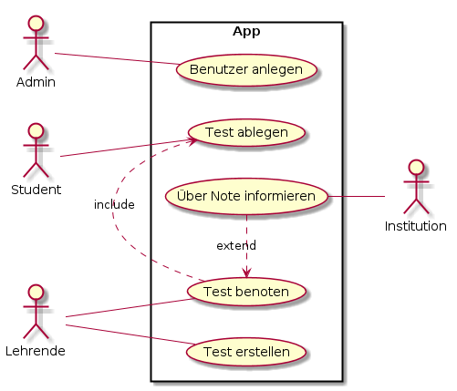

# Projekthandbuch
\textauthor{Schueler XY}

## Entwicklungsplan

### Projektauftrag

Die Platzierung der Container auf einem Frachtschiff ist in der Ladeliste vordefiniert. 
Jedoch sind die Bezeichnungen der Container vom verladenden Kranführer nicht immer eindeutig identifizierbar. 
Diese Unklarheit führt häufig zu einer falschen Platzierung der Fracht auf dem Schiff. 
Folglich kann der angegebene Container nicht an seinem zugewiesenen Stellplatz, sondern an einem anderen Ort gefunden werden. 
Zudem ist es nicht möglich, Informationen über den aktuellen Zustand des Inhalts des Containers abzurufen. 
Dies könnte insbesondere bei sensiblen Frachtgütern von Nachteil sein, beispielsweise bei zerbrechlichen Gütern. 
Es kommt auch des öfteren vor, dass Container während des Überseetransports vom Frachtschiff abhandenkommen, jedoch wird dies erst im Eingangshafen erfasst.

#### Projektziele

##### Hauptziele

- Verminderung der Falschplatzierung von Containern wegen Kranverschiebung auf nahezu 5%
- Ermöglichung der Verfolgung von Container während des Überseetransports mittels GPS-Tracking
- Lesen der Umweltdaten vor und während des Transportprozesses rund um den Container
    - Temperatur
    - Luftfeuchtigkeit
    - Erschütterung
    - Luftdruck
- Entwicklung von Prototypen mit folgenden Funktionen
  - Datenübertragung mittels MQTT
    - Auslesen der Daten
    - Ortung mittels GPS
- Erstellung eines Algorithmus zur Bestimmung der Postion eines Containers auf dem Frachtschiff
  - Dijkstra

##### Zusatzziele

- Erstellen einer Webanwendung mit Benutzeröberfläche zur Darstellung und Abfrage der ausgelesenen Daten

#### Nicht-Ziele bzw. nicht Inhalte

- Mobile Anwendung zu erstellen
- Mehr als 3 Prototypen zu erstellen
- Statische Server- und Kommunikationsarchitektur

#### Projektnutzen

Unser Projekt soll nicht nur den Schiffsarbeitern und der Logistikabteilung des Hafens sondern auch den Kunden unterstützen. Des Öfteren kommt es vor, dass die Fracht auf Schiffen nicht auf ihren designierten Platz platziert wurde. Dies führt nur zu mehr Aufwand für die Schiffsarbeiter und Logistische Abteilung, da ein großer Anteil der Zeit nun für das Suchen eben dieser Container aufgebracht wird. Durch diese verschwendete Zeit, kann und wird es zu Lieferverzögerungen kommen.
Außerdem wird unser Gerät auch beim Wiederfinden oder dem generellen Verfolgen der Fracht von nutzen sein.
Für den Hafen kann dies vom Vorteil sein, wenn ein Container während des Transportes verloren geht und für die Kunden ermöglicht es einen genaueren Einblick wo ihr Paket nun genau ist.

#### Projektauftraggeber/in

Die HTL-Leoben, eine technische Fachschule in Österreich überwacht und hilft uns bei der Eerstellung des Projektes. Sie stellt uns Lehrkräfte zur Verfügung, welche uns fast jederzeit als Berater zur seite stehen.

#### Projekttermine

| Termin     | Inhalt                          |
|-----------:|:--------------------------------|
| 2023-11-23 | Abgabe DA-Vorschschläge         |
| 2024-02-15 | Informationsveranstaltung       |
| 2024-02-23 | Projektstart                    |
| 2024-06-12 | Erstpräsentation der Themenstellung              |

: Projektterminübersicht

#### Projektkosten

Hier dokumentieren Sie welche Kosten fallen Für Ihr Projekt an und wer kommt für diese Kosten auf ?

| Meilenstein  | Kostenart | Menge  | Preis   | Gesamtkosten | Deckung durch |
|:-------------|:---------:|:------:|--------:|-------------:|---------------|
| Prototyp     | Personal  |  10.00 |   15.00 | 150.00      | Schüler       |
| Prototyp     | Hardware  |  1     |  254.00 | 254.00      | Projektpartner|
| DA-Schreiben | Druck     |  3     |   26.00 |  53.00      | Schüler       |

 : Geplante Projektkosten

 
 
Am ende sollten Sie eine Projektkostensumme ermitteln und hier angeben damit man sagen kann
__Das Projekt kostet in Summe so und so viel Euro__. 

Am Ende der Diplomarbeit fügen Sie hier noch eine Liste der tatsächlich angefallenen Kosten ein.

#### Projektrisiken

Hier geben Sie an welche Risiken auf Ihr Projekt zutreffen können, und auch wie wahrscheinlich es ist das dieses Risiko eintritt.
Eine Übersicht über Risiken finden sie hier: https://projekte-leicht-gemacht.de/blog/pm-in-der-praxis/130-projektrisiken-beispiele/

Hier ein Beispiel:

| Risiko         | EW  | Auswirkungen     | Maßnahmen     |
|:--------------:|:---:| :----------------|:--------------|
| Überziehen der Kosten | 15% | Erhöhte Kosten für Schüler | Budgetierung |
| Ungenaue Schätzungen | 30% | Ungenaue Schätzungen führen zu Problem bezüglich Terminen und Budget. | Schätzungen mit Fachkollegen absprechen|
| Verzögerungen beim Aufbau von Hard- und Software | 10% | Prototyp wird nicht rechtzeitig zur Endpräsentation fertig | Früh genug anfangen |

: Projektrisiken

### Projektorganisation

#### Projektbeteiligte
Hier wird definiert wer (welche Personen) an diesem Projekt beteiligt im Prinzip beteiligt ist.

| Vorname     | Nachname | Organisation | Kontaktinfos                |
|:------------|:---------|:-----------  |:----------------------------|
| Luca        | Gekle    | HTL-Leoben   | 201wita04@o365.htl-leoben.at |
| Marko       | Schrempf | HTL-Leoben   | 201wita20@o365.htl-leoben.at |
| Maximilian  | Kampl    | HTL-Leoben   | 201wita27@o365.htl-leoben.at |
| Günther  | Hutter    | HTL-Leoben   | hg@o365.htl-leoben.at |
| Georg  | Judmaier    | HTL-Leoben   | jg@o365.htl-leoben.at |

: Projektbeteiligte

Unter Kontaktinfos können neben der Emailadresse natürlich auch noch andere Informationen wie Telefonnunmmer, Postanschrift, usw. stehen. ... Im Prinzip alles was notwendig ist um die Person zu erreichen wenn es notwendig ist. 

#### Projektrollen

Hier werden den Kontakten von oben konkrete Rollen zuewiesen.

| Projektrolle           | Rollenbeschreibung                                 | Name              |
|------------------------|----------------------------------------------------|-------------------|
| Projektleiter          | Verantwortlicher für Einhaltung des Projektrahmens | Schrempf Marko    |
| Auftraggeber           | Auftraggeber der internen Diplomarbeit             | HTL-Leoben        |
| Betreuer               | Schulischer Betreuer                               | Günther Hutter         |
| Betreuer               | Schulischer Betreuer                               | Georg Judmaier       |

: Projektrollen

Gerne können Sie hier auch noch zusätzlich eine Grafik oder ein Organisationsdiagramm einbauen.

{width=50%}

### Vorgehen bei Änderungen

Hier dokumentieren sie betreffend des Meilensteinplans oder der Anwendungsfälle: 

* Wer wird informiert
  * Alle Projektbeteiligten
* Wer muss zustimmen
  *  Projektleiter o. Betreuer
* Wo werden die Änderungen wie vermerkt?
  * Github Repository mittels Commits

Das dient in erster Linie dazu um ein einheitliches Vorgehen definiert zu haben.

## Meilensteine

Der Begriff taucht im Projektmanagement sehr häufig auf. Meilensteine sind wichtige Punkte im Projektverlauf. Oft werden sie auch als Prüfpunkte bezeichnet.

Generell kann ein Meilenstein ein Ereignis sein, an dem

* etwas abgeschlossen ist,
* etwas begonnen wird oder
* über die weitere Vorgehensweise entschieden wird

Meilensteine werden meist am Ende von Projektphasen definiert. Auch innerhalb von Phasen kann es zusätzliche Meilensteine geben.

Meilensteine verlaufen nie über eine Zeitdauer. Nie. Sie sind lediglich Entscheidungspunkte

Hier ein Beispiel wie die Meilensteine im Fall einer aussehen können

### 2024-02-23: Genehmigung der DA

- Einreichen des Antrags durch die Schüler
- DA Dokumentation wurde ausgefüllt und unterschrieben

### 2024-05-09: Projekthandbuch fertig 

- Zielsetzung ausgefüllt
- Projekplan ausgefüllt

### 2024-06-01: Hardware Komponenten Recherche abgeschlossen

- Bestimmung der Komponenten
- Preisrechnung
- Terminrechnung

### 2024-06-17: Datenbanken fertig

- Allgemeine Container Informationen
- Sensor Daten
  - Datentypen bestimmen
      
### 2024-07-04: Fertige Server Architektur

- Server ist einsatzfähig
- REST-Schnittstelle
  - Zugriff auf DB
- Zugriff kann von überall gestattet werden
  - DDNS

### 2024-09-04: Prototyp ist funktionell

- Hardware Komponeten gekauft und geliefert
- Löten der Komponenten
- Datenübertragung mittels MQTT

### 2025-01-31: Webanwendung funktionell

- Datenabfrage möglich
- Einlogen / Ausloggen möglich
- Ansprechendes GUI

    
## Anwendungsfälle

Hier beschreiben Sie die Anwendungsfälle (=UseCases) Ihrer Anwendung / Diplomarbeit. Dabei sollte die Beschreibung auf hohem Niveau (also ohne implementierungsspezifische Details) erfolgen und typischerweise so benannt sein, wie die Ziele aus Sicht der Akteure heißen: Mitglied anmelden, Geld abheben, Auto zurückgeben.

Jeder Anwendungsfall wird im selben Muster beschrieben. In den folgenden Absätzen ist zuerst eine allgemeine Beschreibung eines solchen Anwendungsfalls zu finden und dann ein Beispiel dazu.

Damit man auch versteht wer mit welchem Anwendungsfall agiert bietet es sich an hier eine Übersichtsgrafik zu erstellen:

{width=60%}

\newpage
### Anwendungsfallname
Anwendungsfälle haben einen eindeutigen Namen aus dem man auf den Inhalt des Anwendungsfalls schließen kann. Wenn Sie agil arbeiten dann stellt ein Anwendungsfall eine UserStory dar welche im Backlog liegt und im Laufe des Projekts (in einem Sprint) abgearbeitet wird.

#### Kurzbeschreibung
Hier erfolgt eine kurze Beschreibung, was im Anwendungsfall passiert. Kurz bedeutet, dass es zwei oder drei Zeilen sind, selten mehr.
      
#### Trigger
Der fachliche Grund bzw. die Gründe dafür, dass dieser Anwendungsfall ausgeführt 

#### Vorbedingung
Alle Bedingungen, die erfüllt sein müssen, damit dieser Anwendungsfall ausgeführt werden kann. Gibt es keine Vorbedingungen, so steht hier "keine".
      
#### Nachbedingung
Der Zustand, der nach einem erfolgreichen Durchlauf des Anwendungsfalls erwartet wird.

#### Akteure
Akteure sind beteiligte Personen oder Systeme außerhalb (!) des beschriebenen Systems. Z. B. Anwender, angemeldeter Anwender, Kunde, System, Abrechnungsprozess.

#### Standardablauf
Hier wird das typische Szenario dargestellt, das leicht zu verstehen oder der am häufigsten vorkommende Fall ist. An seinem Ende steht die Zielerreichung des Primärakteurs. Die Ablaufschritte werden nummeriert und meist in strukturierter Sprache beschrieben. Ablaufpläne können jedoch ebenfalls benutzt werden, wenn es angebracht erscheint. Mittels der UML können diese Ablaufschritte in Aktivitätsdiagrammen oder Anwendungsfall-orientierten Sequenzdiagrammen dargestellt werden.

#### Fehlersituationen
Dies sind Szenarien, die sich außerhalb des Standardablaufs auch bei der (versuchten) Zielerreichung des Anwendungsfalls ereignen können. Sie werden meistens als konditionale Verzweigungen der normalen Ablaufschritte dargestellt. An ihrem Ende steht ein Misserfolg, die Zielerreichung des Primärakteurs oder eine Rückkehr zum Standardablauf.

#### Systemzustand im Fehlerfall
Der Zustand, der nach einem erfolglosen Durchlauf des Anwendungsfalls erwartet wird.

\newpage
### Daten senden

#### Kurzbeschreibung
Das Gerät übermittelt dem Server seine erfasste Daten 

#### Trigger
Daten wurden registriert

#### Vorbedingung
Gerät ist aktiv
      
#### Nachbedingung
Daten werden in der Datenbank gespeichert

#### Akteure
* Gerät
* Server

#### Fehlersituationen

- Sensor defekt
- Verbindung zu Server kann nicht bereitgestellt werden

#### Systemzustand im Fehlerfall
Daten werden nicht geschickt

#### Standardablauf:

1. Gerät wird aktiviert 
2. Sensor ermittelt Daten
3. Daten werden gesendet

#### Alternativabläufe:

* Daten werden nicht gesendet

\newpage
### Daten speichern

#### Kurzbeschreibung
Daten werden nach dem erhalten gespeichert

#### Trigger
Daten werden erhalten

#### Vorbedingung
Datenbank ist aktiv
      
#### Nachbedingung
Neue Einträge in der Datenbank

#### Akteure
* Gerät
* Datenbank
* Server

#### Fehlersituationen
- Daten können nicht eingefügt
- Verbindung zu Server kann nicht bereitgestellt werden

#### Systemzustand im Fehlerfall
Keine neuen Einträge

#### Standardablauf:

1. Daten erhalten
2. Daten validiert
3. Daten gespeichert

#### Alternativabläufe:

* Daten werden nicht gespeichert

\newpage
### Daten abrufen

#### Kurzbeschreibung
Daten werden von der Datenbank an die Webanwendung geschickt

#### Trigger
Neue Daten werden angefordert

#### Vorbedingung
Server ist ak
      
#### Nachbedingung
Neue Daten werden geschickt

#### Akteure
* DB
* Server
* Webanwendung

#### Fehlersituationen
- Anfrage ist nicht korrekt

#### Systemzustand im Fehlerfall
Es werden keine (neuen) Daten angezeigt

#### Standardablauf:

1. Webanwendung schickt Anfrage
2. Anfrage wird validiert
3. Daten werden übermittelt

#### Alternativabläufe:

* Anfrage wird abgelehnt

\newpage

\newpage
### Daten anzeigen

#### Kurzbeschreibung
Der Benutzer kann die ermittelten Daten abrufen

#### Trigger
Benutzer lädt die Seite

#### Vorbedingung
Benutzer ist angemeldet
      
#### Nachbedingung
Daten werden (neu) geladen

#### Akteure
* Benutzer
* Server

#### Fehlersituationen
- Benutzer bricht die Aktion ab
- Keine Daten vorhanden
- Server antwortet nicht

#### Systemzustand im Fehlerfall
Daten können nicht angezeigt werden

#### Standardablauf:

1. Benutzer lädt die Seite
2. Benutzer meldet sich an 
3. Benutzer ruft Daten ab

#### Alternativabläufe:

- Benutzer ist bereits angemeldet
